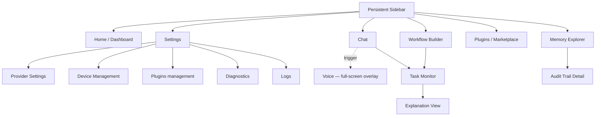

# NOVA — Screens & App Flow (Single-File Reference)

> Generated from the hardened NOVA documentation corpus. Every screen and
> flow below is transcribed from its canonical source, not invented —
> sources are cited inline. Two gaps found while assembling this file
> (an undercounted nav list, and a fabricated workflow-node state
> machine referenced from a different area of the docs) were fixed in
> the source repository first; this file reflects the corrected version.

---

## 1. App Navigation Structure

Primary navigation is a **persistent sidebar** with **six top-level
destinations**. No top-level destination is more than one click from
any other. `Settings` expands to five sub-destinations (still only one
click from Settings, so two clicks from any other top-level item).
`Voice` is not a sidebar row — it's a full-screen overlay mode entered
by trigger.

*Source: `docs/30-design/navigation.md`*

### Top-level destinations

| # | Destination | Screen spec | One-line purpose |
|---|---|---|---|
| 1 | **Home** | `docs/40-screens/home-screen.md` | At-a-glance summary of pending approvals, recent autonomous actions, and suggested next steps — so the user never has to open Chat just to check status. |
| 2 | **Chat** | `docs/40-screens/chat-screen.md` | The primary conversational interface to the Planner: streaming responses, inline action chips for tool calls, full transcript history. |
| 3 | **Memory Explorer** | `docs/40-screens/memory-screen.md` | Browse, search, and correct NOVA's stored memory and knowledge graph, with full lineage visibility. |
| 4 | **Workflow Builder** | `docs/40-screens/workflow-screen.md` | Visual builder and monitor for multi-step workflows, including live execution status per node. |
| 5 | **Plugins / Marketplace** | `docs/40-screens/plugins-screen.md` | Browse, install, configure, and manage permissions for plugins. |
| 6 | **Settings** | `docs/40-screens/settings-screen.md` | Central configuration hub, organized to match the settings taxonomy. |

### Settings sub-destinations

| Sub-destination | Screen spec | One-line purpose |
|---|---|---|
| **Provider Settings** | `docs/40-screens/provider-screen.md` | Manage AI provider credentials, routing preferences, and per-capability provider pinning. |
| **Device Management** | `docs/40-screens/device-screen.md` | List paired devices, their sync status, and revoke access. |
| **Diagnostics** | `docs/40-screens/diagnostics-screen.md` | System health: service status, resource usage, and self-test results. |
| **Logs** | `docs/40-screens/logs-screen.md` | Searchable, filterable raw event/action log for power users and debugging. |
| **Updates** | `docs/40-screens/updates-screen.md` | Update availability, changelog, and rollback control. |

### Trigger-activated (not a sidebar row)

| Screen | Screen spec | How it's reached |
|---|---|---|
| **Voice** | `docs/40-screens/voice-screen.md` | Full-screen voice interaction mode (live transcript, waveform, always-visible mute/cancel). Entered via a trigger from Chat, or a system-level wake-word / push-to-talk activation — never a persistent sidebar entry, same pattern as the Overlay surface in `docs/09-ui/ui-overview.md`. |

**All 12 screens, one canonical count** — Home, Chat, Memory, Workflows,
Plugins, Settings, Provider, Device, Diagnostics, Logs, Updates, Voice.

---

## 2. Every Screen — Full Spec Summary

Each screen shares the same structural pattern (per `docs/40-screens/`):
a primary content region + persistent sidebar nav; layout detail is
implementation-defined against `docs/30-design/design-tokens.md`
rather than hardcoded in the spec; shared components come from
`docs/41-components/`; keyboard shortcuts are catalogued centrally in
`docs/29-product/keyboard-shortcuts.md`; and every screen must implement
the full required-states checklist in
`docs/45-code-perfection-failure-modes/09-ui-and-state-binding.md` item 5
(loading, empty, error, and populated states — no screen ships with only
the "happy path" state wired up).

| Screen | Purpose |
|---|---|
| **Home / Dashboard** | At-a-glance summary of pending approvals, recent autonomous actions, and suggested next steps. |
| **Chat** | Primary conversational interface to the Planner; streaming responses, inline action chips, full transcript. |
| **Memory Explorer** | Browse/search/correct stored memory and the knowledge graph, with full lineage visibility. |
| **Workflow Builder** | Visual builder and monitor for multi-step workflows; live per-node execution status. |
| **Plugins / Marketplace** | Browse, install, configure, and manage permissions for plugins (per `docs/16-extensibility/plugin-marketplace.md`). |
| **Settings** | Central configuration hub matching `docs/29-product/settings.md`'s taxonomy. |
| **Provider Settings** | Manage AI provider credentials, routing preferences, per-capability provider pinning. |
| **Device Management** | List paired devices, sync status, revoke access. |
| **Diagnostics** | Service status, resource usage, self-test results. |
| **Logs** | Searchable, filterable raw event/action log. |
| **Updates** | Update availability, changelog, rollback control. |
| **Voice** | Full-screen voice mode: live transcript, waveform feedback, always-visible mute/cancel. |

---

## 3. Every App Flow — Step by Step

Transcribed from `docs/31-user-flows/` (14 flows). Each flow's screen
and component references live in `docs/40-screens/` and
`docs/41-components/` respectively.

### Onboarding & Identity

**Authentication Flow** (`authentication-flow.md`)
Local-only mode requires no authentication. Cloud-sync mode uses a
passphrase-derived encryption key (never transmitted), with a recovery
phrase shown once at setup and never retrievable again afterward.

**Onboarding Flow** (`onboarding-flow.md`)
Exact screen sequence per `docs/29-product/onboarding.md`; user can
skip/resume onboarding without losing prior choices.

### Core Interaction

**Chat Flow** (`chat-flow.md`)
User opens Chat → types/dictates request → Planner streams intermediate
status ("checking calendar…") → final response with any actions taken
shown inline as chips linking to their outcome.
*Failure branch:* Planner can't resolve the request deterministically
or via available providers → explicit "I can't do this yet, here's why"
message — never a silent non-answer.

**Voice Flow** (`voice-flow.md`)
Wake word / push-to-talk → local speech-to-text → same Planner path as
Chat → TTS response, with a visible transcript always shown
simultaneously (accessibility + confirmation).
*Failure branch:* STT low-confidence → NOVA reads back its
interpretation before acting, rather than acting on a guess.

**Tool Execution Flow** (`tool-execution-flow.md`)
Planner selects a tool → permission check → (if required) user approval
prompt with exact action preview → execution → Verifier check → result
surfaced with a link back to the originating request.

### Memory & Knowledge

**Memory Flow** (`memory-flow.md`)
User opens Memory Explorer → browses by timeline/entity/search →
selects a memory → sees its lineage (source observer, derived-from
chain, confidence) → can correct or delete it, which propagates to
dependent derived memories.

### Workflows

**Workflow Builder Flow** (`workflow-builder-flow.md`)
User creates a workflow from a template or blank canvas → adds nodes
(step, condition, approval gate) → validates the graph (cycle check) →
saves → can dry-run before activating.

### Extensibility

**Plugin Flow** (`plugin-flow.md`)
User browses the Plugin Marketplace → views the permission manifest
before install → installs (sandboxed) → grants requested permissions
individually, never as a bundle → plugin tools become available to the
Planner.

### Providers & Devices

**Provider Selection Flow** (`provider-selection-flow.md`)
User adds a provider credential → NOVA validates it live → provider
appears in the routing pool with its capability tags shown → user can
pin/exclude it per capability domain.

**Device Pairing Flow** (`device-pairing-flow.md`)
New device shows a pairing code → primary device confirms → session
keys exchanged → new device performs an initial, chunked, resumable
sync → paired device appears in the device list with a revoke action
always visible.

**Workspace Flow** (`workspace-flow.md`)
Multi-workspace users switch context via the sidebar; each workspace
has isolated memory/permissions unless explicitly shared — preventing
conflicting settings across workspaces.

### System

**Settings Flow** (`settings-flow.md`)
Settings grouped to match the product settings taxonomy; every toggle
shows its current enforced effect in-line (not just a label), so the
user isn't guessing what a setting does.

**Update Flow** (`update-flow.md`)
Background update check → download → user notified update is ready →
applied on next restart, or immediately if the user chooses →
changelog shown, with rollback available if the update introduces a
detected regression.

**Recovery Flow** (`recovery-flow.md`)
On detected corruption/crash, NOVA shows a recovery banner explaining
what happened in plain language, offers automatic recovery with a
manual-inspection fallback, and never auto-deletes data without an
explicit confirm.

---

## 4. Cross-Screen Backbone (shared across every flow)

- **Task Monitor** is reachable from every task-initiating surface
  (Chat, Workflow Builder), not just one entry point, per
  `docs/09-ui/ui-overview.md`'s shared-backend principle.
- **Explanation View** is reached from Task Monitor specifically —
  explaining a decision is most useful in the context of a specific
  task's progress or history (`docs/05-ai/explainability.md`).
- **Audit Trail Detail** is reached from Memory Explorer
  (`docs/10-security/audit.md`).
- Every screen's **required states** (loading / empty / error /
  populated) and every primary action's **keyboard equivalent** are
  centrally specified, not left screen-by-screen, so no screen ships
  incomplete relative to the others.

---

*Sources: `docs/30-design/navigation.md`, `docs/40-screens/*.md`,
`docs/31-user-flows/*.md`, `docs/41-components/*.md`,
`docs/09-ui/ui-overview.md`, `docs/29-product/settings.md`.*
