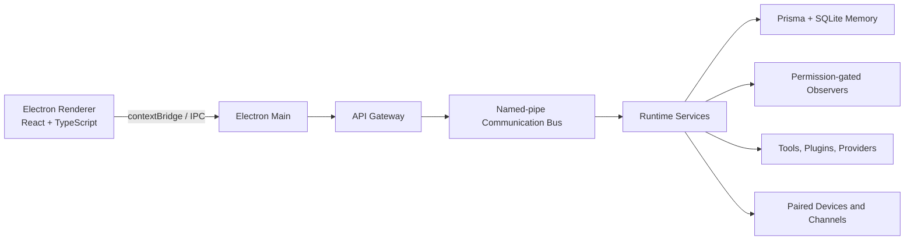

# Nova

> A local-first desktop AI agent platform built for permissioned automation, durable memory, and auditable execution.

[](https://github.com/vincenzo-afk/Nova-test/actions/workflows/ci.yml) [](LICENSE) [](https://www.typescriptlang.org/) [](https://www.electronjs.org/)

**Repository:** [github.com/vincenzo-afk/Nova-test](https://github.com/vincenzo-afk/Nova-test)

**Status:** Active development; version `0.1.0`

**License:** MIT

## Table of Contents

- [About the Project](#about-the-project)
- [Tech Stack](#tech-stack)
- [Getting Started](#getting-started)
- [Usage](#usage)
- [API and IPC Reference](#api-and-ipc-reference)
- [Project Structure](#project-structure)
- [Features and Roadmap](#features-and-roadmap)
- [Testing](#testing)
- [Deployment](#deployment)
- [Contributing](#contributing)
- [Security](#security)
- [License](#license)
- [Acknowledgments](#acknowledgments)

## About the Project

Nova is a local-first desktop agent platform. Its runtime coordinates planning, permission checks, tool execution, verification, memory persistence, knowledge retrieval, workflows, device capabilities, voice interaction, and operational recovery. The architecture is designed around explicit boundaries: the desktop renderer cannot access Node.js directly, permissions are visible before first-run interaction, and runtime messages carry versioned envelopes and correlation identifiers.

The repository is a TypeScript monorepo containing an Electron desktop shell, shared contracts, runtime services, memory persistence, filesystem observation, and a command-line surface. The project is structured so individual services can be tested independently while also being exercised through integration, simulation, chaos, filesystem E2E, performance-budget, and release-gate checks.

### Core capabilities

- Permission-first Electron desktop onboarding with local/cloud provider choice and a concrete demonstration task.
- In-app Provider Settings and Settings forms backed by the validated local configuration store for provider/model identifiers, vault references, routing policy, and visible personalization records with individual or full reset.
- Planner, executor, verifier, task-manager, priority/concurrency task scheduler, tool-registry, deterministic model routing, and resource-locking boundaries.
- An explicit `nova.workspace-code` CLI tool for approved script execution inside a configured workspace: it uses registered runtimes, canonical path containment, no shell, bounded output, timeouts, exit-code evidence, mandatory confirmation, and workspace locks; it does not execute free-form shell text.
- A real desktop Task Monitor backed by the authoritative TaskManager, with paginated task history, retry/waiting metadata, isolated IPC, and cancellation controls that distinguish cancellable queued states from unsupported running-process interruption.
- Task-bound Windows desktop-agent boundaries for one-shot screenshots, structured accessibility-state reads, and UI Automation `invoke`/`set_value` actions, with off-by-default `screen` and `desktop_control` permissions, immediate focus revalidation, post-action accessibility-state evidence, resource locks, bounded native execution, explicit destructive confirmation, and no raw-frame persistence. Live Windows validation remains deferred when no Windows host is connected; raw input, OCR, browser control, and continuous screen streaming are not included in this slice.
- Working, recent, and long-term memory persistence with SQLite and Prisma, workspace scoping, checksums, lineage, and schema-version controls.
- Filesystem observation with explicit permission gates, canonicalized security checks, caller-path-preserving Windows output, batching, hashing, and event delivery.
- A real event-based Windows clipboard observer using separate off-by-default `clipboard_metadata` and `clipboard_content` permissions, metadata-only downgrade behavior, sensitive-source exclusion, latest-state coalescing, task correlation, and task-bound normalized memory indexing without raw-content leakage.
- A real event-based Windows notifications observer using separate off-by-default `notifications_metadata` and `notifications_content` permissions, metadata-only downgrade behavior, sensitive messaging/authentication-source exclusion, task correlation, event coalescing, immediate revocation shutdown, and task-bound normalized Recent Memory indexing without unapproved body leakage. Live Windows validation remains deferred while no Windows host is connected.
- A real browser metadata observer using the off-by-default `browser_metadata` permission and a visible Manifest V3 extension. It observes tab open/close/activation/navigation metadata through Chrome Native Messaging and the local named-pipe API Gateway, accepts only normalized HTTP(S) domain/path URLs and bounded titles, applies persisted `permissions.browser_excluded_domains` before publication, coalesces per-tab state, and never captures page content, forms, passwords, payments, DOM state, screenshots, or browser automation. Chrome/Windows installation and live validation remain deferred while no Windows host is connected.
- A real keyboard activity observer using the off-by-default `keyboard_activity` permission. Its Windows bridge emits only active/idle transitions from `GetLastInputInfo` and explicitly registered `WM_HOTKEY` identities, while the ephemeral World Model exposes bounded engagement state. It has no keystroke-reading API, never records key codes, modifiers, entered text, or application content, and rejects unregistered or malformed native events. Live Windows validation remains deferred while no Windows host is connected.
- A real mouse activity observer using the off-by-default `mouse_activity` permission. Its Windows bridge emits only active/idle transitions from `GetLastInputInfo`; an authorized caller can request one bounded cursor-position read through `GetCursorPos`, but no continuous position, click, button, or movement history is published, persisted, or logged. Live Windows validation remains deferred while no Windows host is connected.
- Local privacy-safe structured diagnostics across the CommunicationBus, NamedPipe transport, API Gateway, permission store, orchestration, RuntimeApplication, and observers. Desktop logs are retained as bounded JSONL under the user data directory with UTC timestamps, severity, correlation IDs where applicable, stable event names, recursive redaction, and no default external telemetry. Tests can inject an in-memory sink.
- Knowledge graph, retrieval fusion, context building, workflows, plugins, configuration, credentials, setup, diagnostics, backup, restore, repair, and upgrade boundaries.
- A real Groq OpenAI-compatible LLM provider adapter with vault-reference credential resolution, authenticated model health checks, chat-completion translation, strict response validation, and compatibility with the deterministic provider router.
- Multi-agent coordination, authenticated network discovery, paired-device synchronization, distributed Full Peer task scheduling, and logical clocks.
- Streaming-aware voice pipeline contracts, barge-in cancellation, and 150 ms multi-device wake-claim coordination.
- Local IPC over platform-correct named pipes (including deterministic Windows named-pipe mapping and readiness handshake), a UI-facing API Gateway, authenticated REST task and memory-search boundaries, signed webhook delivery with retry/health handling, context-isolated Electron IPC, stable error codes, dead-letter recording, and release-blocking performance-budget evaluation.

### Architecture overview



## Tech Stack

| Area               | Verified technologies                                                                                                  |
| ------------------ | ---------------------------------------------------------------------------------------------------------------------- |
| Language           | TypeScript 5.x with strict compiler settings                                                                           |
| Desktop UI         | Electron, React 19, Vite, Tailwind CSS 4, Lucide, Motion                                                               |
| Runtime            | Node.js-compatible TypeScript services, Fastify-oriented service boundaries, Vitest                                    |
| Persistence        | SQLite through Prisma Client 6.19.3                                                                                    |
| Package management | pnpm 9.15.5 workspaces                                                                                                 |
| Validation         | Zod, TypeScript, ESLint 9, Prettier 3                                                                                  |
| Testing            | Vitest unit/integration tests and deterministic filesystem, simulation, chaos, performance, and desktop-boundary tests |
| IPC                | Named-pipe CommunicationBus with versioned message envelopes and an API Gateway                                        |
| Desktop security   | Electron `contextIsolation: true`, `nodeIntegration: false`, and sandboxed renderer configuration                      |

## Getting Started

### Prerequisites

Install the following before working on Nova:

- Node.js 22 or a compatible modern Node.js release supported by the repository toolchain.
- pnpm 9.15.5, as declared by the root `package.json` `packageManager` field.
- Git.
- A desktop environment capable of running Electron for desktop-shell development.

No API key or hosted service is required by the default repository test setup. The optional Groq provider requires an application-supplied credential resolver and an opaque vault reference; credentials are never accepted inline by the provider configuration. The Prisma schema defines `DATABASE_URL` for the memory datasource; the test preparation script supplies `file:./test.db` automatically for test runs.

### Installation

```bash
git clone https://github.com/vincenzo-afk/Nova-test.git
cd Nova-test
pnpm install --frozen-lockfile
```

Generate the Prisma client and run the full repository verification suite:

```bash
pnpm verify
```

The `verify` script runs documentation-link validation, formatting checks, ESLint, recursive TypeScript typechecking, and the test command. The test command prepares the SQLite test database, builds shared contracts, and runs Vitest.

### Windows source-checkout bootstrap

For a Windows source checkout, run the repository bootstrap command from the checkout root:

```powershell
pnpm install:windows
```

This command is deliberately a **bootstrap**, not a packaged Windows installer. It refuses to run on non-Windows hosts, installs the locked workspace dependencies, builds the Electron desktop package, and creates the user-scoped Nova data directories under `%LOCALAPPDATA%\\Nova`. It does not register a Windows service, install third-party software, delete data, download arbitrary files, or start observers. The packaged Windows installer and service-registration assets described by the deployment documentation are not present in this repository yet.

After the command completes, launch the desktop application from the built package or the development workflow. First launch must present the permission center; Nova must not begin source-specific observation or initial scanning until the user grants the corresponding permission. Initial discovery is limited to the explicitly approved folders and sources.

### Browser metadata extension

Build the visible extension artifacts with:

```bash
pnpm --filter @nova/browser-extension typecheck
pnpm --filter @nova/browser-extension build
```

The output is written to `apps/browser-extension/dist`. Install the extension through the browser’s unpacked-extension workflow, then install the Native Messaging host manifest from `dist/native-host/com.nova.browser.json` using an explicit Windows installation step. Replace `__NOVA_EXTENSION_ID__` with the installed extension ID and `__NOVA_NATIVE_HOST_PATH__` with the absolute host executable path; the repository’s source-checkout bootstrap intentionally does not claim to perform this registration. The extension requests only the Chrome `tabs` permission and has no content scripts. Page content, DOM automation, screenshots, and vision fallback are separate future slices, not hidden behavior of this surface. No live browser or Windows validation is claimed in the current sandbox.

### Local diagnostics

Desktop diagnostics are written locally to `<userDataPath>/logs/nova.jsonl` by the shared structured logger. The logger records lifecycle, permission, routing, execution, verification, observer, retry, recovery, and failure checkpoints using UTC JSONL records. It never logs secrets, credentials, raw action parameters, page content, entered text, keystrokes, clipboard or notification bodies, screenshots, or pipe paths. The file is automatically bounded to a seven-day default window and 10,000 records; diagnostic logs are not transmitted externally by default.

For focused logger tests, run:

```bash
pnpm exec vitest run packages/shared/test/structured-logger.test.ts packages/shared/test/communication-bus.test.ts packages/shared/test/named-pipe-bus.test.ts
```

### Desktop build

Build the Electron renderer and TypeScript desktop sources with:

```bash
pnpm --filter @nova/desktop build
```

For renderer-only development, the desktop package exposes:

```bash
pnpm --filter @nova/desktop dev
```

The current repository does not define a packaged installer or release command. Do not treat the Vite development server as a complete Electron distribution, and do not describe `pnpm install:windows` as a packaged installer.

### Configuration

The current repository has no committed `.env.example` file and no required application environment-variable inventory beyond the Prisma datasource contract. The Groq adapter is intentionally not coupled to a client-visible environment variable: a host or backend must resolve its configured opaque credential reference at call time. Capability/provider selections are stored as validated registry records, and provider credentials contain only opaque `vault_reference` values. Personalization is stored as visible `{ id, category, value, enabled, source, updated_at }` records in a `preferences` array; users can inspect, edit, or reset these records, and no model weights or hidden weighting are changed. Tests use an isolated SQLite file through `scripts/prepare-memory-test.mjs`:

```text
DATABASE_URL=file:./test.db
```

Do not commit `.env`, `.env.*`, database files, Prisma generated output, or build artifacts. The root `.gitignore` excludes these classes of files.

## Usage

### Run the verification workflow

```bash
pnpm verify
```

### Run individual checks

```bash
pnpm test
pnpm typecheck
pnpm lint
pnpm format:check
pnpm check:links
pnpm --filter @nova/desktop build
```

### Submit a desktop task

The renderer exposes the task submission boundary through the preload API. A desktop task request is routed from the renderer to Electron main, through the API Gateway, and onto the named-pipe CommunicationBus. The current task handler creates a task snapshot in the `Created` state; full planner/executor execution remains represented by the runtime service boundaries and their tests.

### Work with the runtime services

The runtime exports `GroqProvider` for the documented first cloud-provider path. Register it through `CapabilityRegistry` and `ProviderRouter` with a vault-backed `authReference` and resolver; do not place a Groq key in source, configuration, or renderer code. The adapter calls Groq's OpenAI-compatible `/models` health endpoint and `/chat/completions` endpoint only after resolving the credential at invocation time.

Runtime services are exported from their workspace package where a public package entry exists. Direct service tests are the authoritative executable examples for service contracts. The local `TaskScheduler` requires explicit concurrency and starvation-aging configuration, dispatches interactive/default/background work with FIFO tie-breaking, and delegates execution to the real runtime coordinator boundary. The distributed placement scheduler is exercised by:

```bash
pnpm exec vitest run services/runtime/test/task-scheduler.test.ts
pnpm exec vitest run services/runtime/test/distributed-scheduler.test.ts
```

## API and IPC Reference

Nova exposes a local authenticated REST task-lifecycle boundary and an internal IPC boundary. The full REST endpoint catalog and WebSocket streaming surface remain staged for subsequent runtime integrations.

### Local REST API

The runtime exports `PublicApiServer`, which binds to a configurable local HTTP address and implements the task lifecycle, memory-search, and tool-registration routes below. External consumers authenticate with an ephemeral locally issued bearer token scoped to the current OS-user session.

| Method  | Path                         | Required scope     | Behavior                                                                                                                                  |
| ------- | ---------------------------- | ------------------ | ----------------------------------------------------------------------------------------------------------------------------------------- |
| `POST`  | `/v1/tasks`                  | `task.submit`      | Validates the task body, propagates `x-correlation-id` or generates one, and returns the handler’s initial task snapshot with HTTP `202`. |
| `POST`  | `/v1/search`                 | `memory.read`      | Validates `query`, optional project/entity filters, and ISO time ranges before routing to the Retrieval Fusion handler.                   |
| `GET`   | `/v1/memory/{record_id}`     | `memory.read`      | Returns a single memory record with its documented provenance lineage, or a typed not-found response.                                     |
| `POST`  | `/v1/graph/query`            | `memory.read`      | Queries a graph node with explicit direction, optional ontology edge type, and bounded traversal depth from 1 to 3.                       |
| `GET`   | `/v1/permissions`            | `config.read`      | Returns the current `{ source, granted }` permission grants.                                                                              |
| `PATCH` | `/v1/permissions/{grant_id}` | `config.write`     | Treats `grant_id` as the permission source and updates its boolean `granted` value.                                                       |
| `GET`   | `/v1/config`                 | `config.read`      | Returns the complete versioned `NovaConfiguration` snapshot.                                                                              |
| `PATCH` | `/v1/config`                 | `config.write`     | Atomically updates one configuration section using `{ section, value }` and returns the updated snapshot.                                 |
| `POST`  | `/v1/events/subscribe`       | `network.external` | Registers an HTTPS/HTTP callback and topic set through the real WebhookManager boundary; returns HTTP `201` with registration metadata.   |
| `GET`   | `/v1/tasks/{task_id}`        | `task.read`        | Returns the current task snapshot or a typed not-found response.                                                                          |
| `GET`   | `/v1/tasks`                  | `task.read`        | Returns cursor-paginated task snapshots with `next_cursor` and `has_more`.                                                                |
| `POST`  | `/v1/tasks/{task_id}/cancel` | `task.cancel`      | Requests cancellation and returns the updated snapshot with HTTP `202`.                                                                   |
| `GET`   | `/v1/tools`                  | `tools.read`       | Returns cursor-paginated registered-tool metadata with `next_cursor` and `has_more`.                                                      |
| `POST`  | `/v1/tools/register`         | `tools.register`   | Registers a plugin tool through the same trust and validation boundary as built-in tools; returns HTTP `201`.                             |

The server uses the documented opaque cursor scheme with a default limit of 50 and a maximum of 200, clamps oversized limits, enforces a configurable per-token request limit, returns `401` for missing or invalid local tokens, `403` for insufficient scopes, `429` for rate-limit violations, and emits `x-nova-schema-version: 1.0.0` on responses.

### Electron preload API

The preload bridge exposes only the following renderer-safe operations:

| Operation                                     | Input                               | Purpose                                                                       |
| --------------------------------------------- | ----------------------------------- | ----------------------------------------------------------------------------- |
| `window.nova.submitTask(goal)`                | A task goal string                  | Submit a task request through Electron main and the API Gateway               |
| `window.nova.getPermissions()`                | None                                | Read current permission grants                                                |
| `window.nova.setPermission(source, granted)`  | Permission source and boolean grant | Update an explicit permission grant                                           |
| `window.nova.getConfig()`                     | None                                | Read the versioned local configuration snapshot                               |
| `window.nova.updateConfig(section, value)`    | Configuration section and value     | Atomically validate and persist an editable configuration section             |
| `window.nova.captureScreenshot(request)`      | Task-bound target and byte bound    | Request one permission-gated PNG frame; raw data is not persisted             |
| `window.nova.executeUiAction(request)`        | Task-bound structured UIA request   | Execute a focus-checked Windows UI Automation action through Runtime Executor |
| `window.nova.readAccessibilityState(request)` | Task-bound structured UIA target    | Read current name, control type, enabled/offscreen state, and value evidence  |

The renderer has no direct Node.js access. The main process uses `contextIsolation`, disables `nodeIntegration`, enables sandboxing, and routes core operations through the API Gateway. Desktop-agent requests are converted into `ExecutionStep` records and pass through ToolRegistry, PermissionManager, ResourceManager, Executor, and Verifier; the native PowerShell/C# bridge is never exposed to the renderer.

### Internal API Gateway operations

The API Gateway consumes `api.internal.request` envelopes and publishes correlated replies to the request’s `reply_to` topic.

| Operation                  | Current behavior                                                                              |
| -------------------------- | --------------------------------------------------------------------------------------------- |
| `task.submit`              | Returns a task snapshot with an ID, goal, and `Created` state                                 |
| `permissions.get`          | Returns the current permission-grant snapshot                                                 |
| `permissions.set`          | Updates a known permission source and returns the permission snapshot                         |
| `browser.activity.capture` | Validates and routes one bounded browser tab-metadata event through the permissioned observer |

Unknown operations return a typed `NOVA-TL004` error. Malformed routing fields return `NOVA-TL003`. Operation failures return retryable `NOVA-TL002` errors.

### Shared message envelope

Every CommunicationBus message includes `message_id`, `topic`, `schema_version`, `timestamp`, `correlation_id`, `source_service`, and `payload`. The named-pipe transport uses newline-framed JSON envelopes, topic subscriptions, consumer-side message-ID deduplication, and dead-letter recording for invalid frames or failed subscribers.

## Project Structure

```text
.
├── apps/
│   ├── browser-extension/    Visible Manifest V3 tab-metadata extension and Native Messaging host
│   ├── cli/                  CLI application workspace
│   └── desktop/              Electron main, preload, React renderer, and shell tests
├── packages/
│   └── shared/               Contracts, error codes, envelopes, buses, and lifecycle types
├── services/
│   ├── memory/               Prisma schema, SQLite persistence, and memory tests
│   ├── observers/            Permission-gated filesystem observer
│   ├── runtime/              Orchestration and runtime service boundaries
│   └── state/                State Manager service
├── docs/                     Normative architecture, product, security, testing, and operations docs
├── scripts/                  Documentation checks, test preparation, and Windows bootstrap script
├── IMPLEMENTATION_PLAN.md    Milestone plan and acceptance criteria
├── NOVA_SCREENS_AND_APP_FLOW.md  Desktop screen and interaction reference
├── package.json              Root scripts and workspace toolchain
├── pnpm-workspace.yaml       Workspace discovery configuration
└── vitest.config.ts          Test discovery configuration
```

The runtime workspace contains service-focused modules for orchestration, memory retrieval, workflows, plugins, providers, credentials, device pairing and sync, voice, channels, diagnostics, backup and restore, repair, networking, multi-agent coordination, distributed scheduling, and incident response.

## Features and Roadmap

### Implemented capabilities

- [x] Shared contracts, stable errors, message envelopes, lifecycle state, and in-memory/named-pipe communication buses.
- [x] Planner → permission → executor → verifier orchestration and task lifecycle management.
- [x] Memory persistence, filesystem observation, knowledge graph, retrieval fusion, and context building.
- [x] Electron security boundary, complete documented desktop navigation surface, and guided onboarding.
- [x] Plugin lifecycle, workflow DAG execution, provider/configuration/credential boundaries, setup wizard, and diagnostics.
- [x] Device pairing, sync, session continuity, network discovery, distributed task scheduling, logical clocks, and Android companion permissions.
- [x] Voice pipeline, streaming-oriented contracts, barge-in, and multi-device wake-claim coordination.
- [x] Backup, isolated restore, upgrades, conservative repair, resource arbitration, incident lifecycle, runbooks, and CLI boundaries.
- [x] Performance-budget evaluation, signed webhook delivery, recorded-replay simulation, chaos recovery, filesystem E2E, desktop preload, and documentation-link verification.

### Changelog

See [CHANGELOG.md](CHANGELOG.md) for the current release history.

### Known limitations and next work

- The repository is currently version `0.1.0`. `pnpm install:windows` is a non-destructive source-checkout bootstrap; a packaged Electron installer, Windows service registration, signing, and release workflow remain separate work.
- The runtime now exposes a real `RuntimeTaskCoordinator`, local `TaskScheduler`, and `RuntimeApplication` composition root for Planner → Permission Manager → Executor → Verifier execution, priority/concurrency dispatch, correlated task-progress events, configuration, webhook, REST, and WebSocket services. Electron main now instantiates that shared runtime through `createDesktopRuntime`; the renderer refreshes authoritative task status through the isolated preload bridge; and the desktop host creates a stable per-user workspace UUID, applies packaged Prisma migrations to `memory/structured/nova.db`, injects `TaskCheckpointStore`, and restores checkpoints before opening listeners. Full capability registration and a packaged installer/release workflow remain subsequent integration work.
- The REST server currently implements task submission, task status lookup, cursor-paginated task listing, task cancellation, memory search, memory record lookup with lineage, bounded Knowledge Graph traversal queries, permission listing and updates, configuration listing and section-level updates, cursor-paginated tool listing, plugin-tool registration, and webhook registration through the real WebhookManager boundary. The runtime also provides the authenticated WebSocket event transport at `/v1/events` with live CommunicationBus delivery, topic authorization, bounded replay, and backpressure handling.
- Hosted sync and third-party channel deployments are represented by documented service boundaries rather than a production hosted service in this repository.
- Hardware model installation and speech-provider binaries are not bundled by the repository.

## Testing

The repository uses Vitest for executable tests and Prisma-generated SQLite clients for memory tests. Run the complete suite with:

```bash
pnpm test
```

Run every local release gate with:

```bash
pnpm verify
```

The verification surface includes unit tests, integration pipelines, recorded-replay simulations, runtime chaos recovery, performance-budget evaluation, real temporary-filesystem E2E behavior, Electron preload-boundary tests, recursive typechecking, ESLint, Prettier, explicit documentation-link validation, and the Electron production build.

The repository currently contains 57 test files and 222 passing tests in the maintained workspace. Test counts are expected to change as features evolve; the command output is authoritative.

## Deployment

There is no Dockerfile, Kubernetes manifest, packaged installer, Windows service-registration asset, or hosted deployment configuration in the current repository. Nova is developed as a local-first desktop application. The Windows source-checkout bootstrap is intended for development and verification only; a production deployment or release process should be added only after the target operating systems, packaging format, signing requirements, update channel, and runtime model-distribution strategy are selected.

For local validation, use the Electron production build command:

```bash
pnpm --filter @nova/desktop build
```

## Contributing

Nova is maintained as a solo repository by [vincenzo-afk](https://github.com/vincenzo-afk). Contributions are welcome through focused pull requests or reproducible GitHub issues, but the maintainer may also push direct changes to `main` while the project is in active development.

Before opening a pull request, run:

```bash
pnpm verify
pnpm --filter @nova/desktop build
```

Use a focused branch name such as `feat/<short-name>`, `fix/<short-name>`, `docs/<short-name>`, or `chore/<short-name>`. Prefer Conventional Commit subjects such as `feat:`, `fix:`, `test:`, `docs:`, and `chore:`. Every behavioral change should include tests, and documentation should be updated when a contract changes.

## Security

Nova’s security boundaries include permission-first onboarding, explicit observer grants, Electron context isolation, disabled renderer Node integration, sandboxing, stable typed errors, credential-store boundaries, encrypted-backup boundaries, authenticated network discovery, and documentation-link validation.

Please report a suspected vulnerability privately through [GitHub’s security advisory form](https://github.com/vincenzo-afk/Nova-test/security/advisories/new) rather than publishing exploit details in an issue. Until the first stable release, the `main` branch is the supported development target; older commits and branches are not maintained as supported versions.

Do not place access tokens, API keys, private credentials, database files, or generated build artifacts in commits. The repository’s ignore rules cover common environment files, SQLite files, Node dependencies, coverage output, TypeScript build metadata, and distribution output.

## License

Nova is licensed under the [MIT License](LICENSE). The repository’s license notice identifies the copyright holder as **BHARANI KUMAR S**.

## Acknowledgments

The repository is authored and maintained by [vincenzo-afk](https://github.com/vincenzo-afk). The project uses and acknowledges TypeScript, Electron, React, Vite, pnpm, Prisma, SQLite, Zod, Vitest, ESLint, Prettier, Fastify-oriented service boundaries, and the broader open-source ecosystem that makes local-first desktop development possible.

## Back to Top

[Back to top](#nova)

---

Built with TypeScript, Electron, and a permission-first local-first architecture by [vincenzo-afk](https://github.com/vincenzo-afk).
