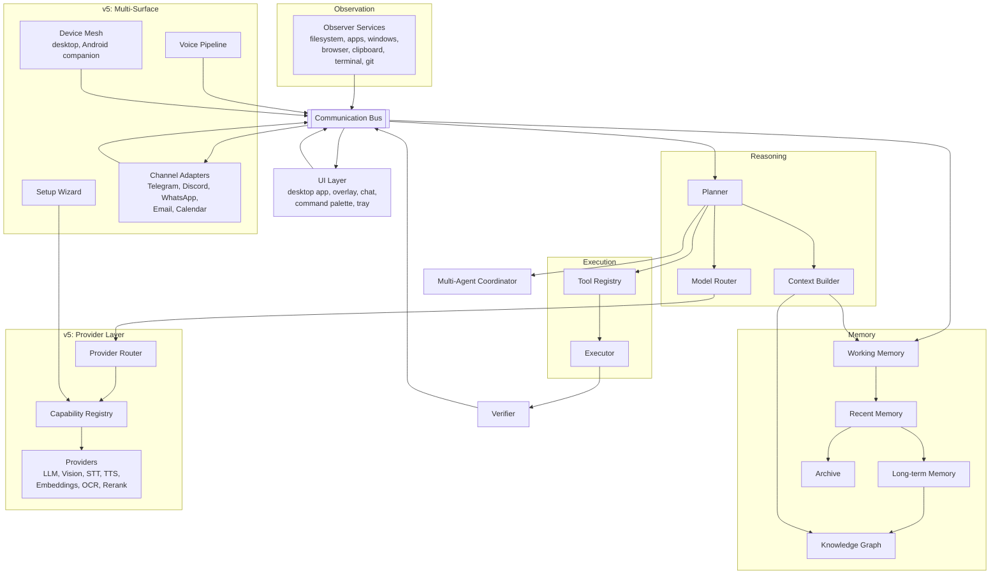

# Architecture Summary

## Purpose

A single-page map of the whole system for readers who need the shape of
NOVA before descending into `docs/02-architecture/` (Tier 2) for full
detail. This document is intentionally shallow; it must never contain a
fact that isn't also stated, with more depth, in a Tier 2/3 document.

## Scope

High-level structure only: services, data flow, execution priority, and
memory tiers. Internal algorithms, schemas, and failure handling live in
the Tier 2/3 documents this one links out to.

## System diagram

## Core services (full detail in `docs/02-architecture/service-architecture.md`, Tier 2)

| Service | Responsibility |
|---|---|
| Observer | Captures filesystem, application, window, browser, clipboard, terminal, and git events, with per-source user permission |
| Memory | Owns the working/recent/long-term/archive tiers and their promotion rules |
| Knowledge Graph | Owns the fixed-schema entity/relationship store |
| Planner | Converts a goal into a plan, deciding at each step whether deterministic execution or an LLM call is required |
| Model Router | Selects which AI provider/model handles a given LLM call, deterministically (not via another LLM call) |
| Tool Registry | Holds every available tool/integration, tagged by execution tier and risk tier |
| Executor | Carries out the selected tool call and returns structured results |
| Verifier | Confirms, from ground-truth signals wherever possible, whether the action's intended outcome actually occurred |
| API Gateway | Exposes the REST/WebSocket/SDK surface described in `docs/08-api/` (Tier 3) |
| UI Layer | Desktop app, overlay, chat, command palette, and tray — all backed by the same runtime |

### v5 additions (full detail in `docs/18-providers/`, `docs/19-setup/`, `docs/20-devices/`, `docs/21-channels/`, `docs/22-voice/`, `docs/23-autonomy/`, `docs/24-collaboration/`)

| Service | Responsibility |
|---|---|
| Capability Registry | Tracks every capability domain and its configured providers (`docs/18-providers/capability-management.md`) |
| Provider Router | Selects the active provider for any capability domain — the LLM Model Router generalized (`docs/18-providers/provider-routing.md`) |
| Setup Wizard | First-run and re-entrant configuration of every capability (`docs/19-setup/setup-wizard.md`) |
| Device Mesh | Multi-device pairing, sync, and remote control (`docs/20-devices/multi-device-architecture.md`) |
| Channel Adapters | Normalizes messaging platforms, email, and calendar into the same request pipeline as any other tool (`docs/21-channels/`) |
| Voice Pipeline | Wake word, streaming STT/TTS, barge-in (`docs/22-voice/voice-assistant.md`) |
| Multi-Agent Coordinator | Spawns and merges concurrent agent instances for parallelizable tasks (`docs/24-collaboration/multi-agent-collaboration.md`) |

Each service is independently deployable and communicates only over the
Communication Bus — no service calls another directly (Principle 3,
`design-principles.md`). This is unchanged by the v5 additions: every new
component above is a bus participant, not a direct-call shortcut.

## Execution priority (full detail in `docs/06-tools/execution-priority.md`, Tier 2)

Native Runtime → Internal Functions → API → MCP → CLI → Accessibility APIs
→ Vision → Keyboard/Mouse. Vision and Keyboard/Mouse exist from v1 but are
never the first method attempted for a task a higher tier can complete.

## Memory tiers (full detail in `docs/04-memory/memory-architecture.md`, Tier 2)

Working Memory → Recent Memory → Long-term Memory → Knowledge Graph →
Archive, queried through weighted retrieval fusion rather than a single
fixed order.

## Related documents

- `vision.md`, `design-principles.md` — why the system is shaped this way
- `docs/02-architecture/system-architecture.md` — full system architecture
  (Tier 2)
- `docs/03-runtime/` — per-service internal design (Tier 2)
- `docs/04-memory/` — memory and knowledge graph detail (Tier 2)
