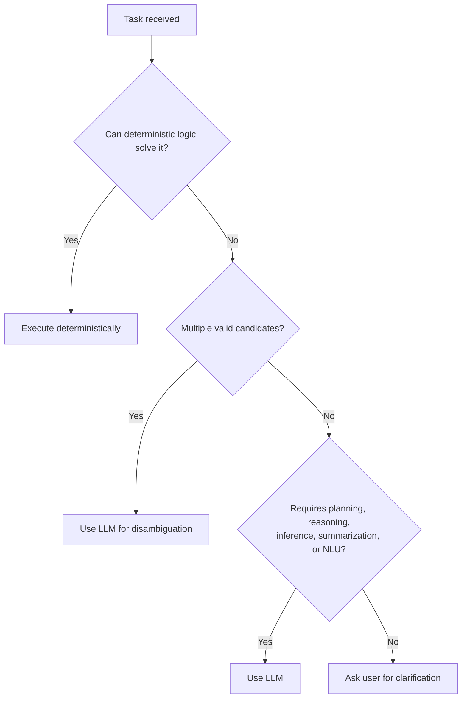

# Design Principles

## Purpose

Five principles that every architectural decision in this repository must
satisfy. Where a design choice in any other document appears to conflict
with one of these, either the design is wrong or this document needs an
ADR to change — informal drift is not acceptable, because these principles
are the mechanism that keeps the system's risk, cost, and complexity
bounded as it grows.

## Scope

Applies to all components, all phases, without exception.

## The five principles

### 1. Deterministic Before Intelligent

For every task, NOVA prefers deterministic computation over AI reasoning.
An LLM is invoked only when deterministic execution cannot produce a
single, high-confidence result. This is listed first because it is not
just another principle alongside the other four — it is the filter that
keeps the other four cheap, fast, and debuggable in practice. Without it,
"risk-based execution" and "memory-first design" would still be
architecturally correct but would be slow and expensive to operate.

Concretely:

Examples: "git status" is always deterministic. "Summarize this project"
always requires an LLM. "Find my resume" is deterministic search first; an
LLM is only invoked to rank ambiguous candidates, or the user is asked
directly if confidence remains too low even after that. Full specification
in `docs/05-ai/deterministic-first.md` and `docs/05-ai/ambiguity-resolution.md` (Tier 2).

### 2. Observe → Remember → Reason → Act → Verify

Every task, regardless of complexity, moves through this same five-stage
loop (see `vision.md`). No component is permitted to act without having
gone through the reasoning and memory stages first, and no action is
considered complete until it has been verified — a "silent" action with no
verification step is a defect, not an acceptable shortcut.

### 3. Modular Runtime Architecture

The system is built as independently deployable services (Observer,
Memory, Knowledge Graph, Planner, Runtime, Executor, Verifier, API Gateway,
Registry, Communication Bus, UI — see
`docs/02-architecture/service-architecture.md`, Tier 2) communicating
asynchronously over a message bus. A crash or slowdown in one service must
not take down or block the others. This principle exists so that the
system's most experimental, least mature component (currently, vision-based
execution) can fail without degrading the components that are already
reliable (observation, memory, retrieval).

### 4. Risk-Based Execution

Every action is classified into a risk tier — read-only, reversible-write,
or destructive/irreversible — before it is executed, and the confirmation
requirements and available execution methods scale with that tier. This
principle exists specifically because the execution-priority chain
(Native Runtime → ... → Vision → Keyboard/Mouse, see
`docs/06-tools/execution-priority.md`) on its own does not distinguish
between a safe action that happens to fall to a low-priority tier and a
dangerous one — risk tiering is the independent axis that prevents the
priority chain from being treated as a blanket safety guarantee.

### 5. Memory-First Design

Reasoning and action are informed by structured memory and the knowledge
graph before any new information is requested from the user or inferred
fresh. A stated preference, a past decision, or a previously resolved
ambiguity must never be re-derived or re-asked if it is already
in memory with sufficient confidence (see
`docs/04-memory/memory-ranking.md`, Tier 2, for how confidence is scored).

## How these interact

These principles are not independent — they are ordered so that each
later one operates inside the boundary the earlier ones set:

- Modularity (3) contains the blast radius when Risk-Based Execution (4)
  or Deterministic Before Intelligent (1) get something wrong in one
  service.
- Memory-First Design (5) reduces how often Deterministic Before
  Intelligent (1) needs to fall through to an LLM call at all, because
  many "ambiguous" situations are already resolved in memory.
- Risk-Based Execution (4) is what makes Observe → Remember → Reason → Act
  → Verify (2) safe to run autonomously rather than requiring a human in
  the loop for every single action.

## Related documents

- `vision.md` — the identity these principles operationalize
- `docs/05-ai/deterministic-first.md`, `docs/05-ai/ambiguity-resolution.md`
  — full specification of Principle 1 (Tier 2)
- `docs/02-architecture/service-architecture.md` — full specification of
  Principle 3 (Tier 2)
- `docs/10-security/permissions.md` — full specification of Principle 4
  (Tier 3)
- `docs/04-memory/memory-architecture.md` — full specification of
  Principle 5 (Tier 2)
