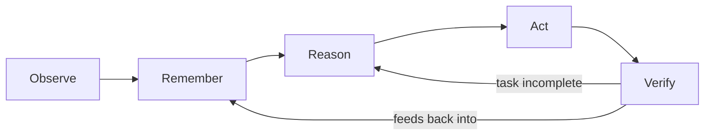

# Vision

## Purpose

This document defines what NOVA fundamentally is, states its identity in a
form that cannot drift as individual features are added, and gives every
other document in this repository a single reference point to check
against: does this proposed component serve the vision below, or is it
scope creep?

## Scope

Applies to the entire project. Every architectural decision, feature, and
document in this repository must be traceable back to this vision. Where a
proposal conflicts with it, the proposal is wrong, not this document —
changing this document requires an ADR (`docs/15-decisions/`), not a
feature branch.

## Statement of identity (v5)

> NOVA is a persistent AI runtime that lives across the user's devices —
> PC, phone, and the channels the user already communicates through —
> continuously understands the user's digital life, remembers everything
> important, reasons over it, and safely performs tasks on the user's
> behalf, through voice or text, proactively or on request — preferring
> deterministic computation over AI reasoning whenever a task can be
> solved without it, and preferring a local, private path over a cloud
> one wherever the user has configured that preference.

This statement, ratified by
`docs/15-decisions/adr-0008-v5-architecture-evolution.md`, extends the
original v1 identity ("lives on the user's PC") to the multi-device,
multi-channel reality specified in `docs/20-devices/` and `docs/21-channels/`. The core loop below, and the deterministic-first
preference, are unchanged — what changed is the number of surfaces that
loop now runs across.

NOVA is explicitly **not**:

- A chatbot (chatbots know only the current conversation)
- A generic automation/RPA tool (automation tools execute predefined
  workflows; NOVA plans against unstructured goals)
- An AI coding assistant (coding assistants operate inside one editor on
  one codebase; NOVA's scope is the entire workspace)
- An operating system (NOVA runs on top of one, using its existing
  primitives — it does not replace the kernel, filesystem, or process
  model; this holds even where the phone becomes a primary interaction
  terminal, per `docs/20-devices/ai-phone.md` — NOVA remains the phone's
  assistant layer, not a replacement for Android itself)

See `non-goals.md` (v2) for the complete, explicit boundary, including
which v1 exclusions this revision repealed or narrowed.

## The core loop

Every interaction with NOVA, regardless of the specific task, executes the
same five-stage loop. This loop is the thing that makes NOVA one coherent
system rather than a collection of unrelated features.

- **Observe** — continuously and, with permission, passively perceive the
  state of the user's workspace (files, apps, windows, browser, clipboard,
  terminal, git, containers).
- **Remember** — convert observations into structured, queryable memory
  across working, recent, and long-term tiers, plus a fixed-schema
  knowledge graph.
- **Reason** — given a user goal, determine whether it can be solved
  deterministically; only invoke an LLM when the ambiguity-resolution
  criteria in `docs/05-ai/ambiguity-resolution.md` are met.
- **Act** — execute using the lowest-risk, most reliable method available,
  following the execution-priority chain in
  `docs/06-tools/execution-priority.md`.
- **Verify** — confirm, using ground-truth signals wherever possible, that
  the action actually produced the intended outcome, rather than assuming
  success.

## Why this exists

Existing tools each solve one slice of this loop in isolation: memory
tools remember but don't act; automation tools act but don't remember or
reason about ambiguity; coding assistants reason but are scoped to one
application. NOVA's reason for existing is combining all five stages into
one runtime that shares a single, consistent model of the user's
workspace — not adding a sixth isolated tool to the pile.

## Related documents

- `goals.md` — what "success" looks like concretely, by phase
- `non-goals.md` — the explicit boundary of what NOVA does not do
- `design-principles.md` — the five principles that operationalize this
  vision into architectural rules
- `architecture-summary.md` — how the five-stage loop maps to actual
  services
