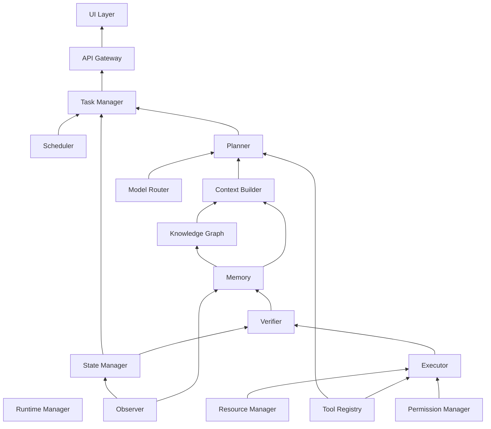

# Dependency Map

## Purpose

Makes the dependency relationships implied throughout `docs/02-architecture/` and `docs/03-runtime/` explicit and singular, so that
startup order (`lifecycle.md`), failure-domain reasoning
(`service-architecture.md`), and build/test sequencing
(`docs/14-development/implementation-order.md`, Tier 3) all reference the
same authoritative graph rather than each re-deriving it.

## Scope

Service-level dependencies only (which services must be available for
another to function correctly). Does not cover build-time code
dependencies, which belong to `docs/14-development/` (Tier 3).

## Dependency graph

Read the arrows as "depends on" pointing toward the dependency (e.g.,
Context Builder depends on both Memory and Knowledge Graph).

## Startup-order consequence

`lifecycle.md`'s startup sequence is a topological sort of this graph:
Memory and Knowledge Graph before Observer's output has anywhere useful to
go; State Manager before Task Manager; Context Builder, Model Router, and
Tool Registry before Planner; Resource Manager and Permission Manager
before Executor.

## Failure-domain consequence

A service failure degrades only its downstream dependents in this graph,
per Principle 3. Concretely: Model Router failing degrades only tasks that
reach the Planner's LLM-required branch (per
`docs/05-ai/deterministic-first.md`) — it does not affect Observer, Memory,
Knowledge Graph, or purely deterministic task execution, since none of
those depend on Model Router in the graph above.

## Circular-dependency rule

No cycle is permitted in this graph. Where two services appear to need
each other (e.g., Verifier needing State Manager's current view, and State
Manager potentially needing Verifier's outcome to update that view), the
relationship is resolved by direction of data flow at a point in time, not
mutual dependency: Verifier reads State Manager's current state as an
input, and any state change Verifier's outcome causes flows through Memory
and back to State Manager via the normal Observer/event path, not a direct
callback.

## Related documents

- `lifecycle.md` — the startup sequence derived from this graph
- `service-architecture.md` — the responsibilities of each node above
- `docs/14-development/implementation-order.md` (Tier 3) — build-time
  sequencing informed by this same graph
- `docs/02-architecture/dependency-graph.json` — a machine-readable
  derivative of this exact graph, for an AI agent to programmatically
  verify a new dependency doesn't introduce a cycle before writing code
  against it. This document remains canonical; the JSON file must be
  updated to match in the same change if this graph changes.
