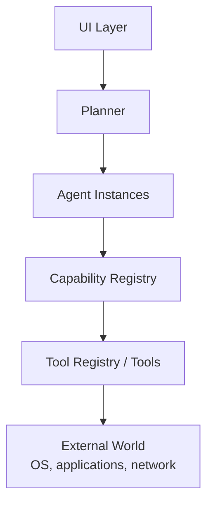

# Dependency Rules and Layer Boundaries

## Purpose

Defines the *allowed direction* of dependency between architectural
layers — as distinct from `docs/02-architecture/dependency-map.md`,
which documents actual service startup dependencies. This document is a
design rule enforced at code-review time (`docs/14-development/module-checklist.md`): which layer may call, import, or depend on which
other layer, and which interactions are explicitly forbidden regardless
of whether they would technically work.

## Scope

Layer-to-layer dependency direction and forbidden interactions. Specific
service-to-service startup ordering is `docs/02-architecture/dependency-map.md`; this document is about architectural layering, a
different and complementary axis.

## Layer stack and allowed dependency direction

Dependency flows strictly downward. A layer may depend on the layer(s)
below it; it must never depend on a layer above it. Memory
(`docs/04-memory/`) is the one explicit exception to strict layering — it
is read by many layers (UI, Planner, Agent instances, Tool execution
results feeding back into it) rather than sitting at one point in this
stack, consistent with `docs/00-overview/ownership-boundaries.md`'s note
that ownership of writes does not imply exclusive read access.

## Forbidden interactions

- **UI Layer never imports or calls the Planner directly.** All UI-
  initiated task requests pass through the API Gateway
  (`docs/08-api/internal-api.md`), never a direct in-process call —
  this is also what the process-isolation model in
  `docs/10-security/sandboxing.md` structurally enforces, since the UI
  Layer is a separate, unprivileged process.
- **Tools never call the Planner.** A tool's structured result
  (`docs/06-tools/tool-interface.md`) is returned to the Executor, which
  reports to the Planner — a tool implementation has no reference to or
  awareness of the Planner and cannot trigger planning itself.
- **Agent instances never modify Planner decisions after the fact.** An
  agent instance executes the scope it was configured with
  (`docs/05-ai/planner-agent.md`); it reports outcomes back for the
  Planner to act on, but does not reach backward into the Planner's plan
  state to alter already-decided steps.
- **Plugins never bypass the permission system.** Per
  `docs/16-extensibility/plugin-permissions.md`, a plugin's tools are
  gated by the Permission Manager exactly as any other tool — there is
  no plugin-specific execution path that skips this layer.
- **The Capability Registry never calls a tool directly.** It is a
  lookup/metadata layer (`docs/05-ai/capability-registry.md`); actual
  invocation happens through Tool Selection and the Executor.

## Why this is enforced as a rule, not left to convention

Without an explicit, checked rule, dependency direction tends to drift
toward "everything talks to everything" as convenience shortcuts
accumulate under time pressure — exactly the failure mode this document
exists to prevent. `docs/14-development/module-checklist.md` includes a
check for layer-violating imports/calls as part of standard pull request
review, treating a violation the same as any other architecture-rules
violation (`docs/14-development/architecture-rules.md`).

## Relationship to Ownership Boundaries

`docs/00-overview/ownership-boundaries.md` states *who* is authoritative
for a responsibility; this document states the *direction* dependencies
must flow to respect that ownership — a component that is not the owner
of a responsibility must depend on the owner, never the reverse.

## Related documents

- `docs/02-architecture/dependency-map.md` — the analogous service
  startup-order dependency graph (a different axis from layering)
- `docs/00-overview/ownership-boundaries.md` — the ownership model this
  dependency direction respects
- `docs/14-development/module-checklist.md` — where layer violations are
  checked at review time
