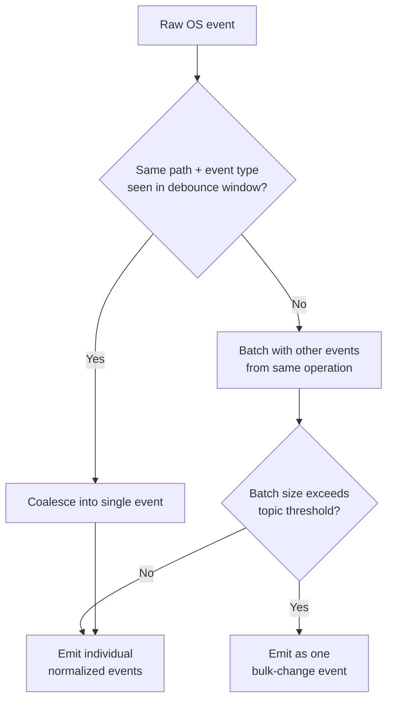

# Event-Driven Architecture

## Purpose

Defines the event model NOVA uses to propagate observed changes through
the system, and specifically how event storms (e.g., a large git clone
producing tens of thousands of filesystem events) are handled without
degrading the rest of the system.

## Scope

Event taxonomy, ordering guarantees, and storm-handling mechanisms. The
step-by-step pipeline a single event travels through is in
`execution-pipeline.md`; the transport itself is in
`communication-model.md`.

## Event taxonomy

Every event belongs to one of these categories, each with its own topic
namespace on the Communication Bus:

- **Observation events** (`observer.*`) — file created/modified/deleted/
  moved/renamed, app installed/removed/launched/closed, window opened/
  closed/focused, git repository state changed, container started/
  stopped, clipboard changed, browser tab changed.
- **Task events** (`task.*`) — task queued, planning started, step
  executed, step verified, task completed/failed/unverified/cancelled.
- **Memory events** (`memory.*`) — record written, promoted between
  tiers, archived, deleted.
- **System events** (`system.*`) — service started/stopped/crashed,
  resource threshold exceeded.

## Ordering guarantees

Ordering is guaranteed only within a single topic and single source
service — e.g., filesystem events for one specific file are delivered in
the order they occurred. Ordering across different topics or different
source services is not guaranteed and must not be assumed by any consumer;
where cross-topic causal order matters, the `correlation_id` in the
message envelope (`communication-model.md`) is the mechanism for
reconstructing it, not arrival order.

## Handling event storms

A single filesystem operation (cloning a repository, extracting an
archive) can generate a very large number of raw OS-level events in a
short window. The Observer applies the following before anything reaches
the bus, using the canonical 250ms debounce window and 50-event batch
threshold defined in `docs/26-system-reference/
19-ordering-concurrency-and-retry-rules.md`'s Coalescing, debounce, and
conflict windows section:

This means a 50,000-file git clone produces one `observer.filesystem.bulk_change` event referencing the operation and its scope, rather than
50,000 individual events — Memory and Knowledge Graph consumers handle
bulk-change events with a dedicated, more efficient ingestion path (see
`docs/04-memory/indexing.md`) rather than processing each file
individually.

## Backpressure

If, despite coalescing and batching, a topic's queue still exceeds its
configured depth limit, the topic's overflow policy
(`communication-model.md`) determines behavior — for observation topics,
the default is to drop the oldest queued events for that specific path in
favor of the most recent state, since for filesystem/window observation
the current state matters more than a complete history of every
intermediate state during a burst.

## Event priority

Not every topic is equal-priority for delivery ordering under load. Task-
related topics (`task.*`) and system topics (`system.*`) are delivered
ahead of observation topics (`observer.*`) when the bus is under
sustained backpressure, since a delayed task-state update directly
degrades the user-facing experience described in
`docs/09-ui/task-monitor.md`, whereas a delayed observation event only
delays when that information becomes searchable — a delay tolerable for
background indexing but not for an in-progress task the user is actively
watching. Priority is a delivery-ordering hint under contention, not a
guarantee that lower-priority topics are ever dropped outright outside
the overflow policy above.

## Priority inversion prevention

A high-priority message (e.g., a `task.*` update) must never be blocked
behind a lower-priority message's processing purely because they share a
consumer or resource — this is prevented by processing high-priority
topics on a dedicated consumer path, independent of the queue depth on
lower-priority topics, rather than a single shared queue where a burst of
low-priority observation events could delay a high-priority task update
simply by being ahead of it in one combined queue.

## Deduplication

Consistent with `communication-model.md`'s at-least-once delivery model,
every consumer deduplicates by `message_id`. For observation topics
specifically, an additional semantic deduplication applies: two raw OS
events describing the same logical change (e.g., a save operation that
fires both a modify and a metadata-update event in quick succession) are
coalesced by the debounce step above before a `message_id` is even
assigned, distinct from `message_id`-based deduplication of an
already-emitted event's redelivery.

## Related documents

- `communication-model.md` — the transport and envelope this event model
  runs on
- `execution-pipeline.md` — the full pipeline a single event or task
  travels through end to end
- `docs/04-memory/indexing.md` — how bulk-change events are ingested
  differently from individual events
