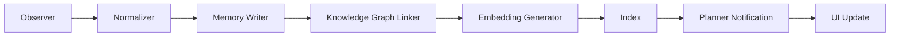
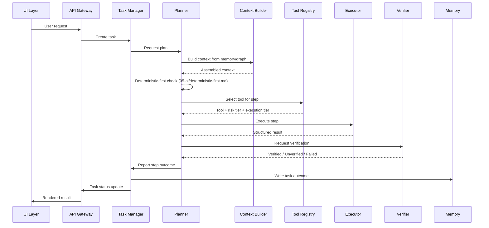

# Execution Pipeline

## Purpose

Traces the complete, end-to-end path of both an observation and a user
task through the system, tying together the individual service
descriptions in `service-architecture.md` into one concrete sequence.

## Scope

Two pipelines: the observation-to-memory pipeline (always running) and the
request-to-verified-result pipeline (triggered per user task). Internal
logic of each stage is documented in its owning service's page.

## Observation pipeline

This pipeline runs continuously and asynchronously, independent of any
user request in flight. Every stage is idempotent with respect to
`message_id` (`communication-model.md`) so that a service restart mid-
pipeline does not corrupt or duplicate memory records.

## Request-to-result pipeline

Each step in the loop above may repeat (replanning) if verification
reports Unverified or Failed and the Planner determines recovery is
possible — see `docs/03-runtime/planner.md` and `docs/03-runtime/verifier.md`.

## Where risk-tier gating enters the pipeline

Between Tool Registry returning a tool and Executor being invoked, the
Permission Manager (`docs/03-runtime/permission-manager.md`) checks the
tool's declared risk tier and either allows execution to proceed
immediately, requires explicit user confirmation before proceeding, or
requires multi-step confirmation for critical-risk actions — this gate is
not optional and cannot be skipped by any caller, including the Planner
itself.

## Where the deterministic-first check enters the pipeline

The Planner's deterministic-first check happens before tool selection is
even requested from the Tool Registry for LLM-oriented tools — if a task
can be resolved by a deterministic function, the pipeline shortcuts
directly from Planner to Executor for that step without involving Context
Builder or the Model Router at all, which is why the "proportion of tasks
resolved without any LLM call" metric in
`docs/01-product/success-metrics.md` is measurable directly from pipeline
traces.

## Related documents

- `service-architecture.md` — the services referenced in the diagrams
  above
- `event-driven-architecture.md` — the event model underlying the
  observation pipeline
- `docs/03-runtime/planner.md`, `verifier.md` — full internal detail of
  the two most complex stages
