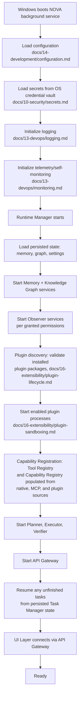

# System Lifecycle

## Purpose

Defines what happens when NOVA starts, stops, sleeps, wakes, or recovers
from an unclean shutdown, at the system level. Per-service startup/
shutdown detail is in `docs/03-runtime/service-lifecycle.md`; this
document covers the system-wide sequence and state-recovery guarantees.

## Scope

System-level lifecycle events: install-time first start, ordinary start/
stop, OS sleep/wake, reboot, and crash recovery.

## Startup sequence

Services start in dependency order derived from `docs/02-architecture/dependency-map.md` —
Memory and Knowledge Graph must be available before Observer begins
emitting events that expect to be written somewhere, and before Planner
can build context. Plugin discovery and capability registration happen
after Observer startup but before the Planner starts, since the Planner
depends on a fully populated Tool Registry and Capability Registry
(`docs/05-ai/capability-registry.md`) being available the moment it can
receive its first task — a Planner accepting work before capability
registration completes would risk failing to find a capability that is,
in fact, available but not yet registered. Configuration, secrets,
logging, and telemetry are the earliest steps specifically because every
later step depends on being able to read its own configuration, resolve
credentials, and emit diagnostics if something goes wrong during its own
initialization.

## Per-step startup timeout

Every step in the sequence above has a configured maximum duration. A
step exceeding its timeout is treated identically to a step-level failure
in `docs/03-runtime/failure-recovery.md`'s taxonomy — most commonly
**Internal** (something is wrong with NOVA's own initialization) or
**External** (a dependency like the credential vault is unreachable) —
and triggers the retry/partial-startup handling below rather than hanging
indefinitely.

## Retries during startup

A step that fails during startup (e.g., Memory service fails to open its
storage engine) is retried with the same backoff policy used for service
restarts generally (`docs/03-runtime/runtime-manager.md`'s exponential
backoff), up to the same restart-count ceiling before being treated as a
persistent failure.

## Partial startup / failed initialization

If a non-critical service fails to start after exhausting retries (e.g.,
a single Observer source, or the Plugin Manager), NOVA does not abort
startup entirely — it proceeds in a **degraded** state, per
`docs/03-runtime/service-lifecycle.md`'s state machine, with the failed
service marked `Failed` and surfaced via the Tray status indicator
(`docs/09-ui/tray.md`). If a **critical** service fails (Memory, Runtime
Manager itself, or the Communication Bus), startup does not proceed to a
degraded state — it aborts, logs the failure, and the Windows Service
Control Manager's restart policy (`docs/13-devops/deployment.md`)
governs the next attempt, since a system with no working memory layer has
no safe degraded mode to offer.

## Shutdown sequence

Reverse of startup: API Gateway stops accepting new requests first, the
Planner is given a bounded window to bring in-flight tasks to a safe
pause point (not necessarily completion — see
`docs/03-runtime/task-manager.md` for what "safe pause" means per task
state), Executor and Observer stop, and finally Memory and Knowledge Graph
flush any pending writes before the Runtime Manager exits.

## Unclean shutdown / crash recovery

If NOVA's process tree terminates without going through the shutdown
sequence (power loss, forced termination), the next startup performs:

1. Integrity check of the memory and graph storage (see
   `docs/04-memory/memory-storage.md`); a failed check triggers restore
   from the most recent valid snapshot (`docs/13-devops/backup.md`,
   Tier 3).
2. Recovery of Task Manager state: any task that was in `executing` or `verifying` state at crash time is marked `unverified` on restart,
   never silently assumed complete or silently dropped — this is a direct
   consequence of the Task Success Score definition in
   `docs/01-product/success-metrics.md`, which treats unverifiable outcomes
   as failure, not success.
3. Re-validation of world-model state (`docs/03-runtime/world-model.md`),
   since the actual OS state may have changed while NOVA was down in ways
   the last-known snapshot does not reflect.

## Sleep/wake and fast user switching

On OS sleep, Observer services pause event capture rather than continuing
to poll; on wake, each Observer performs a differential re-scan of its
source rather than assuming no changes occurred during sleep. On Windows
fast user switching, NOVA's workspace for the switched-away user is
paused, not terminated, and resumes on switch-back — consistent with the
one-workspace-per-OS-account boundary in
`docs/01-product/project-scope.md`.

## Related documents

- `docs/03-runtime/service-lifecycle.md` — per-service startup/shutdown
  detail and state machine
- `docs/02-architecture/dependency-map.md` — the dependency order referenced above
- `docs/13-devops/backup.md` (Tier 3) — snapshot and restore mechanics
- `docs/16-extensibility/plugin-lifecycle.md` — plugin discovery and
  startup detail
- `docs/05-ai/capability-registry.md` — the registry populated during
  capability registration above
- `docs/14-development/configuration.md`, `docs/10-security/secrets.md`,
  `docs/13-devops/logging.md`, `monitoring.md` — the four earliest
  startup steps
