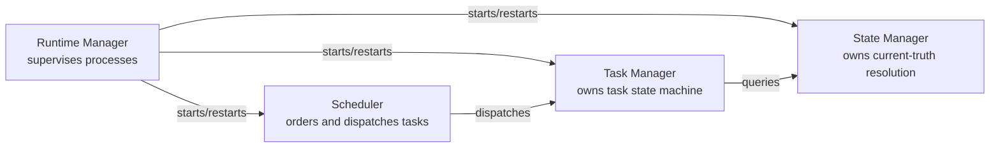

# Runtime Architecture

## Purpose

Describes the Runtime as a cross-cutting concept — the set of components
responsible for keeping NOVA alive, scheduled, and supervised — as
distinct from the specific "Runtime Manager" service. This document
clarifies that distinction and describes how the runtime concept spans
several services detailed individually in `docs/03-runtime/`.

## Scope

The relationship between Runtime Manager, Scheduler, Task Manager, and
State Manager, and how together they constitute "the runtime" referenced
throughout this repository. Individual internals of each are documented
separately.

## The runtime as a layer, not a single service

"The runtime" is used in two senses across this repository:

1. **Informally**, to mean the whole always-running NOVA system (as in
   "personal AI runtime" in `docs/00-overview/vision.md`).
2. **Specifically**, to mean the cluster of four services that manage
   execution state rather than domain data: Runtime Manager, Scheduler,
   Task Manager, and State Manager.

This document uses "runtime" in the second, specific sense, and exists to
prevent the ambiguity from causing cross-document confusion.

## The four runtime services and their relationship

- **Runtime Manager** owns process lifecycle: starting, health-checking,
  and restarting the other supervised services (see
  `docs/03-runtime/runtime-manager.md`).
- **Scheduler** owns task ordering and dispatch: which queued task runs
  next, subject to concurrency limits and priority (see
  `docs/03-runtime/scheduler.md`).
- **Task Manager** owns the task state machine itself — queued, planning,
  executing, verifying, completed, failed, unverified, cancelled (see
  `docs/03-runtime/task-manager.md`).
- **State Manager** owns resolving "what is true right now" when
  observations conflict, independent of any specific task (see
  `docs/03-runtime/state-manager.md`).

## Why this separation

Task state and current-world-state are conceptually different things that
are easy to conflate: a task can be "executing" while the world state it
depends on has just changed underneath it (the user closed the file being
edited). Keeping Task Manager and State Manager as separate services means
a task's Verifier step can explicitly check "has State Manager's view of
the world changed since I planned this?" rather than the task silently
assuming a stale snapshot is still current — this is the mechanism behind
the edge case handling described in `docs/01-product/use-cases.md`
("user changes window during automation").

## Related documents

- `docs/03-runtime/runtime-manager.md`, `scheduler.md`, `task-manager.md`,
  `state-manager.md` — full detail on each service
- `system-architecture.md` — how these services are hosted at the process
  level
