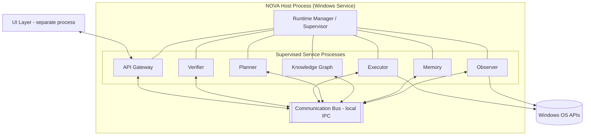

# System Architecture

## Purpose

The full system-level architecture of NOVA: process model, deployment
topology, and how the services introduced in
`docs/00-overview/architecture-summary.md` are actually hosted and
connected on a Windows machine. Where the overview is a map, this document
is the terrain.

## Scope

Covers process/deployment topology and inter-service transport. Internal
design of each individual service is in `docs/03-runtime/`; memory and AI
internals are in `docs/04-memory/` and `docs/05-ai/` respectively.

## Deployment topology

NOVA runs as a single Windows background service (`docs/13-devops/deployment.md`, Tier 3) that hosts multiple independently-supervised
service processes, rather than one monolithic process or fully separate
installed services. This is a deliberate middle point: full process
isolation per service (Principle 3, `docs/00-overview/design-principles.md`)
without the operational overhead of managing ten separately-installed
Windows services.

Each supervised service is its own OS process, supervised by the Runtime
Manager (`docs/03-runtime/runtime-manager.md`). The UI Layer runs as a
separate, unprivileged process and talks to everything else only through
the API Gateway — the UI never has direct filesystem/input-control
privileges itself; only the Observer and Executor processes do, and only
for the specific OS capabilities they need.

## Inter-service transport

Local IPC over named pipes, carrying the message envelope defined in
`docs/02-architecture/communication-model.md`. No service calls another
directly by reference or in-process function call — every interaction
passes through the Communication Bus, which is what allows a crashed
service to be restarted without the caller needing to know or handle that
directly (it retries against the bus, not against a process handle).

## Why not a single monolithic process

A single process is simpler to build initially, but violates Principle 3
(Modular Runtime Architecture): a crash in an experimental component
(vision-guided execution, Phase 4) would be able to take down Memory and
Knowledge Graph access, which are the most mature and most depended-upon
services. Process-level isolation is the mechanism that actually enforces
the failure-domain boundary the principle requires, not just a documented
intention.

## Why not fully separate installed Windows services

Ten independently installed Windows services would each need their own
install/update/permission lifecycle, which multiplies the deployment
surface (`docs/13-devops/deployment.md`, Tier 3) for a single-machine
process without a corresponding benefit — there is no scenario where one
service needs to be installed/updated independently of the others by an
end user.

## Note on multi-device (v5)

`docs/20-devices/multi-device-architecture.md` adds multiple *devices*,
each running its own independent instance of this same process
architecture (a Primary Runtime or Companion instance per device) — it
does not change the per-device reasoning above. Cross-device
coordination happens at the Memory/Task layer
(`docs/20-devices/cross-device-memory.md`) and over the Device Mesh
transport (`docs/20-devices/remote-control.md`), not by merging multiple
devices' internal service buses into one.

## Related documents

- `docs/00-overview/architecture-summary.md` — the one-page version of
  this diagram
- `service-architecture.md` — per-service responsibility detail
- `communication-model.md` — the message envelope and bus semantics
- `docs/03-runtime/runtime-manager.md` — how supervision actually works
