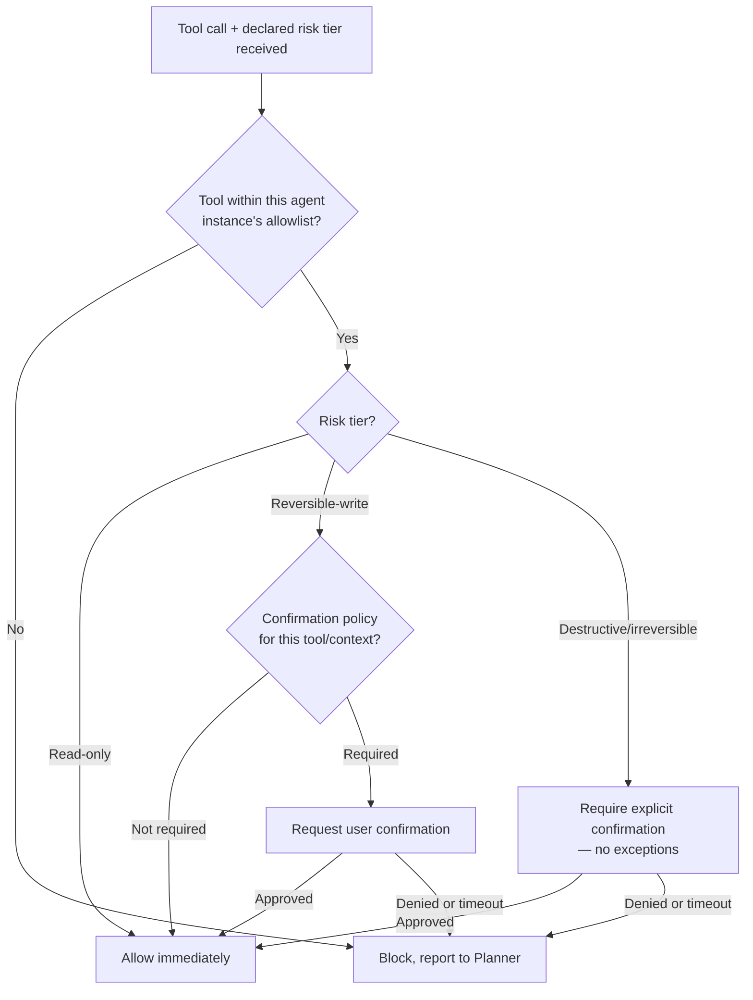

# Permission Manager

## Purpose

Enforces risk-tiered execution (Principle 4,
`docs/00-overview/design-principles.md`) at the point of execution: every
tool call passes through this gate before the Executor is allowed to
invoke it. This document covers the runtime enforcement mechanism; the
policy itself (which risk tiers require which confirmation) is defined in
`docs/10-security/permissions.md` (Tier 3).

## Scope

Enforcement mechanism only. Policy definition, consent UI, and the
broader security model live in `docs/10-security/` (Tier 3).

## Gate placement

Every Executor invocation, regardless of execution tier
(`docs/06-tools/execution-priority.md`), passes through the Permission
Manager first — there is no code path from Planner or Executor to an
actual OS-level action that bypasses this check, including for
GUI/vision-driven actions (this specifically closes the "escalating
fallback as guardrail bypass" risk identified in the project's
foundational review: falling back to a lower execution tier changes
*how* an action is performed, never *whether* it is permission-checked).

## Decision flow

The agent-scoped allowlist check (see below) runs **first**, before risk
tier is even considered — a tool outside the current agent instance's
allowlist is blocked regardless of its risk tier, including read-only
tools, since the allowlist is a scope boundary, not a risk judgment:

## Agent-scoped permission boundaries

Beyond risk tier, the Permission Manager also enforces the tool allowlist
declared for the specific agent instance handling the task
(`docs/05-ai/planner-agent.md`) — an agent instance configured with a
read-only tool scope cannot invoke a write-capable tool even at the
lowest risk tier, regardless of what the Planner requests, because the
allowlist check runs first, per the decision flow above, before risk
tier is even evaluated.

## Handling denial and timeout

A confirmation request times out after **5 minutes** of no user
response — a configurable override
(`docs/14-development/configuration-schema.md`), not a hardcoded
constant, but the shipped default absent one. This duration is
deliberately the same regardless of risk tier: timing out always
resolves to `Denied` (the safe direction — a timeout can never
substitute an approval), so a longer or shorter timeout only changes how
quickly a blocked step is reported back to the Planner, never the safety
of the outcome. A denied or timed-out confirmation request is reported
to the Planner as a blocked step, not a failure — the Planner can then
decide to ask the user for an alternative, skip the step if it is
non-essential to the overall goal, or terminate the task, but the
Permission Manager itself never substitutes a default answer on the
user's behalf.

## Permission Request states

A permission request (the confirmation flow entered at `E`/`F` in the
decision flow above) moves through exactly three states, referenced by
`docs/26-system-reference/16-lifecycle-and-state-machine-index.md`:
**Requested** (confirmation asked of the user, awaiting response), then
either **Approved** (leads to `Allow`) or **Denied** (leads to `Block,
report to Planner` — this state also covers a timed-out request, which
is handled identically to an explicit denial, per the section above).
There is no distinct "Pending" or "Expired" state beyond these three —
a request is either awaiting response (`Requested`) or resolved
(`Approved`/`Denied`), and timeout is a path into `Denied`, not a fourth
terminal state.

## Auditability

Every Permission Manager decision (allowed, confirmed, denied, timed out)
is written to the audit trail (`docs/10-security/audit.md`, Tier 3) with
the `correlation_id` of the originating task, so that "why was this
action allowed to run" is always answerable from the log alone.

## Related documents

- `docs/25-failure-modes/FM-12-security-sandbox-identity.md` — failure modes for this component
- `docs/10-security/permissions.md` (Tier 3) — the policy this mechanism
  enforces
- `executor.md` — the caller gated by this service
- `docs/05-ai/planner-agent.md` — where agent-scoped tool allowlists are
  defined
