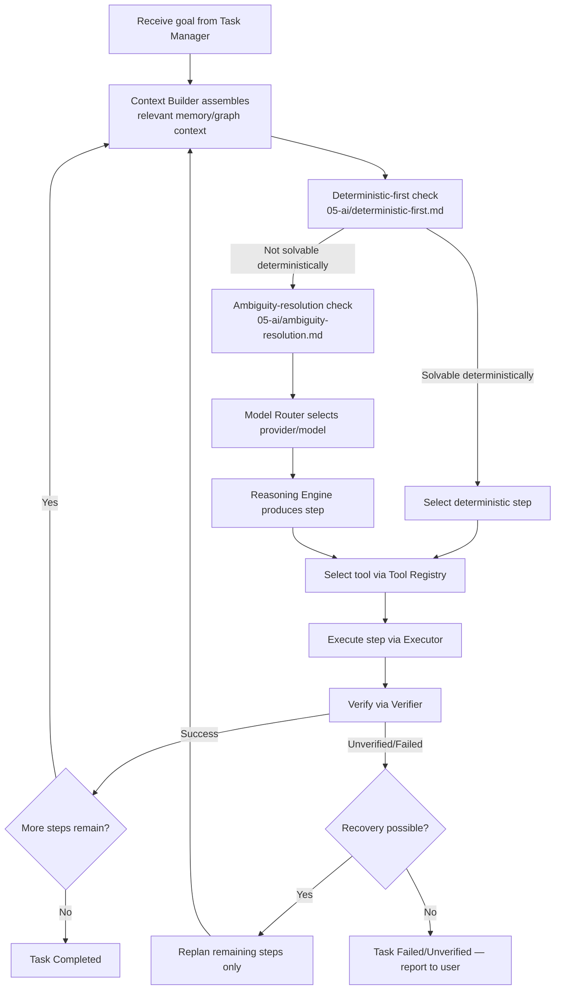
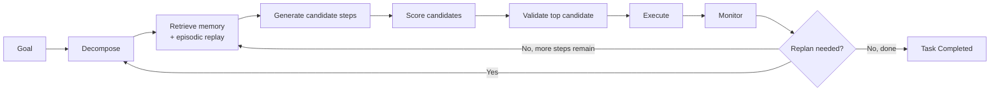

# Planner

## Purpose

The service that converts a user goal into an executable sequence of
steps, deciding at every step whether deterministic execution suffices or
an LLM call is genuinely required. This is the component most directly
responsible for upholding Principle 1, Deterministic Before Intelligent
(`docs/00-overview/design-principles.md`).

## Scope

Planning and step-level reasoning only. Delegates context assembly to the
Context Builder, model selection to the Model Router, and tool execution
to the Executor — the Planner decides *what* to do next and *whether* an
LLM is needed for that decision; it does not itself call tools or LLMs
directly without going through those services.

## Planning loop

This is a hierarchical, iterative planner: Plan → Execute → Observe →
Replan, continuing until success, failure, timeout, or a configured step/
cost budget is exceeded (see `docs/11-performance/performance-goals.md`,
Tier 3, for the specific budget values).

## Formal planning algorithm

The single-box "Context Builder assembles context" and "select step"
boxes in the loop above expand, conceptually, into the following named
stages — stated explicitly here because a prior version of this document
left them implicit in prose:

- **Decompose** — break the goal into sub-goals where it is not already
  a single, directly actionable step.
- **Retrieve memory** — assemble relevant context via the Context
  Builder, including a check against Episodic Replay
  (`docs/05-ai/episodic-replay.md`) for a similar prior successful task.
- **Generate candidates** — for a step not resolved deterministically,
  produce more than one candidate approach where genuine alternatives
  exist (e.g., two different tools could satisfy the same capability,
  `docs/05-ai/capability-registry.md`) rather than committing to the
  first plausible option. For purely deterministic steps, this
  degenerates to a single candidate — candidate generation is not
  invoked speculatively where there is nothing to choose between.
- **Score candidates** — rank generated candidates by cost, latency,
  risk tier, and combined confidence (`docs/05-ai/confidence-propagation.md`), not by taking the first one the Reasoning
  Engine happens to produce.
- **Validate** — confirm the top-scored candidate is actually executable
  given current World Model state (`docs/03-runtime/world-model.md`)
  before committing to it — a candidate that scored well against stale
  context is re-checked, not blindly executed.
- **Monitor** — the Verifier's role in the loop, feeding back into
  Replan decisions.

## Candidate generation is bounded, not unbounded speculative search

Generating multiple candidates is scoped to genuinely ambiguous
tool/method choices at a single step, not a general speculative search
across entire alternate plans for the whole task — full-plan-level
alternatives are not explored in parallel, since the cost of doing so
(multiple LLM calls and, for execution-tier candidates, potentially
conflicting resource assumptions) is not justified by the step-level
decision this stage is scoped to. This is a deliberate scope boundary,
not an oversight: a request for full parallel multi-plan generation
across an entire task is a larger, separately-justified capability this
document does not currently commit to.

## Mid-task correction handling

When the user provides a correction while a task is in flight (e.g., "no,
the other file"), the Planner does not restart the task from step one. It
identifies which already-completed steps remain valid under the corrected
goal and rebuilds only the remaining plan from the current state forward
— this is the "dynamic replanning, reuse completed work" behavior
established as a firm requirement, not an optimization that can be
skipped under time pressure.

## Goal-drift prevention (re-anchoring)

Distinct from mid-task correction above (an explicit user-initiated
change), this addresses silent drift: over a long multi-step task, a
sequence of individually-reasonable reinterpretations can compound until
the Planner is solving a subtly different problem than the one
originally requested, with no single step having been wrong on its own.
At each replanning checkpoint (every re-entry into the Planning state,
per `docs/03-runtime/task-manager.md`), the Planner re-compares its
current plan state against the original, verbatim goal statement
recorded at task creation — not the most recently rebuilt plan's own
description of the goal, which is exactly what could have already
drifted. A material divergence halts the task and surfaces the drift
explicitly to the user/Verifier for confirmation before continuing,
per `docs/25-failure-modes/FM-05-llm-core-and-ai-specific-failures.md`'s
FM-05-008, rather than completing a task that has quietly stopped
matching what was asked.

## Step budget and termination

Every plan has a maximum step count and a maximum wall-clock budget,
configured per task-risk-tier (a read-only informational task gets a
smaller budget than an approved multi-step file-organization task). A
plan that would exceed its budget does not silently continue — it stops
and reports incomplete state exactly as a verification failure would,
consistent with `docs/01-product/success-metrics.md`'s "no partial-credit"
rule.

## Interaction with Model Router

The Planner never chooses a specific AI provider or model itself — it
requests "a model capable of X, within cost/latency constraint Y" from the
Model Router (`docs/05-ai/model-router.md`), which resolves that request
deterministically. This separation is what keeps model routing testable
independently of planning logic.

## Related documents

- `docs/25-failure-modes/FM-02-planner-task-queue-scheduler.md` — failure modes for this component
- `docs/05-ai/deterministic-first.md`, `docs/05-ai/ambiguity-resolution.md`
  — the decision logic referenced in the loop above
- `docs/05-ai/context-builder.md` — how context is assembled before
  planning
- `docs/05-ai/episodic-replay.md` — prior-plan reuse within the Retrieve
  stage
- `docs/05-ai/confidence-propagation.md` — the scoring input used in the
  Score stage
- `verifier.md` — how the Verify/Monitor stage of the loop actually works
- `task-manager.md` — the state machine this loop reports into
