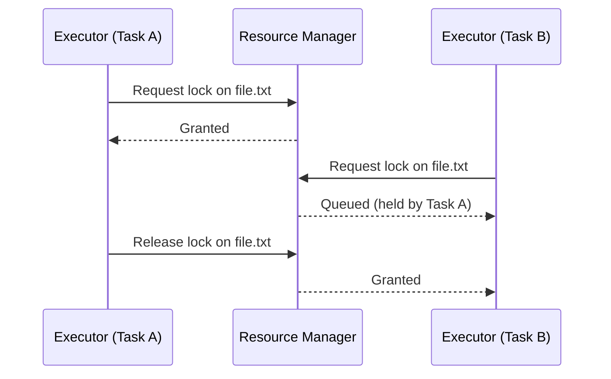

# Resource Manager

## Purpose

Prevents concurrent or overlapping actions from corrupting or silently
overwriting each other by serializing access to shared resources (files,
windows, clipboard) through an explicit lock model. This is the direct
fix for the concurrency risk identified in the project's foundational
review: agents with no resource-locking model can silently trample each
other's work.

## Scope

Lock acquisition, release, and contention handling for any resource an
Executor action might touch. Does not manage locks on Memory or Knowledge
Graph writes themselves, which have their own internal consistency
mechanisms (`docs/04-memory/memory-architecture.md`).

## Lockable resource types

- Individual files and directories (by path)
- Individual OS windows (by window handle)
- The system clipboard
- Any other resource a tool integration explicitly declares as
  exclusive-access in its `docs/06-tools/tool-interface.md` registration

## Lock model

Exclusive-write locks only — a resource has at most one holder at a time
for write access; concurrent read access is not gated (read-only actions,
per `docs/10-security/permissions.md`, do not require a lock at all).

## Contention handling

A task whose required lock is held by another task is queued, not failed
immediately — the Scheduler (`docs/03-runtime/scheduler.md`) is informed
so it does not dispatch further steps of the waiting task until the lock
is available, and a configurable maximum wait time applies, after which
the waiting task is reported to the Planner as blocked so it can decide
whether to wait longer, choose an alternate approach, or report the
blockage to the user.

## Deadlock avoidance

Locks must be requested in a single batch per step wherever a step needs
more than one resource, rather than acquired incrementally — this
avoids the classic two-tasks-each-holding-one-of-two-needed-locks
deadlock pattern by ensuring a task either gets everything it needs for a
step or nothing, never a partial set it then holds while waiting for the
rest.

## Lock release guarantees

Locks are always released by the Executor at the end of a step
(`docs/03-runtime/executor.md`), including on failure or cancellation —
a crashed or cancelled task must never leave an orphaned lock. As a
backstop, Resource Manager applies a maximum lock duration per risk tier,
after which an unreleased lock is force-released and the holding task is
marked failed, since a lock held longer than its expected duration
indicates the holding task itself is stuck.

## Related documents

- `docs/25-failure-modes/FM-16-resource-management-and-performance.md` — failure modes for this component
- `executor.md` — the primary caller of this service
- `scheduler.md` — how contention affects task dispatch ordering
- `docs/06-tools/tool-interface.md` — where a tool declares its lockable
  resources
