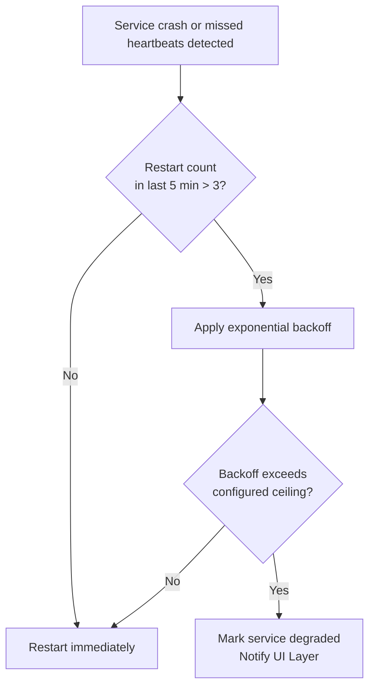

# Runtime Manager

## Purpose

The supervisor process responsible for starting, health-checking, and
restarting every other supervised service process. This is the one
service with no upstream dependency (see `docs/02-architecture/dependency-map.md`) and the first thing to start and last thing to stop.

## Scope

Process supervision only — it does not participate in task execution,
memory, or reasoning. Its entire responsibility is keeping the rest of the
system running.

## Responsibilities

- Start every supervised service in dependency order at system startup
  (`docs/02-architecture/lifecycle.md`).
- Continuously health-check each service via a lightweight heartbeat on
  the Communication Bus.
- Restart a crashed or unresponsive service, applying exponential backoff
  if a service repeatedly crashes, and surfacing a persistent-failure
  state to the UI Layer rather than restarting forever silently.
- Coordinate graceful shutdown in reverse dependency order.

## Internal architecture

The Runtime Manager itself is intentionally the simplest service in the
system — it has no dependency on Memory, Knowledge Graph, or any AI
component, specifically so that a failure anywhere else in the system
cannot prevent it from doing its job of restarting things. It maintains
only: a static service registry (name, executable, dependency list,
restart policy) and a small persistent log of recent restart events for
diagnostics.

## Health check protocol

Each supervised service publishes a heartbeat message on a
service-specific topic (`system.heartbeat.<service_name>`) at a fixed
interval. Runtime Manager considers a service unresponsive if it misses
three consecutive heartbeats, at which point it initiates a restart.

## Restart policy

A service marked degraded is not retried automatically further; a human
must intervene (restart NOVA, check logs) — this prevents a
misconfigured or genuinely broken service from consuming resources in an
infinite restart loop, which is one of the self-monitoring gaps identified
in the project's foundational review.

## Failure handling

If the Runtime Manager itself crashes, the Windows Service Control Manager
restarts the entire NOVA host process, which re-invokes Runtime Manager's
own startup sequence — this is the outermost safety net and the reason
NOVA is registered as a genuine Windows service rather than a plain
background executable (see `docs/13-devops/deployment.md`, Tier 3).

## Related documents

- `docs/25-failure-modes/FM-15-architecture-runtime-lifecycle-events.md` — failure modes for this component
- `docs/02-architecture/lifecycle.md` — the startup/shutdown sequence this
  service executes
- `docs/02-architecture/dependency-map.md` — the dependency order it
  enforces
- `docs/11-performance/resource-usage.md` (Tier 3) — resource budget this
  service itself must respect
