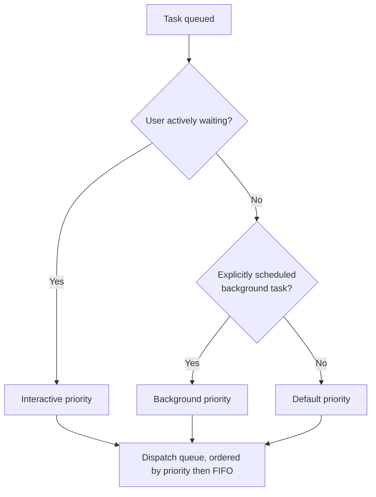

# Scheduler

## Purpose

Decides which queued task runs next and how many run concurrently,
subject to resource and priority constraints. Distinct from Task Manager,
which owns the state of a task once it is running (see
`docs/02-architecture/runtime-architecture.md` for the distinction).

## Scope

Task ordering and dispatch only. Does not decide *how* a task is executed
(that is the Planner's responsibility) — only *when* and in what order.

## Responsibilities

- Maintain the task queue and dispatch tasks to Task Manager for
  execution.
- Enforce concurrency limits so that the number of simultaneously
  executing tasks does not exceed the resource budget in
  `docs/11-performance/resource-usage.md` (Tier 3).
- Apply priority ordering: user-interactive tasks (something the user is
  actively waiting on) are dispatched ahead of background/autonomous tasks
  (e.g., a multi-step cleanup task running unattended).
- Respect resource locks already held (`docs/03-runtime/resource-manager.md`) when deciding whether a queued task can start —
  a task requiring a currently-locked resource is held rather than
  dispatched to fail immediately.

## Priority model

Interactive tasks preempt default and background tasks for dispatch, but
never preempt a task that is already executing — the Scheduler controls
what starts next, not what stops, since stopping an in-flight action
mid-execution is the Task Manager's cancellation responsibility
(`docs/03-runtime/task-manager.md`), governed by its own safety rules.

## Concurrency limits

A configurable maximum number of tasks may execute simultaneously,
defaulting conservatively to protect the resource budget in
`docs/11-performance/performance-goals.md` (Tier 3). Tasks beyond this
limit remain queued, ordered by priority, rather than executing with
degraded per-task resource share.

## Starvation prevention

A background task that has been queued longer than a configured threshold
has its effective priority gradually increased, preventing a steady stream
of interactive tasks from indefinitely starving a legitimate background
task (e.g., a scheduled cleanup) from ever running.

## Related documents

- `docs/25-failure-modes/FM-02-planner-task-queue-scheduler.md` — failure modes for this component
- `task-manager.md` — what happens to a task once dispatched
- `resource-manager.md` — the lock state the Scheduler checks before
  dispatch
- `docs/11-performance/resource-usage.md` (Tier 3) — the resource budget
  concurrency limits are derived from
