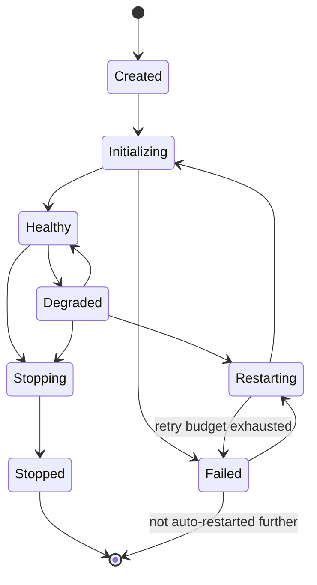

# Per-Service Lifecycle

## Purpose

Defines the startup and shutdown contract every individual supervised
service must implement, so that Runtime Manager
(`docs/03-runtime/runtime-manager.md`) can supervise any service uniformly
regardless of its internal responsibility. Where
`docs/02-architecture/lifecycle.md` covers the system-wide sequence, this
document covers what each service does within its own start/stop call.

## Scope

The lifecycle interface contract every service implements. Does not cover
system-wide ordering, which is `docs/02-architecture/lifecycle.md`, or
system-wide crash recovery, which is also covered there.

## Required lifecycle interface

Every supervised service exposes:

- **`start()`** — initialize internal state, connect to the Communication
  Bus, begin publishing heartbeats, and only then signal "ready" to
  Runtime Manager. A service must not accept work before signaling ready.
- **`stop(graceful: bool)`** — on graceful stop, complete or safely pause
  in-flight work (per that service's own definition of a safe pause
  point — see `docs/03-runtime/task-manager.md` for the Task Manager's
  specific definition) before releasing resources and disconnecting; on
  non-graceful stop (a forced termination), skip straight to releasing
  any held resources.
- **`heartbeat()`** — a lightweight liveness signal published at the
  configured interval, independent of whether the service is currently
  busy with work.
- **`health()`** — a richer status query Runtime Manager can invoke
  on-demand, returning not just "alive" but degraded-status detail (e.g.,
  "alive but Model Router unreachable" for the Planner).

## Service state machine

- **Created** — the process exists but `start()` has not yet been
  invoked.
- **Initializing** — `start()` is running: connecting to the bus,
  restoring persisted state, verifying dependencies
  (`docs/02-architecture/dependency-map.md`).
- **Healthy** — `health()` reports fully functional; heartbeats are being
  published on schedule.
- **Degraded** — the service is alive and publishing heartbeats but
  `health()` reports a specific functional gap (e.g., a dependency it
  needs for full functionality, like Model Router, is unreachable, while
  the service's core responsibility otherwise continues). A degraded
  service is not restarted automatically purely for being degraded —
  only for missed heartbeats or an explicit failure.
- **Restarting** — Runtime Manager has initiated a restart per its
  backoff policy (`runtime-manager.md`).
- **Stopping** — graceful `stop()` in progress.
- **Stopped** — clean shutdown complete.
- **Failed** — missed heartbeats or explicit failure signal, with restart
  budget not yet exhausted (routes to `Restarting`) or exhausted (a
  terminal state requiring manual intervention, per
  `runtime-manager.md`'s restart policy).

## Health check and heartbeat parameters

The heartbeat interval and the missed-heartbeat threshold that triggers a
`Healthy`/`Degraded` → `Failed` transition are the same parameters defined in `runtime-manager.md`'s health check protocol — this state
machine is the per-service view of the same mechanism that document
describes from the supervisor's perspective.

## Restart semantics

When Runtime Manager restarts a service, that service's `start()` must
reconstruct any necessary state from persisted storage (Memory, Task
Manager's persisted task state, etc.) rather than assuming a cold, empty
state — a mid-flight task must not simply vanish because the Planner
process restarted; it must be recoverable from Task Manager's
persisted record per `docs/02-architecture/lifecycle.md`'s crash-recovery
behavior.

## Dependency-aware startup

A service's `start()` may itself block briefly waiting for a hard
dependency (per `docs/02-architecture/dependency-map.md`) to report
ready, rather than starting in a half-functional state and hoping the
dependency appears later — Runtime Manager enforces the correct start
order, but individual services still defensively verify their
dependencies are actually reachable before signaling their own readiness.

## Related documents

- `docs/25-failure-modes/FM-15-architecture-runtime-lifecycle-events.md` — failure modes for this component
- `docs/02-architecture/lifecycle.md` — the system-wide sequence this
  per-service contract fits into
- `runtime-manager.md` — the supervisor invoking this interface
- `docs/02-architecture/dependency-map.md` — the dependency order
  informing startup blocking
