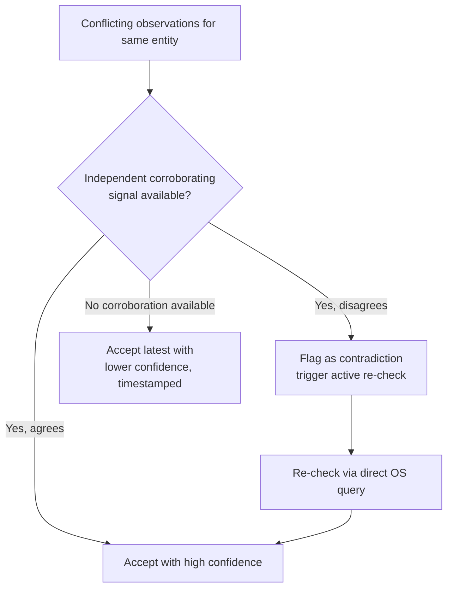

# State Manager

## Purpose

Resolves what is actually true right now when multiple observations
disagree, and serves as the single source of truth other services
(Task Manager, Verifier, World Model) query rather than each doing their
own conflict resolution independently.

## Scope

Conflict resolution and current-truth serving. The World Model
(`world-model.md`) is the structured representation of desktop state;
State Manager is the mechanism that keeps that representation correct
when inputs disagree.

## Why conflicts occur

Multiple observers can report seemingly contradictory information about
the same entity within the canonical 5-second cross-observer conflict
window (`docs/26-system-reference/19-ordering-concurrency-and-retry-
rules.md`'s Coalescing, debounce, and conflict windows section) — e.g., a
file-watcher reports a file as deleted while an application-level
observer still shows it open in an editor's recent-files list; these are
not necessarily contradictory in reality, but naive last-write-wins logic
could produce an incorrect merged view.

## Confidence representation

State Manager's "confidence level" is the same `0.0`–`1.0` float scale
`docs/04-memory/memory-confidence.md` defines for stored memory records
— State Manager is that scale's upstream producer: a resolved
observation's confidence value here becomes the `confidence` field on
the memory record eventually written for it, not a separately-invented
scale. This holds even though State Manager (build order step 2) is
implemented before the Memory tier's confidence document (step 3) — per
`docs/43-ai-development/implementation-order.md`'s own rule, a document
forward-referencing a not-yet-built component's interface should build
at least that interface's minimal shape first, and `{"confidence":
"0.0-1.0"}` is that minimal shape here.

## Resolution rule

The latest **verified** observation becomes the source of truth,
verified meaning: corroborated by a second independent signal where one
exists, or, where only one signal exists, accepted with a confidence
level attached rather than treated as unconditionally true. Concretely:



## Active re-check

When State Manager cannot resolve a conflict from existing signals alone,
it can trigger a direct, on-demand OS query (e.g., checking whether a
file actually exists right now) rather than waiting for the next passive
observer event — this is used sparingly, since active queries have a
resource cost, and only when a pending task's correctness actually depends
on resolving the ambiguity (see `docs/11-performance/resource-usage.md`,
Tier 3, for the budget this is weighed against).

## Worked example: three observers, one file

The Filesystem Observer reports `report.docx` as deleted. Within the
same short window, the Browser Observer shows an active download of a
file with the same name into the same folder, and the Clipboard Observer
shows the user recently copied that filename in a chat application. These
are not necessarily contradictory, but naive last-write-wins logic could
misread this as "the file was deleted and no longer exists" when the
more accurate interpretation is "the original file was deleted and is
being replaced by a fresh download of the same name."

Resolution: State Manager treats the Filesystem Observer as authoritative
for the file's *existence state* (only a filesystem-level signal can
confirm a file exists or not), while treating the Browser and Clipboard
observations as *contextual corroboration* informing *why* the change
happened, not *whether* it happened. Concretely: the delete is accepted
immediately (Filesystem Observer wins for existence) — this part is the
Step-2-testable core and has no dependency on any not-yet-built
component. The download-in-progress observation additionally raises
confidence that a follow-up create event for the same filename, if it
arrives shortly after, is a continuation of the same real-world event
rather than an unrelated new file — this second part informs Entity
Resolution (`docs/04-memory/entity-resolution.md`), a build-order step 8
component, so it is an enhancement layered on top once step 8 lands, not
something step 2's implementation or tests need to wire up; State
Manager's core conflict resolution is complete and testable without it.

## Query interface

Every consumer above queries State Manager the same way — there is one
interface, not a different ad hoc call per consumer:

```json
// Request
{
  "entity_ref": "string — the entity being queried (file path, window handle, etc., per the entity's own identifying scheme)",
  "allow_active_recheck": "boolean — whether this call may trigger an on-demand OS query if existing signals are insufficient, per the Active re-check section's resource-cost tradeoff"
}

// Response
{
  "value": "the resolved current value, shape depends on entity_ref's type",
  "confidence": "0.0-1.0, per docs/04-memory/memory-confidence.md's scale",
  "resolved_at": "ISO 8601 timestamp of this resolution, not the original observation time",
  "contradiction_pending": "boolean — true if a disagreeing signal was flagged for active re-check (per the Resolution rule flowchart) but re-check hasn't completed yet"
}
```

A consumer receiving `contradiction_pending: true` treats the returned
`value` as provisional — per `docs/03-runtime/permission-manager.md`'s
conservative-treatment-of-low-confidence-facts rule, a destructive-risk-
tier decision must not proceed on a provisional value without either
waiting for resolution or explicit user confirmation.

## Consumers

Task Manager consults State Manager before allowing a task to proceed
past a step that depends on current state; Verifier consults it as one
ground-truth channel for GUI-related actions; World Model is, in effect,
State Manager's output formatted for the desktop-state use case
specifically.

## Confidence propagation

State Manager's confidence level for a given fact is carried alongside
the fact itself when consumed downstream — a low-confidence fact feeding
into a destructive-risk-tier decision is treated more conservatively by
the Permission Manager (`permission-manager.md`) than a high-confidence
one, rather than confidence information being silently dropped once state
is "resolved."

## Related documents

- `docs/25-failure-modes/FM-15-architecture-runtime-lifecycle-events.md` — failure modes for this component
- `world-model.md` — the desktop-state-specific consumer of this service
- `docs/03-runtime/task-manager.md`, `verifier.md` — other consumers
- `docs/11-performance/resource-usage.md` (Tier 3) — the budget governing
  active re-check frequency
