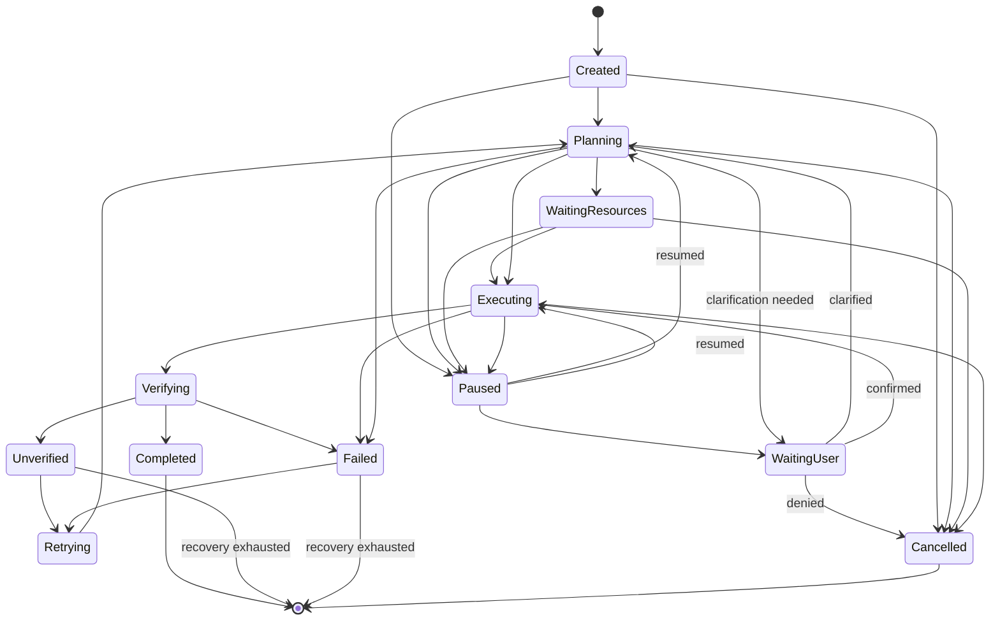

# Task Manager

## Purpose

Owns the task state machine: the authoritative record of what state every
task is in, from creation through terminal outcome, and the only service
permitted to transition a task between states.

## Scope

Task lifecycle and state only. Delegates planning to the Planner,
execution to the Executor, and outcome confirmation to the Verifier —
Task Manager coordinates these but does not perform any of them itself.

## Revision note

This state machine was revised to add explicit resource-waiting,
pause/resume, user-confirmation-blocked, and retry states that an earlier
version of this document left implicit. `Completed` is retained (rather
than renamed to a "Succeeded" synonym also considered) to avoid
introducing inconsistency with the many other documents across this
repository that already reference `Completed` as the clean-success
terminal state.

## Task state machine

> **Resolved documentation conflict.** This diagram was previously
> flagged as conflicting with `docs/26-system-reference/04-state-transition-tables.md`'s Task / Agent Lifecycle table, which
> used different state names and a different shape (cognitive stages
> `Idle`/`Thinking`/`Planning`/`Waiting`/`Verifying`/`Unverified` rather
> than this document's execution mechanics). Per
> `docs/00-overview/normative-precedence.md`, this document
> (`docs/03-runtime/task-manager.md`, a Tier 5 component specification)
> is authoritative for the Task state machine; `docs/26-system-reference/04-state-transition-tables.md` is a derived index and has
> been corrected to match this document's state machine exactly. No
> other document defines a competing Task state machine; any that
> appears to must be corrected to match this one. Reconciliation
> surfaced one genuine gap rather than a purely cosmetic naming
> difference: the system-reference version's `Thinking` stage modeled an
> ambiguity-clarification loop (`docs/05-ai/ambiguity-resolution.md`'s
> "ask user for clarification" branch) that this document's diagram did
> not previously represent. That behavior has been folded into this
> document as the `Planning --> WaitingUser: clarification needed` /
> `WaitingUser --> Planning: clarified` transitions below, rather than
> discarded along with the rest of the superseded table.

## State definitions

- **Created** — task submitted, not yet planned.
- **Planning** — the Planner is determining the next step
  (`docs/03-runtime/planner.md`).
- **WaitingResources** — a planned step requires a resource lock
  currently held by another task; queued at the Resource Manager
  (`resource-manager.md`) rather than proceeding.
- **Executing** — the Executor is carrying out the current step
  (`executor.md`).
- **Verifying** — the Verifier is confirming the step's outcome
  (`verifier.md`).
- **Completed** — the task's goal was achieved and verified. Terminal.
- **Unverified** — no sufficient signal confirms or denies the outcome.
  Distinct from both `Completed` and `Failed`, never silently collapsed
  into either, per `docs/01-product/success-metrics.md`.
- **Failed** — a signal positively confirms the outcome did not occur.
- **Retrying** — `Unverified` or `Failed` routed back for another attempt;
  a distinct, visible state rather than an invisible internal loop, so
  the retry count and history are directly inspectable
  (`docs/09-ui/task-monitor.md`).
- **Paused** — execution suspended, either user-initiated or system-
  initiated (e.g., the focused window changed mid-automation,
  `docs/06-tools/automation.md`), with state preserved for resumption.
- **WaitingUser** — blocked on required user input that only the user
  can supply, covering exactly two triggers, both surfaced distinctly in
  the UI (`docs/09-ui/task-monitor.md`) since each requires a specific
  user action to unblock, not merely a resume click:
  1. A pending Permission Manager confirmation
     (`docs/03-runtime/permission-manager.md`), entered from `Paused`;
     resolves to `Executing` (confirmed) or `Cancelled` (denied).
  2. A pending ambiguity-resolution clarifying question
     (`docs/05-ai/ambiguity-resolution.md`'s "ask user for clarification"
     branch), entered directly from `Planning` when the Planner cannot
     proceed without more information; resolves back to `Planning`
     (clarified) with the new information incorporated, never directly
     to `Executing`, since a clarified request must still be
     (re-)planned before execution.
  These two triggers are never conflated in the task record: the
  `WaitingUser` state's stored reason field distinguishes
  `permission_confirmation` from `clarification_requested` so the UI and
  any audit trail can tell which is blocking the task.
- **Cancelled** — terminated before reaching a terminal outcome, by user
  or system action.

## Retry budget

`Retrying` is bounded by the same step/time budget described in`docs/03-runtime/planner.md` — a task does not retry indefinitely; once
its retry budget is exhausted, it settles into its last `Unverified` or `Failed` state as final, per the terminal transitions shown above.

## Task record lifecycle (a separate axis from execution state)

Once a task reaches a terminal state (`Completed`, `Failed` with
exhausted retries, `Unverified` with exhausted retries, or `Cancelled`),
its record follows the same memory-tier progression as any other memory
content (`docs/04-memory/memory-lifecycle.md`): it remains in Recent
Memory with full step detail, then ages into Long-term Memory (summarized)
and eventually **Archive** once it passes out of the active retrieval
window. "Archived" is not a peer of the execution states above — it is
what eventually happens to every terminal task's record, governed by
`docs/04-memory/memory-lifecycle.md`'s existing rules, not a new,
separate task-state concept.

## Task data model

Each task record includes: a unique task ID, the originating user request,
`correlation_id` (linking every downstream message to this task, per
`docs/02-architecture/communication-model.md`), current state, retry
count, the full step history (each step's tool call, risk tier, execution
tier, and verification result), and, if cancelled or failed, the reason
and the state of any partially-completed steps.

## Cancellation

A user-initiated or system-initiated cancellation transitions a task to
`Cancelled` only after: any resource locks it holds are released
(`resource-manager.md`), the Executor is signaled to stop the current
step if one is in flight, and the current partial state is recorded —
never discarded, since a task that partially completed before
cancellation still needs to be auditable and, where possible, undoable.

## Pause and resume

A `Paused` task retains its full Working Memory context
(`docs/04-memory/memory-types.md`) for the duration of the pause — a
resumed task continues from its paused step rather than restarting
planning from scratch, using the same "reuse completed work" logic
already established for mid-task user corrections
(`docs/03-runtime/planner.md`).

## Replanning vs. retry

`Unverified` and `Failed` both route to `Retrying` and then back to `Planning` when the Planner determines recovery is possible
(`docs/03-runtime/planner.md`), but Task Manager distinguishes them for
scoring purposes: a task that reaches `Completed` after passing through `Unverified`, `Failed`, or `Retrying` at least once is recorded as a
"recovered" success, not a clean success, per the Task Success Score
definition in `docs/01-product/success-metrics.md`.

## Persistence and crash recovery

Task state is persisted incrementally, not just at completion, so that
the crash-recovery behavior in `docs/02-architecture/lifecycle.md`
(marking in-flight tasks `Unverified` on unclean restart) has an accurate
last-known state to recover from rather than reconstructing it from
scratch. A task in `Paused` or `WaitingUser` at crash time resumes into
that same state on restart, rather than being marked `Unverified`, since
it was not actually executing anything at the time of the crash.

## Related documents

- `docs/25-failure-modes/FM-02-planner-task-queue-scheduler.md` — failure modes for this component
- `scheduler.md` — what decides when a `Created` task is dispatched toward `Planning` - `docs/03-runtime/verifier.md` — how the `Verifying` → {`Completed`,
  `Unverified`, `Failed`} transition is decided
- `docs/04-memory/memory-lifecycle.md` — the Archive progression terminal
  task records follow
- `docs/01-product/success-metrics.md` — how these terminal states map to
  scoring
