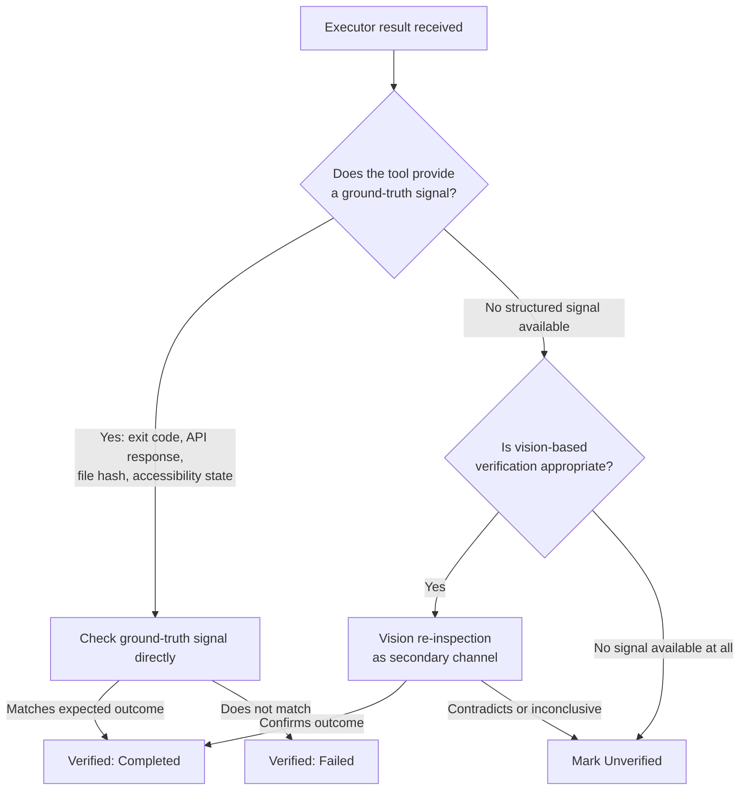

# Verifier

## Purpose

Confirms whether an executed action actually produced its intended
outcome. This is the component that directly implements the project's
core corrective principle from its foundational review: verification must
never assume success, and a false-positive "success" is treated as worse
than a visible failure.

## Scope

Outcome confirmation only, after the Executor has returned a result.
Recovery decisions (retry, alternate method) are the Planner's
responsibility, informed by the Verifier's output.

## Verification hierarchy

Ground-truth signals are always attempted first and are the primary
channel. Vision-based re-inspection is a fallback used only when no
structured signal exists for that tool/action — never the default or the
only check, specifically because using the same modality (vision) to both
act and verify shares the same blind spots that caused an error in the
first place.

## The three verification outcomes

- **Verified (Completed)** — a ground-truth or, secondarily, a vision
  signal positively confirms the intended outcome occurred.
- **Failed** — a signal positively confirms the intended outcome did *not*
  occur.
- **Unverified** — no sufficient signal exists either way. This is
  distinct from both of the above and is never conflated with success,
  per `docs/01-product/success-metrics.md`.

## Per-action-type verification requirement

Every tool registered in the Tool Registry must declare, at registration
time, which verification signal it provides (see
`docs/06-tools/tool-interface.md`). A tool with no declared verification
signal is restricted to confirmation-required execution only — it cannot
be run unattended, because its outcome cannot be independently confirmed.

## State-change detection

The Verifier consults State Manager's current world-model snapshot
(`docs/03-runtime/state-manager.md`) as part of ground-truth checking for
GUI-related actions — e.g., confirming the expected window/element state
exists post-action, not just that the input was sent successfully.

## Why vision verification is never primary

Vision-based checks are probabilistic pattern recognition over a
screenshot; a rendering glitch, a stale cached view, or a slightly
different expected layout can all produce a plausible-looking but
incorrect confirmation. Ground-truth signals (an exit code, a file hash, an
accessibility-tree state, an API status code) are deterministic and
structurally independent of the failure modes that caused the original
action to potentially go wrong, which is why they are required wherever
available.

## Related documents

- `docs/25-failure-modes/FM-03-agent-orchestration-and-collaboration.md` — failure modes for this component
- `executor.md` — the source of the result being verified
- `docs/06-tools/tool-interface.md` — the verification-signal declaration
  every tool must provide
- `docs/01-product/success-metrics.md` — how these three outcomes map to
  the Task Success Score
