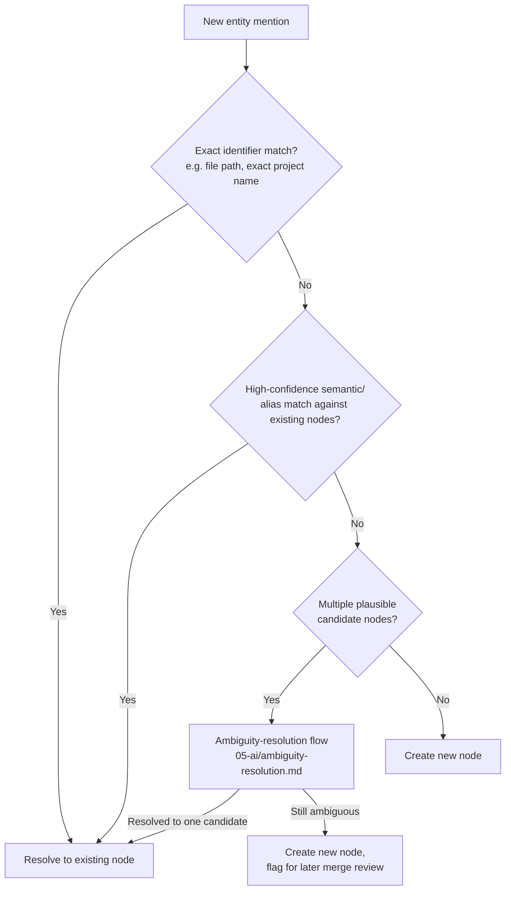

# Entity Resolution

## Purpose

Determines whether a newly observed or mentioned entity — a project name,
a file, a person — refers to an existing Knowledge Graph node or is
genuinely new, so that "the KingstonConnect project" is recognized as the
same node whether it appears in a file path, a conversation, or a
different phrasing, rather than creating a duplicate node per mention.

## Scope

Matching and disambiguation logic at write time. The schema being matched
against is `ontology.md`; the graph being written to is
`knowledge-graph.md`.

## Resolution pipeline

## Alias tracking

Once an entity is resolved, alternate phrasings that led to that
resolution (e.g., "the KingstonConnect project" vs. "my Supabase deploy
project" both referring to the same Project node) are recorded as aliases
on that node, so future mentions using either phrasing resolve directly
via the exact/alias match step without needing semantic matching again.

## Confidence thresholds

Semantic/alias matching produces a confidence score; only matches above a
configured high-confidence threshold resolve automatically. Matches
between the high-confidence and ambiguity thresholds are routed to the
ambiguity-resolution decision flow (`docs/05-ai/ambiguity-resolution.md`)
rather than resolved silently, consistent with that flow's general
principle of not guessing quietly when genuine ambiguity exists.

## Avoiding false merges

A wrongly merged entity (two genuinely different projects that happen to
share a similar name) is harder to detect and correct than a duplicate,
which is why the confidence threshold for automatic resolution is set
conservatively — a duplicate node created in the "still ambiguous" path
above is auditable and mergeable later; an incorrect silent merge would
have already commingled two different projects' file/decision history by
the time anyone noticed.

## Manual merge and split

A user or maintainer can explicitly merge two nodes discovered to be
duplicates, or split a node discovered to have incorrectly merged two
distinct entities. Both operations preserve full history (which node
contributed which relationships) rather than silently discarding
provenance, since the audit trail (`docs/10-security/audit.md`, Tier 3)
depends on that provenance remaining traceable.

## Related documents

- `docs/25-failure-modes/FM-01-memory-and-knowledge-graph.md` — failure modes for this subsystem
- `knowledge-graph.md` — the graph this resolution writes into
- `ontology.md` — the node types being resolved against
- `docs/05-ai/ambiguity-resolution.md` — the decision flow for uncertain
  matches
