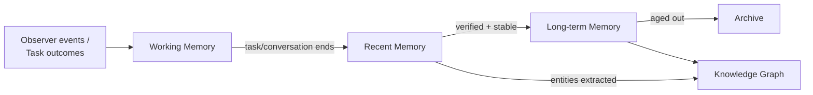

# Memory Architecture

## Purpose

The top-level design of NOVA's memory system: the four tiers, how data
moves between them, and how they collectively implement Principle 5,
Memory-First Design (`docs/00-overview/design-principles.md`).

## Scope

The overall shape of the memory system. Individual tiers, storage
engines, retrieval, and the Knowledge Graph each have dedicated documents
this one links to.

## The four tiers plus the Knowledge Graph

- **Working Memory** — the current task or conversation's active context.
  Exists only for the duration of that task; cleared or promoted at its
  end.
- **Recent Memory** — rolling history of recently completed tasks and
  conversations, retained until summarized/promoted.
- **Long-term Memory** — verified, durable facts and summaries, retained
  according to the retention policy in `memory-lifecycle.md`.
- **Knowledge Graph** — the fixed-schema graph of entities and
  relationships, populated from both Recent and Long-term Memory as
  entities are extracted and resolved (`entity-resolution.md`).
- **Archive** — cold storage for memory that has aged out of active
  retrieval tiers but is not deleted; retrievable on demand but excluded
  from default context assembly (`docs/05-ai/context-builder.md`).

## Storage engines per tier

See `memory-storage.md` for full detail. In summary: Working and Recent
Memory use a fast structured store (SQLite locally); Long-term Memory and
Archive combine structured storage with a vector database for embeddings;
the Knowledge Graph uses a dedicated graph database; raw artifacts (e.g.,
full document contents) use blob storage referenced by the structured
records rather than duplicated into every tier.

## Why four tiers instead of one undifferentiated store

A single undifferentiated memory store cannot answer "is this fact
current and confident" without re-deriving it every query. Separating
tiers by recency and verification status means retrieval
(`retrieval-engine.md`) can weight Long-term Memory facts more heavily
than an unverified Working Memory guess without needing a separate
scoring pass over a single flat table each time.

## Relationship to World Model

The World Model (`docs/03-runtime/world-model.md`) is explicitly *not*
one of these tiers — it is ephemeral, in-memory desktop state that is
never itself persisted; only summarized, verified facts derived from it
flow into Recent Memory and onward, per `memory-lifecycle.md`.

## No unbounded retention

Per `docs/00-overview/non-goals.md`, raw observation data is not retained
indefinitely by default. What actually happens to data over time —
promotion, summarization, expiry — is fully specified in
`memory-lifecycle.md`.

## Related documents

- `docs/25-failure-modes/FM-01-memory-and-knowledge-graph.md` — failure modes for this subsystem
- `memory-types.md` — detailed content of each tier
- `memory-lifecycle.md` — promotion, summarization, and retention rules
- `memory-storage.md` — concrete storage engines
- `knowledge-graph.md`, `ontology.md` — the graph this architecture feeds
- `retrieval-engine.md` — how these tiers are queried together
- `table-contracts.md`, `relationships.md`, `indexes.md`, `transactions.md`, `seed-data.md` — the relational schema implementing these tiers at the database layer
