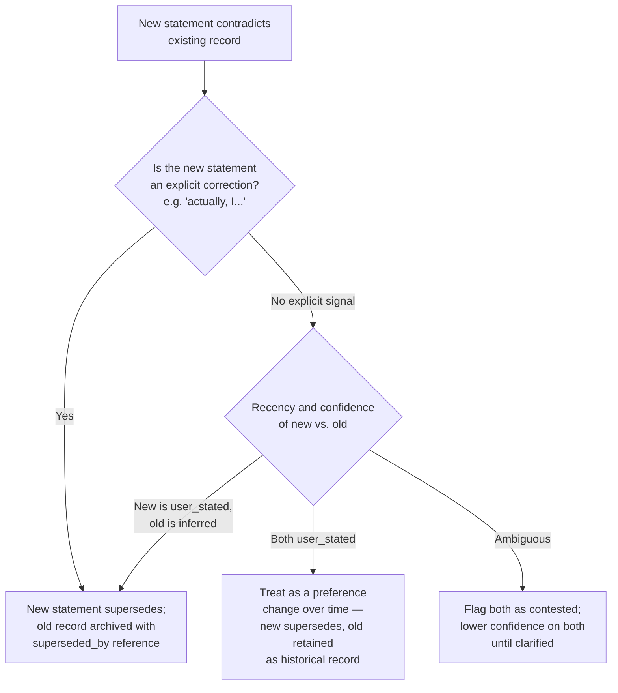

# Memory Conflict Resolution

## Purpose

Defines how NOVA handles a new statement or observation that directly
contradicts existing memory — for example, a user stating "I like
Python" and, weeks later, "I hate Python" — rather than silently holding
two contradictory facts or arbitrarily discarding one.

## Scope

Conflict detection and merge rules for contradictory memory content.
Preference-specific confidence scoring is `docs/04-memory/memory-ranking.md`;
this document covers the general conflict-resolution rule applicable
beyond preferences (contradictory facts, decisions, or observations more
broadly).

## Conflict detection

A new statement or observation is checked against existing memory for
direct contradiction as part of the indexing pipeline
(`docs/04-memory/indexing.md`) — for preferences and stated facts, this
is a targeted check against existing records for the same entity/subject
(via Entity Resolution, `docs/04-memory/entity-resolution.md`), not a
blanket comparison against all of memory.

## Resolution rule

The default for two directly conflicting `user_stated` facts (the "I
like Python" / "I hate Python" case) is **E**: the new statement
supersedes the old as the current fact, but the old statement is not
deleted — it is retained as a historical record (queryable via Timeline
Memory, `docs/04-memory/timeline.md`, as "the user's stated preference
changed on this date") rather than treated as an error to be erased.

## Superseded-record retention

A superseded record is marked with a `superseded_by` reference to the
record that replaced it and its confidence is reduced but not zeroed —
this preserves the ability to answer "did my opinion on X ever change"
while ensuring current retrieval and context assembly
(`docs/05-ai/context-builder.md`) prioritize the current, superseding
fact by default.

## Ambiguous conflicts

Where neither statement is clearly a correction or a later restatement
(e.g., two observations from different sources disagreeing about a
factual matter, not a stated preference), both records are flagged as
**contested** with reduced confidence, and — if the conflict is material
to an in-flight task — routed through the ambiguity-resolution decision
flow (`docs/05-ai/ambiguity-resolution.md`) rather than the Planner
silently picking one.

## Related documents

- `docs/25-failure-modes/FM-01-memory-and-knowledge-graph.md` — failure modes for this subsystem
- `docs/04-memory/memory-ranking.md` — preference-specific confidence
  scoring and the correction-supersedes rule this document generalizes
- `docs/04-memory/timeline.md` — where superseded records remain
  queryable as history
- `docs/05-ai/ambiguity-resolution.md` — how unresolved, task-relevant
  conflicts are escalated
