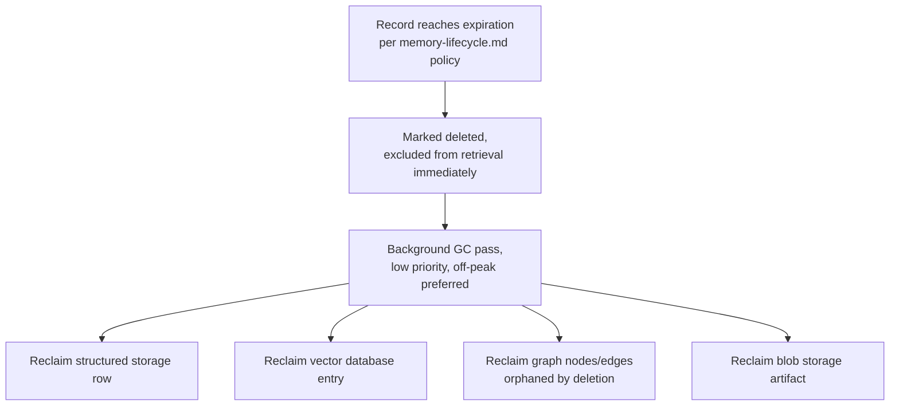

# Memory Garbage Collection and Defragmentation

## Purpose

Specifies how NOVA reclaims storage from expired or deleted memory
records at scale, and how the Knowledge Graph is periodically optimized
as its structure changes — both necessary once a workspace has
accumulated millions of memory records and graph edges over years of use,
per the scaling concerns in `docs/11-performance/scalability.md`.

## Scope

Storage reclamation and structural optimization. Deciding *what* expires
and *when* is `docs/04-memory/memory-lifecycle.md`'s expiration policy
tiers; this document covers what happens to the underlying storage once
that decision has been made.

## Garbage collection

Expired records (per `docs/04-memory/memory-lifecycle.md`'s expiration
tiers) are marked for deletion immediately but are not necessarily
reclaimed from underlying storage at that instant — a background garbage
collection pass, scheduled at low priority
(`docs/11-performance/resource-usage.md`'s background-job budgeting),
performs the actual storage reclamation across structured storage,
vector database, graph database, and blob storage
(`docs/04-memory/memory-storage.md`).

## Why immediate logical deletion, deferred physical reclamation

Marking a record deleted and excluding it from retrieval must be
immediate — a user who deletes a time range
(`docs/04-memory/timeline.md`) must never see that content resurface in
a subsequent query. Physical storage reclamation, however, can safely be
deferred to a background pass, since it has no user-visible effect beyond
freeing disk space, and batching reclamation is more efficient than
reclaiming storage synchronously per deletion.

## Knowledge Graph defragmentation

As entities are merged or split (`docs/04-memory/entity-resolution.md`)
and edges are added or removed over time, the graph's physical layout can
become less efficient for traversal queries than a freshly built graph
would be. A periodic defragmentation pass (scheduled independently of
garbage collection, since it addresses structural efficiency rather than
reclaiming deleted content) re-optimizes graph storage layout — this is
an internal storage-engine operation and does not change any node,
edge, or relationship's logical meaning; it is purely a performance
maintenance operation, verified against `docs/11-performance/benchmarks.md`'s
Knowledge Graph query latency target before and after to confirm it is
actually improving, not merely running unnecessarily.

## Orphaned edge cleanup

Per `docs/04-memory/knowledge-graph.md`'s consistency guarantee, an edge
is never created without both endpoints existing — garbage collection
extends this by cleaning up edges that reference a node deleted through
expiration, since a node's deletion can otherwise leave a dangling
reference behind if not explicitly handled as part of the same GC pass.

## Scheduling and resource budget

Both garbage collection and defragmentation run under the same
background-job resource ceiling as indexing and summarization
(`docs/11-performance/resource-usage.md`), yielding to foreground user
activity, and are never triggered synchronously in a way that would
delay a user-facing query or task.

## Related documents

- `docs/25-failure-modes/FM-01-memory-and-knowledge-graph.md` — failure modes for this subsystem
- `docs/04-memory/memory-lifecycle.md` — the expiration policy that
  triggers garbage collection
- `docs/04-memory/memory-storage.md` — the storage engines being
  reclaimed and defragmented
- `docs/11-performance/resource-usage.md` — the background-job budget
  these processes operate within
