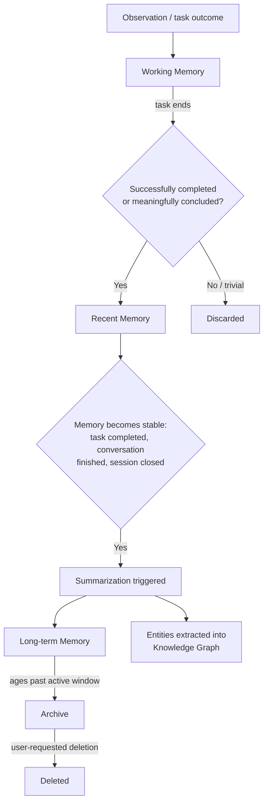

# Memory Lifecycle

## Purpose

Specifies exactly what happens to a piece of memory from the moment it is
captured to the moment it is deleted or archived — this is the direct
answer to the "does raw memory grow forever" risk identified in the
project's foundational review. It does not; this document is why not.

## Scope

Promotion, summarization, and retention/expiry rules across all memory
types in `memory-types.md`.

## Lifecycle pipeline

## What triggers summarization

Summarization into Long-term Memory happens when a memory becomes
**stable** — a completed task, a finished conversation, a completed
project session, or a closed work session. Only completed contexts are
summarized; an in-progress conversation or task remains in Working/Recent
Memory in full detail, since summarizing something still changing risks
losing information that later turns out to matter.

## What summarization discards

Summarization compresses raw step-by-step detail (every intermediate
tool call, every retried attempt) into the durable facts and decisions
that resulted from it. The raw detail is not immediately deleted — it
remains in Recent Memory for its configured retention window (default 4
weeks, per `docs/14-development/configuration-schema.md`'s
`memory.recent_memory_retention_weeks`) and then ages into Archive
rather than being destroyed at the moment of summarization, so that a
"why did you do that" audit query shortly after a task completes can
still reach full step detail (`docs/10-security/audit.md`, Tier 3),
while default retrieval afterward uses the more efficient summary.

## Retention and deletion

Timeline Memory (`timeline.md`) stores a complete chronological history by
default. The user can delete any specific time range manually at any
point — this is an explicit, first-class control, not a hidden setting.
Preferences do not decay automatically; a stored preference remains
until an explicit user correction replaces it (see `memory-ranking.md`
for how corrections are weighted).

## Expiration policy tiers

Not every record follows the same retention rule. Each record is
assigned an expiration policy tier at write time, based on its type and
source (`memory-confidence.md`'s `source` field is one input to this
assignment):

- **Never expires** — Decisions, explicit user preferences, and
  Knowledge Graph entities/relationships. These persist indefinitely
  (subject only to explicit user deletion by time range), since they
  represent durable facts the "never forget" identity of the system
  depends on.
- **Expires after weeks** (default: 30 days; configurable) —
  raw Working/Recent Memory detail not yet summarized: individual tool-
  call step detail, transient observation events, and clipboard/
  notification content at the metadata level. This detail remains
  available for the audit-trail window (`docs/10-security/audit.md`)
  before aging into Archive in compressed/summarized form only.
- **Expires after a configurable short window** — sensitive-category
  content excluded from long-term retention by design regardless of
  general policy (e.g., clipboard content specifically, per
  `docs/07-observers/clipboard.md`'s shorter default retention window).

A record's assigned tier is stored alongside it and governs when it
transitions from Recent Memory into Archive versus being fully expired
(deleted) rather than merely archived — "expires" in this section means
eventual deletion, distinct from "ages into Archive," which retains the
content in a lower-priority tier rather than removing it.

## Related documents (expiration policy)

- `docs/25-failure-modes/FM-01-memory-and-knowledge-graph.md` — failure modes for this subsystem
- `docs/10-security/audit.md` — the window during which expiring raw
  detail remains available for audit purposes before it expires
- `memory-confidence.md` — the source metadata informing tier assignment

## Agent scratch memory disposal

When a task's agent instance finishes execution, its scratch memory
(`memory-types.md`) is discarded except for whatever the Verifier
confirmed as a durable outcome — unverified intermediate reasoning is
never merged into Recent or Long-term Memory, preventing speculative or
abandoned reasoning paths from polluting durable memory.

## Related documents

- `memory-types.md` — what exists in each stage of this pipeline
- `memory-architecture.md` — the tier structure this lifecycle moves data
  through
- `docs/10-security/audit.md` (Tier 3) — how raw step detail remains
  reachable shortly after summarization
