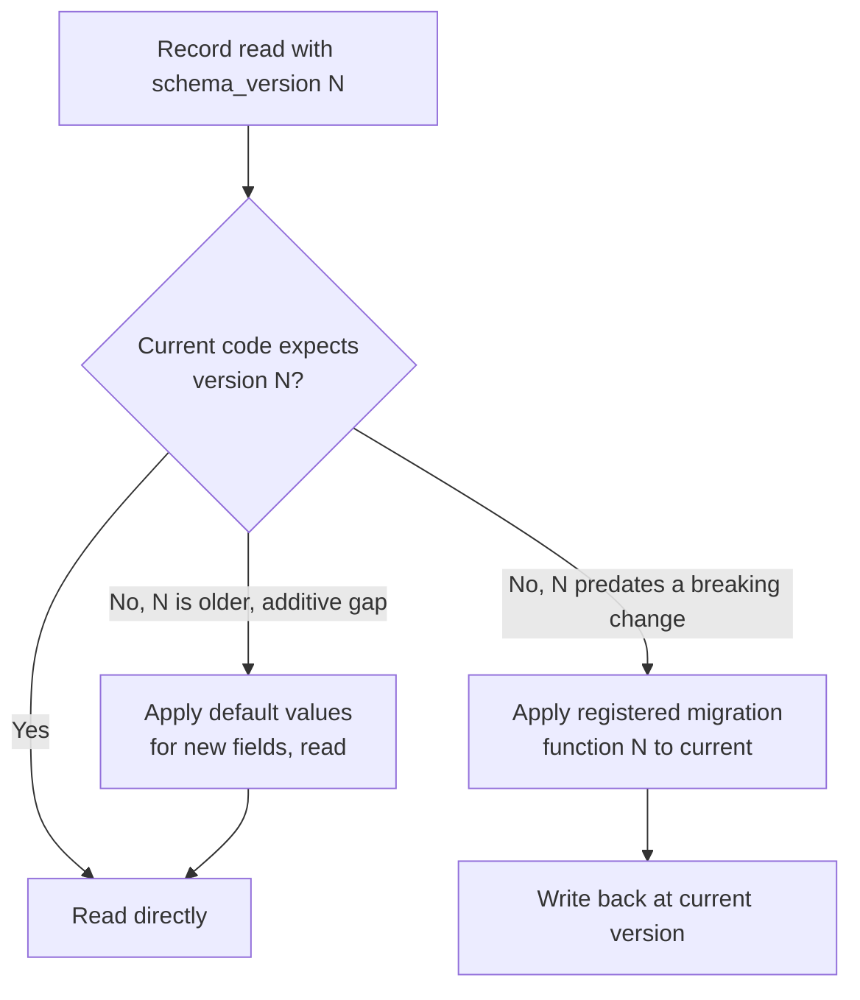

# Memory Versioning

## Purpose

Defines how the structure of stored memory records evolves over time
without breaking access to older memories — distinct from
`docs/04-memory/ontology.md`'s Knowledge Graph schema versioning, this
document covers versioning of the memory record format itself (Working/
Recent/Long-term/Archive entries, per `docs/04-memory/memory-types.md`).

## Scope

Memory record schema versioning and migration. Knowledge Graph node/edge
schema versioning is `docs/04-memory/ontology.md`.

## Why memory records need independent versioning

A memory record's structure (what fields a Recent Memory entry or a
Long-term Memory summary carries) evolves as NOVA's capability grows —
e.g., adding a confidence-source field (`memory-confidence.md`) to
existing record types. Records written under an older version must
remain readable and usable after this evolution, per the "never break
older memories" requirement — a user's years of accumulated history must
not become inaccessible or degraded after an update.

## Versioning scheme

Every memory record carries a `schema_version` field, following the same
semver-style compatibility approach as the message envelope
(`docs/02-architecture/communication-model.md`): additive (minor/patch)
changes are read transparently by newer code without migration; breaking
(major) changes require an explicit migration pass.

## Migration model

Migrations are applied lazily, on read, rather than requiring a bulk
rewrite of all historical memory at update time — this avoids the
disruptive, resource-heavy bulk migration a large accumulated history
would otherwise require, consistent with the lazy re-embedding approach
already used for embedding model changes (`docs/04-memory/embeddings.md`).

## Migration function registry

Each breaking schema version change registers an explicit migration
function (old version → next version), chained as needed for a record
several versions behind current — a record is never migrated by
guessing at intent; a missing migration function for a given version gap
is treated as an error requiring the record to be read in a
degraded, read-only compatibility mode rather than silently
misinterpreted.

## Never break older memories

This is a hard requirement: a memory record written under any previously
released schema version must always be at least readable (even if some
newer-version-only fields are absent) after any future update — a schema
change that would make older records completely unreadable is not
permitted; it requires either an additive-only redesign or an explicit,
disclosed one-time migration with the user informed beforehand, similar
to the disclosure requirement in `docs/13-devops/recovery.md`.

## Related documents

- `docs/25-failure-modes/FM-01-memory-and-knowledge-graph.md` — failure modes for this subsystem
- `docs/04-memory/ontology.md` — the analogous versioning model for
  Knowledge Graph schema specifically
- `docs/04-memory/memory-storage.md` — the storage engines these
  versioned records live in
- `docs/13-devops/updates.md` — how memory versioning interacts with the
  broader software update sequence
