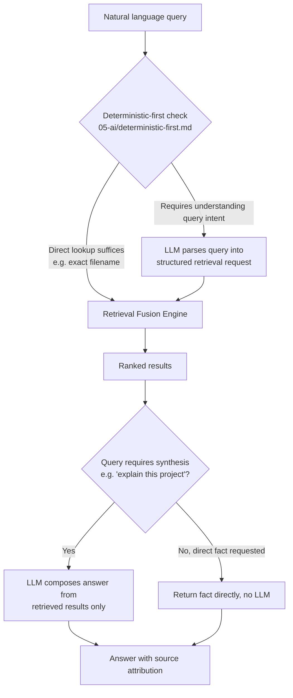

# Search

## Purpose

Describes the user-facing search and Q&A interface built directly on top
of the Retrieval Engine — the mechanism behind "answer questions about
anything you've worked on" from `docs/01-product/product-specification.md`.

## Scope

The user-facing query interface and answer-construction process. The
underlying retrieval mechanics are `retrieval-engine.md`.

## Interface

Available from any UI surface (`docs/09-ui/`, Tier 3): a natural-language
query box (as part of chat, the command palette, or the dedicated Memory
Explorer), plus a structured filter view (by project, by time range, by
entity type) for users who want to browse rather than ask.

## Query-to-answer pipeline

Consistent with Principle 1, a query that only needs a direct fact
lookup ("what is my resume file's path") does not invoke an LLM at all
once the Retrieval Fusion Engine has a confident answer; an LLM is only
used either to parse a genuinely ambiguous natural-language query into a
structured request, or to synthesize an answer that requires combining
multiple retrieved facts into prose.

## Grounding requirement

Every synthesized answer must be traceable to specific retrieved memory
or graph records — the LLM composing step is explicitly constrained to
work only from the retrieved result set passed to it, not from general
model knowledge, and the answer surfaces which records it drew from. This
is what makes the Phase 1 retrieval-accuracy metric in
`docs/01-product/success-metrics.md` measurable: an answer not
attributable to a specific retrieved record is a defect, not an
acceptable use of the model's general knowledge.

## Handling "not found"

When retrieval genuinely returns nothing relevant, Search reports that
directly rather than allowing the LLM composition step to fill the gap
with plausible-sounding but ungrounded content — this is a direct
extension of the hallucination-prevention principle
(`docs/05-ai/hallucination-prevention.md`) to the retrieval-and-answer
path specifically.

## Related documents

- `docs/25-failure-modes/FM-01-memory-and-knowledge-graph.md` — failure modes for this subsystem
- `retrieval-engine.md` — the underlying fusion search this interface
  calls
- `docs/05-ai/ambiguity-resolution.md` — how ambiguous queries are
  disambiguated
- `docs/01-product/success-metrics.md` — how answer quality here is
  measured
