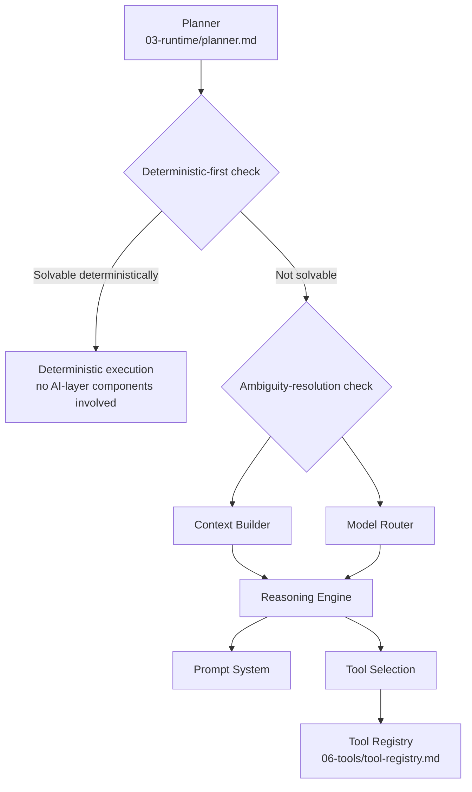

# AI Architecture

## Purpose

The top-level design of NOVA's AI layer: how Model Router, the
Planner-Agent runtime, the Reasoning Engine, Context Builder, Prompt
System, and Tool Selection relate to each other, and how together they
implement Principle 1, Deterministic Before Intelligent.

## Scope

Structural relationships between AI-layer components. Each component's
internal detail is in its own document.

## Component relationship

The critical property of this diagram: a purely deterministic task never
touches any node below "Deterministic execution" — the AI layer is
architecturally bypassable, not merely usually-bypassed, for tasks that
do not need it.

## Component summary

- **Model Router** (`model-router.md`) — deterministically selects which
  AI provider/model handles a given request; is itself not an LLM.
- **Planner-Agent** (`planner-agent.md`) — the single parameterized agent
  runtime instantiated per task, replacing a menagerie of separately
  implemented "agent types."
- **Capability Registry** (`capability-registry.md`) — the named,
  higher-level abstraction the Planner selects from, so it never
  hardcodes assumptions about which specific tools currently exist.
- **Episodic Replay** (`episodic-replay.md`) — retrieves a prior
  successful task's plan as a starting draft for a similar new goal,
  without exempting any step from the usual safety and verification
  requirements.
- **Reasoning Engine** (`reasoning-engine.md`) — constructs the actual
  LLM call and parses its structured output into a usable plan step.
- **Context Builder** (`context-builder.md`) — assembles the per-request
  context from memory/graph without exceeding the model's context window.
- **Prompt System** (`prompt-system.md`) — manages prompt templates,
  including the content/instruction separation critical to prompt
  injection defense, and their versioning (`prompt-versioning.md`).
- **Tool Selection** (`tool-selection.md`) — resolves a chosen capability
  to a specific registered tool once an approach has been decided.

## Why the AI layer is organized this way

Each component above corresponds to a decision that previously risked
being made implicitly or inconsistently: which provider handles a call
(Model Router, made deterministic rather than by another LLM call), how
much context is enough (Context Builder, made explicit rather than
"dump everything"), and whether an LLM is needed at all (the
deterministic-first and ambiguity-resolution checks, made explicit rather
than defaulted to). Separating these into distinct components makes each
individually testable and individually able to fail without silently
degrading the others.

## Related documents

- `deterministic-first.md`, `ambiguity-resolution.md` — the two decision
  gates in the diagram above
- `model-router.md`, `planner-agent.md`, `reasoning-engine.md`,
  `context-builder.md`, `prompt-system.md`, `tool-selection.md` — full
  detail per component
- `docs/03-runtime/planner.md` — the runtime service that owns this
  overall flow
