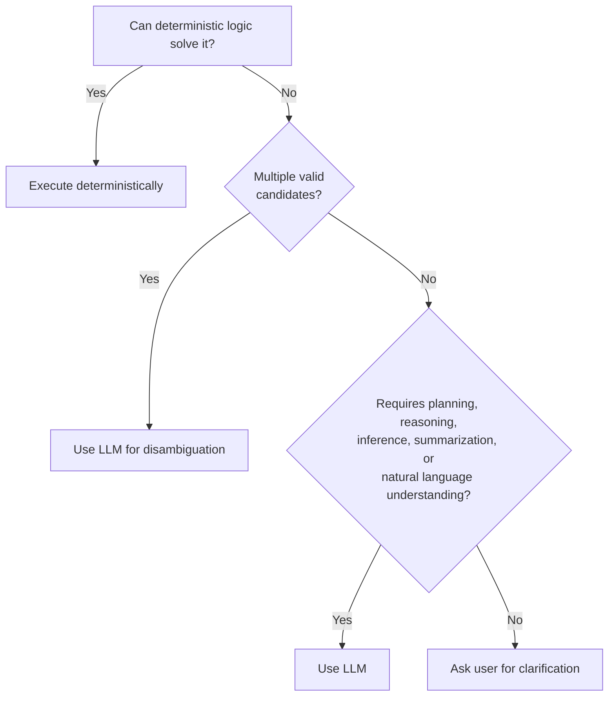

# Ambiguity Resolution

## Purpose

The precise, testable decision flow that governs exactly when an LLM is
invoked, once `deterministic-first.md` has determined a task is not
trivially resolvable by direct deterministic logic. This is the boundary
rule between deterministic execution and AI reasoning.

## Scope

The decision flow itself and its worked examples. General principle
justification is `deterministic-first.md`.

## Decision flow

The LLM is invoked only when deterministic execution cannot produce a
single, high-confidence result — this flow is the operational definition
of that condition.

## Worked example: "Find my resume"

1. Deterministic filename/content search runs first
   (`docs/04-memory/retrieval-engine.md`).
2. If exactly one high-confidence match exists, it is returned directly —
   no LLM involved.
3. If multiple equally plausible matches exist — top two results within
   `docs/04-memory/memory-ranking.md`'s 0.1 ambiguity margin (e.g.,
   "resume.pdf" in two different project folders) — the LLM is invoked
   specifically to rank candidates using available context (recency,
   project relevance, past usage) — this is the "multiple valid
   candidates" branch.
4. If confidence remains insufficient even after LLM ranking, the user is
   asked directly, rather than the system guessing and proceeding
   silently.

## Worked example: "Summarize this project"

Deterministic logic cannot produce a summary — retrieval can gather the
relevant facts (`docs/04-memory/retrieval-engine.md`), but composing them
into a coherent summary requires natural language generation. This
resolves directly via the "requires summarization" branch to LLM use,
with no disambiguation step needed since there is no candidate ambiguity
involved.

## Worked example: "Which file is probably the one I edited yesterday?"

The word "probably" is itself the signal that this requires inference
beyond a direct lookup — even if only one file was edited yesterday
(no candidate ambiguity), the task requires reasoning about likelihood
and user intent, routing it to the LLM via the "requires inference"
branch rather than the disambiguation branch.

## Boundary case: scoring confidence for "high-confidence" and "equally
plausible"

This flow assumes deterministic search can produce a confidence score
per candidate (e.g., exact filename match scores higher than fuzzy
content match). The specific scoring function is an implementation detail
of the Retrieval Fusion Engine and its ranking model
(`docs/04-memory/memory-ranking.md`) — this document defines the decision
boundary; the underlying confidence computation is defined there.

## Why asking the user is the final branch, not guessing

Consistent with `docs/03-runtime/verifier.md`'s rule that an unverifiable
outcome is reported as unverified rather than assumed successful, an
unresolvable ambiguity is reported to the user rather than silently
resolved by picking the statistically likely candidate — silent guessing
at this stage is exactly the kind of unearned confidence the Verifier is
designed to prevent later in the pipeline, so it is prevented here too.

## Related documents

- `docs/25-failure-modes/FM-05-llm-core-and-ai-specific-failures.md` — failure modes for this subsystem
- `deterministic-first.md` — the principle this flow operationalizes
- `docs/04-memory/entity-resolution.md` — a specific application of this
  flow to entity matching
- `docs/04-memory/memory-ranking.md` — the confidence scoring this flow
  depends on
