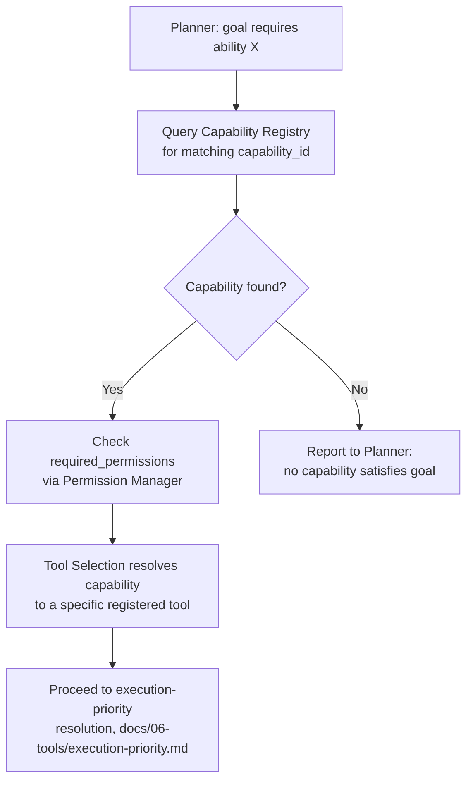

# Capability Registry

## Purpose

Defines the Capability Registry: a layer above the Tool Registry
(`docs/06-tools/tool-registry.md`) that lets the Planner reason about
*what NOVA can do* in terms of named, discoverable capabilities rather
than hardcoding assumptions about which specific tools exist. This closes
a gap identified as critical: without it, adding or removing tools risks
requiring changes to Planner logic itself, rather than the Planner
discovering capability dynamically.

## Scope

The capability abstraction and its relationship to tools, models, and
memory requirements. Individual tool metadata remains
`docs/06-tools/tool-interface.md`; this document covers the higher-level
grouping above it.

## Capability vs. tool

A **tool** (`docs/06-tools/tool-interface.md`) is a single, concrete,
invokable action. A **capability** is a named, higher-level ability
(e.g., "summarize a document," "search the filesystem," "query git
history") that may be satisfied by one or more registered tools, may
require a specific class of AI model, and may depend on specific memory
access. The Planner selects capabilities first, then Tool Selection
(`docs/05-ai/tool-selection.md`) resolves a capability to a specific
registered tool.

## Capability schema

```json
{
  "capability_id": "string, unique",
  "name": "string",
  "description": "string",
  "required_permissions": ["array, per docs/10-security/authorization.md scopes"],
  "required_models": ["array of required model capabilities, e.g. 'tool_calls', 'vision_input', or 'none' if deterministic"],
  "required_tools": ["array of tool_id values that can satisfy this capability"],
  "required_memory_access": ["array of memory tiers/scopes this capability reads, per docs/04-memory/memory-architecture.md"],
  "cost_class": "free | low | medium | high",
  "latency_class": "instant | fast | slow",
  "version": "semver string",
  "dependencies": ["array of other capability_id values this one composes"]
}
```

## Dynamic capability selection



This is what allows the Planner to never hardcode "call tool X" directly
— it reasons in terms of capabilities, and the registry, not the
Planner's own logic, tracks which concrete tools currently satisfy each
one. Adding, removing, or replacing a tool updates the registry's mapping
without requiring a Planner code change.

## Composite capabilities

A capability's `dependencies` field allows it to be defined in terms of
other capabilities (e.g., "produce a project status report" composing
"search recent activity" and "summarize a document") — resolved
recursively by the same mechanism, bottoming out at capabilities backed
directly by registered tools.

## Versioning

Capability versioning follows the same semver discipline as tools
(`docs/06-tools/tool-schema-versioning.md`) — a breaking change to a
capability's required inputs or guarantees requires a major version
bump, with the Planner able to check compatibility before relying on a
specific capability version.

## Related documents

- `docs/25-failure-modes/FM-04-model-router-provider-fallback.md` — failure modes for this subsystem
- `docs/06-tools/tool-registry.md`, `tool-interface.md` — the concrete
  layer this registry sits above
- `docs/05-ai/tool-selection.md` — where a resolved capability becomes a
  specific tool invocation
- `docs/06-tools/tool-schema-versioning.md` — the versioning discipline
  this registry follows
