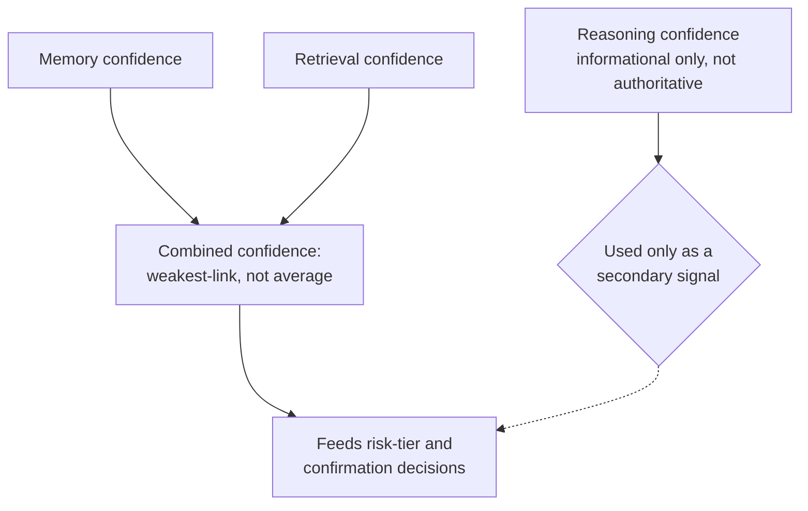

# Confidence Propagation

## Purpose

Specifies how confidence values from different sources — memory records
(`docs/04-memory/memory-confidence.md`), the Retrieval Fusion Engine's
ranking (`docs/04-memory/memory-ranking.md`), and the Planner's own
assessment of a generated plan — combine into a single confidence signal
used for risk-tier and hallucination-prevention decisions
(`docs/05-ai/hallucination-prevention.md`).

## Scope

Confidence combination rules across components. Individual components'
own confidence computation is documented where that confidence
originates (`docs/04-memory/memory-confidence.md`,
`docs/04-memory/memory-ranking.md`).

## Sources of confidence in a single decision

A single Planner decision (e.g., "delete this file") can be informed by
confidence from multiple independent sources:

- **Memory confidence** — how confident NOVA is in the underlying fact
  (e.g., "this is the correct file") per `docs/04-memory/memory-confidence.md`.
- **Retrieval confidence** — how strongly the Retrieval Fusion Engine's
  ranking favored this result over alternatives
  (`docs/04-memory/memory-ranking.md`).
- **Reasoning confidence** — for a step requiring LLM reasoning
  (`docs/05-ai/reasoning-engine.md`), the reasoning model's own expressed
  certainty, if the model surfaces one — always treated as
  self-reported and non-authoritative, per
  `docs/05-ai/hallucination-prevention.md`'s explicit rule that
  self-reported model confidence does not change risk tier.

## Combination rule

Combined confidence for a decision is computed as the **minimum**
(weakest-link) across memory confidence and retrieval confidence, not an
average — a highly confident retrieval match built on a low-confidence
underlying memory record does not produce a high-confidence decision,
since the weakest link determines how much the overall conclusion can
actually be trusted. Self-reported reasoning-model confidence is
tracked and logged (for the audit trail, `docs/10-security/audit.md`) but
is explicitly excluded from this combination — it never raises or lowers
the computed value, consistent with `docs/05-ai/hallucination-prevention.md`'s existing rule.

## Why weakest-link rather than averaging

Averaging can produce a misleadingly moderate combined score from one
very confident input and one very uncertain one, masking the fact that
the decision's correctness is actually bottlenecked by its weakest input.
Weakest-link combination is the conservative choice, consistent with
this project's general posture of treating ambiguous or uncertain
situations as requiring more caution, not less
(`docs/05-ai/ambiguity-resolution.md`'s "ask the user" fallback when
confidence is insufficient, applied at the combination level here).

## Effect on downstream decisions

The combined confidence value feeds directly into
`docs/05-ai/hallucination-prevention.md`'s four-tier AI-specific risk-tier
framework (Low/Medium/High/Critical — see that document's mapping to the
general Read-only/Reversible-write/Destructive scale in
`docs/10-security/permissions.md`): a low combined-confidence decision at
what would otherwise be a Medium AI-specific tier is treated at the next
tier up for confirmation purposes,
consistent with that document's principle that confidence does not
change risk tier upward (toward more autonomy) but can push it downward
(toward more caution).

## Related documents

- `docs/25-failure-modes/FM-05-llm-core-and-ai-specific-failures.md` — failure modes for this subsystem
- `docs/04-memory/memory-confidence.md`, `memory-ranking.md` — the
  individual confidence sources combined here
- `docs/05-ai/hallucination-prevention.md` — how the combined value is
  used downstream
- `docs/05-ai/explainability.md` — how combined confidence is surfaced in
  a plan's explanation
