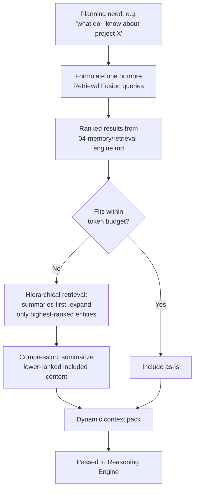

# Context Builder

## Purpose

Assembles the per-request working context passed into an LLM call from
Memory and the Knowledge Graph, without exceeding the selected model's
context window and without "dumping everything" as a substitute for
actual retrieval relevance.

## Scope

Context assembly logic. The underlying retrieval it calls into is
`docs/04-memory/retrieval-engine.md`; the resulting context is consumed
by `reasoning-engine.md`.

## Conversation history schema

`docs/25-failure-modes/FM-06-context-prompt-session.md`'s FM-06-015
references "the conversation-history schema" as something role-mapping
is unit-tested against — this is that schema, since conversation history
is exactly what gets assembled into the context pack above:

```json
{
  "turn_id": "uuid, per docs/14-development/naming-conventions.md's instance-identifier rule",
  "role": "user | assistant | system",
  "content": "string — the message text",
  "created_at": "ISO 8601 timestamp",
  "correlation_id": "uuid, present when this turn is tied to an in-flight task, per docs/03-runtime/planner-executor-contract.md"
}
```

A conversation is an ordered list of turns; `role` is strictly one of
the three values above — never a free-text speaker name, and never
inferred from position (e.g., "assumed alternating" logic), since that
is exactly the class of bug FM-06-015 exists to catch. `docs/09-ui/
chat.md` is the primary renderer of this schema; this document is the
primary consumer of it for context assembly.

## Assembly pipeline



## Never dump everything

The Context Builder never passes the entirety of Recent or Long-term
Memory into a call regardless of how small the current model's context
window is relative to total stored memory — every inclusion decision goes
through ranking (`docs/04-memory/memory-ranking.md`) and is justified by
relevance to the current task, not convenience.

## Sensitive-category purpose gate

Independent of, and applied before, relevance ranking above: a memory
record tagged at capture time with a sensitive category (health,
financial, or any other category the observer/source marks as sensitive
per its own capture logic, e.g. `docs/07-observers/clipboard.md`'s
content-vs-metadata distinction) is only eligible for inclusion in
assembled context when the task's declared purpose explicitly falls
within that category — high relevance ranking alone never overrides
this gate. A task summarizing "my recent expenses" may draw on
financial-tagged memory; a task unrelated to health or finance never
includes health/financial-tagged memories even if a ranking pass would
otherwise consider them relevant, per
`docs/25-failure-modes/FM-06-context-prompt-session.md`'s FM-06-006.
This gate is enforced in the Context Builder itself, not left as an
assumption about what the ranking step will naturally exclude.

## Hierarchical retrieval and entity expansion

For a broad request ("what do I know about project X"), the Context
Builder first retrieves high-level summaries (Long-term Memory
summaries, Knowledge Graph node descriptions) rather than every raw
Recent Memory record, and only expands into more detailed records for the
specific entities that rank highest — e.g., expanding into the full
history of the three most relevant files rather than every file ever
associated with the project.

## Compression

Content that is relevant enough to include but not important enough to
include in full is summarized inline rather than omitted entirely or
included in full raw form — this keeps lower-priority but still-relevant
context present without consuming a disproportionate share of the token
budget.

## Compression algorithm (concrete steps)

When assembled content exceeds the available token budget, compression
proceeds in this fixed order, stopping as soon as the budget is met:

1. **Evict lowest-ranked content first** — per
   `docs/04-memory/memory-ranking.md`'s weighted score, the lowest-
   ranked included items are dropped entirely before any remaining item
   is compressed, since dropping a barely-relevant item loses less than
   compressing a highly-relevant one.
2. **Chunk-level summarization for large documents** — a large included
   document (per `docs/04-memory/embeddings.md`'s chunking) has its
   lowest-relevance chunks summarized into one or two sentences while its
   highest-relevance chunk(s) remain in full, rather than uniformly
   shrinking the entire document.
3. **Importance-scored trimming within Memory records** — a Long-term
   Memory summary record is itself further compressed by dropping
   supporting detail sentences ranked lowest by the same importance
   factors used in `docs/04-memory/memory-ranking.md`, retaining the
   core stated fact or decision.
4. **Sliding-window retention for conversational history** — for
   ongoing multi-turn context (Working Memory,
   `docs/04-memory/memory-types.md`), only the most recent N turns are
   retained in full; older turns are represented by a running summary
   updated incrementally rather than re-summarized from scratch each
   time, avoiding both unbounded growth and repeated summarization cost.
5. **Hard floor — never compress the user's original request or the
   response-format instructions** (per `docs/05-ai/model-context-assembly.md`'s ordering) — if applying steps 1-4 to
   everything else still exceeds budget, the Context Builder reports the
   constraint to the Planner (per the existing token-budget enforcement
   below) rather than trimming these two positions, since compressing
   the request itself risks changing what is actually being asked.

## Token budget enforcement

The Context Builder receives the selected model's context window size
from the Model Router's routing decision (`model-router.md`) and enforces
the budget strictly — if the highest-priority content alone would exceed
budget, lower-ranked content is dropped first, and if even
highest-priority content cannot fit, the Context Builder reports this
constraint back to the Planner rather than silently truncating in an
unpredictable way.

## Related documents

- `docs/25-failure-modes/FM-06-context-prompt-session.md` — failure modes for this subsystem
- `docs/04-memory/retrieval-engine.md` — the fusion search this component
  queries
- `docs/04-memory/memory-ranking.md` — the ranking model driving
  inclusion decisions
- `model-router.md` — the source of the token budget constraint
- `reasoning-engine.md` — the consumer of assembled context
