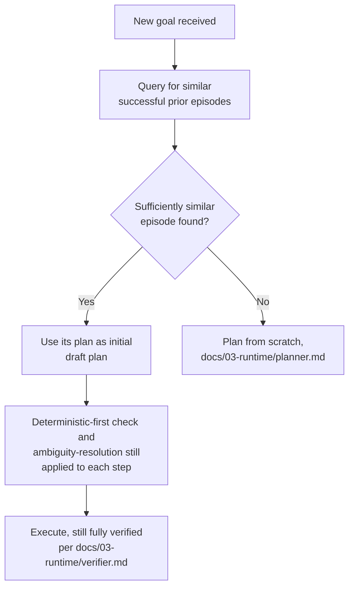

# Episodic Replay

## Purpose

Specifies how the Planner reuses a previously successful task's recorded
plan as a starting point for a new, similar task — distinct from
`docs/12-testing/simulation-tests.md`'s recorded-replay, which is a
testing mechanism; this document covers replay as a live planning
capability that makes repeated, similar tasks faster and more reliable
over time.

## Scope

Runtime plan reuse. Test-time recorded replay for regression detection is
`docs/12-testing/simulation-tests.md`.

## Why this is useful

A task the user has successfully completed before (e.g., "clean up my
Downloads folder using these rules") likely has a very similar successful
plan the next time a similar goal is requested. Without episodic replay,
the Planner replans from scratch every time, re-deriving a plan the
Knowledge Graph and Recent Memory already have a verified, successful
precedent for.

## Retrieval of candidate episodes

When the Planner receives a goal, before full planning
(`docs/03-runtime/planner.md`), it queries Long-term Memory and the
Knowledge Graph (via `docs/04-memory/retrieval-engine.md`) for prior
tasks with a similar goal and a `Completed` outcome
(`docs/03-runtime/task-manager.md`), ranked by similarity, recency, and
confidence (`docs/04-memory/memory-ranking.md`).

## Replay is a starting point, not a shortcut around verification

Critically, a replayed plan's steps are not exempted from the
deterministic-first check, ambiguity resolution, risk-tier confirmation,
or verification — episodic replay only shortcuts *plan generation*,
never the safety and verification scaffolding applied to *plan
execution*. A prior successful plan is a strong prior for what steps are
likely needed, not a license to skip re-checking whether those steps are
still valid for the current state (e.g., the target folder's contents
have changed since the prior episode).

## Adaptation to current context

A replayed plan's steps are re-grounded against current Context Builder
output (`docs/05-ai/context-builder.md`) before execution — file paths,
entity references, and preconditions are re-resolved against the current
Knowledge Graph state, not blindly reused from the prior episode's
recorded values, since the workspace may have changed materially since
then.

## When replay is not used

Episodic replay is skipped for any task at the destructive/irreversible
risk tier where the current context differs materially from the prior
episode's recorded context (e.g., a different target folder, a
different file count) — in these cases, planning proceeds from scratch to
avoid over-trusting a superficially similar but materially different
situation.

## Related documents

- `docs/25-failure-modes/FM-05-llm-core-and-ai-specific-failures.md` — failure modes for this subsystem
- `docs/03-runtime/planner.md` — where this retrieval step fits into the
  planning loop
- `docs/04-memory/retrieval-engine.md`, `memory-ranking.md` — how
  candidate episodes are found and ranked
- `docs/12-testing/simulation-tests.md` — the distinct, test-time use of
  recorded replay
