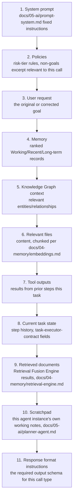

# Model Context Assembly

## Purpose

Specifies the exact, ordered structure of every LLM call the Reasoning
Engine constructs — closing the gap between `docs/05-ai/prompt-system.md`'s
three-section structure (system instructions / trusted context / observed
content) and an implementer's need to know the literal assembly order and
what goes in each position.

## Scope

The literal ordering and content of a single LLM call's input. Which
content is selected for inclusion is `docs/05-ai/context-builder.md`;
this document is about final assembly order once selection is complete.

## Assembly order

## Why this specific order

- **System prompt first** — model providers generally weight earlier
  content as framing for everything after it; fixed instructions belong
  first so they are never confused with the variable content that
  follows.
- **Policies immediately after** — risk-tier and scope constraints must
  be established before the model sees the specific request, so it is
  never in a position to reason about the request without having already
  been told the boundaries.
- **User request before memory/context** — grounds what follows in an
  explicit question, preventing the model from treating retrieved context
  as the prompt itself.
- **Memory and Knowledge Graph before files/tool outputs** — structured,
  already-verified facts are given more prominent positioning than raw,
  larger, less-curated content.
- **Observed content (files, tool outputs, retrieved documents)
  positioned as clearly bounded, labeled blocks** — per
  `docs/05-ai/prompt-system.md`'s content/instruction separation, every
  block in positions 6, 7, and 9 is wrapped with an explicit delimiter
  identifying it as data, never merged into the instruction stream.
- **Scratchpad near the end** — the agent instance's own prior reasoning
  is recent context but explicitly not authoritative instruction, kept
  separate from the system prompt and policies.
- **Response format last** — immediately preceding generation, so the
  model's most recent input before producing output is the exact schema
  it must conform to, per `docs/05-ai/reasoning-engine.md`'s structured
  output requirement.

## Omission rule

A position with nothing to contribute for a given call (e.g., no relevant
files for a pure planning call) is omitted entirely, not included as an
empty placeholder block — an empty block wastes tokens and can be
misread as "no files exist" rather than "no files were relevant to
include."

## Token budget interaction

This ordering is what the Context Builder's token-budget enforcement
(`docs/05-ai/context-builder.md`) trims against when the full assembly
would exceed the model's context window — lower-priority positions
(retrieved documents, then tool outputs, then memory, roughly in reverse
of the order above, excluding system prompt/policies/user request/
response format, which are never trimmed) are compressed or dropped
first.

## Related documents

- `docs/25-failure-modes/FM-06-context-prompt-session.md` — failure modes for this subsystem
- `docs/05-ai/prompt-system.md` — the three-section structure this
  ordering elaborates
- `docs/05-ai/context-builder.md` — selection and token-budget logic
- `docs/05-ai/reasoning-engine.md` — the consumer of this assembled input
