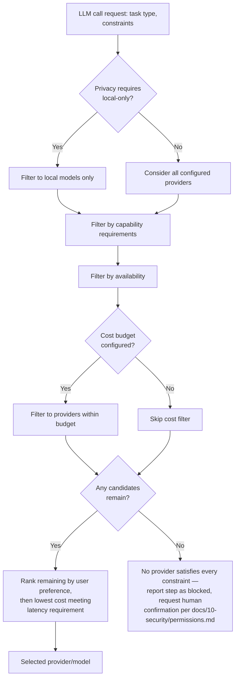
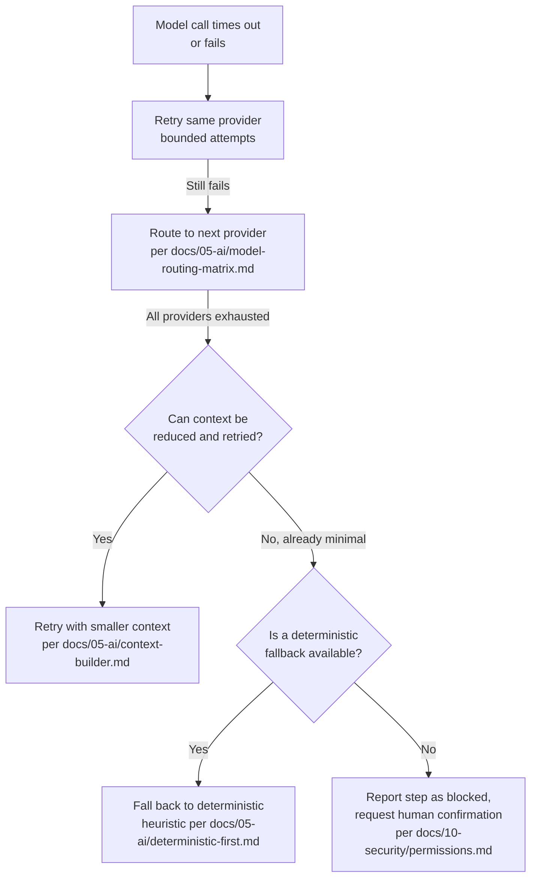

# Model Router

## Purpose

Selects which AI provider and model handles a given LLM call, using fixed,
deterministic rules — explicitly not another LLM call — so that model
selection is itself fast, free, predictable, and debuggable.

## Scope

Routing decision logic only. Provider configuration (endpoints, keys,
capabilities) is `model-providers.md`; what happens once a model is
selected is `reasoning-engine.md`.

## Why deterministic, not LLM-based, routing

Using an LLM to decide which LLM to use adds latency and cost to every
single call and introduces a recursive layer of judgment that is itself
unverifiable — the project's foundational review flagged this
specifically as a risk. A rules-based router is faster, free to run, and
its decisions are fully explainable from the rule that fired.

## Routing inputs

- **Task type** — e.g., summarization, planning, vision parsing,
  embedding generation, disambiguation — each may have a different
  preferred model class.
- **Latency requirement** — an interactive user-facing call has a
  tighter budget (`docs/11-performance/performance-goals.md`, Tier 3)
  than a background task.
- **Cost constraint** — user-configured budget ceilings
  (`docs/11-performance/performance-goals.md`, Tier 3) and per-provider
  cost rates.
- **Privacy requirement** — some content categories may be configured to
  never leave the device, forcing local-model-only routing regardless of
  other factors.
- **Capability requirements** — e.g., vision input support, tool-call
  support, context window size needed for the current Context Builder
  output.
- **Availability** — whether a configured provider is currently reachable
  (falls back per `model-providers.md`'s offline behavior if not).
- **User preference** — an explicit user-configured preference order
  between equally-qualified providers.

## Routing algorithm

The empty-candidate-set case (node `L`) — e.g., privacy configuration
requires local-only but no configured local model has the needed
capability — is genuinely distinct from the Failure and fallback section
below: this is zero providers ever being *eligible*, before any call is
attempted, not a selected, eligible provider failing at call time. Both
terminate the same way (human confirmation), but for a different reason
a debugging implementer needs to be able to tell apart from the router's
logs.

Cost optimization specifically means: among providers that meet the
required quality/capability bar, always prefer the lowest cost, with
local models preferred first where privacy or cost configuration favors
them.

## Failure and fallback

If the selected provider is unreachable at call time, the router
re-runs the algorithm excluding that provider, rather than the calling
component (Reasoning Engine) needing its own retry/fallback logic — this
keeps provider-failure handling in one place.

## AI failure recovery escalation chain

For a call that fails even after provider fallback, the Reasoning Engine
(`docs/05-ai/reasoning-engine.md`) escalates through a fixed sequence
before giving up, per `docs/05-ai/model-routing-matrix.md`'s "Fallback
order" column and `docs/03-runtime/failure-recovery.md`'s taxonomy:

Each stage is attempted in order; the chain does not skip stages even
under time pressure, since skipping directly to human confirmation
without attempting cheaper recovery first would undermine the cost/
latency optimization goals in `docs/11-performance/optimization.md`. A
deterministic fallback (stage 5) is only available where one genuinely
exists for the task — for a step that is inherently synthesis/generation
(e.g., "summarize this"), there is no deterministic equivalent, and the
chain proceeds directly to human confirmation from stage 4.

## Related documents (escalation chain)

- `docs/03-runtime/failure-recovery.md` — the general failure taxonomy
  and retry budget this chain operates within
- `docs/05-ai/model-routing-matrix.md` — the fallback ordering referenced
  above
- `docs/10-security/permissions.md` — the human-confirmation path at the
  end of the chain

## Related documents

- `docs/25-failure-modes/FM-04-model-router-provider-fallback.md` — failure modes for this subsystem
- `model-providers.md` — the provider configuration this router selects
  from
- `reasoning-engine.md` — the consumer of a routing decision
- `docs/11-performance/performance-goals.md` (Tier 3) — the cost/latency
  budgets referenced above
