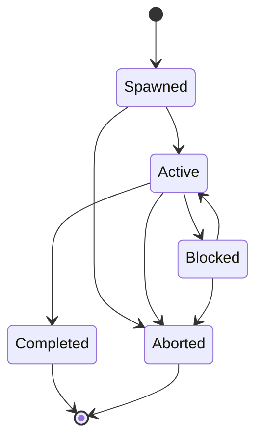

# Planner-Agent Runtime

## Purpose

Specifies the single, parameterized agent runtime NOVA uses for every
task, replacing the originally considered design of ten separately
implemented "agent types" (planner, research, coding, browser, file,
memory, verification, cleanup, etc.) with one runtime configured
differently per task.

## Scope

The agent instantiation and configuration model. The planning loop itself
is `docs/03-runtime/planner.md`; this document covers what an "agent
instance" actually is structurally.

## Why one runtime instead of many agent types

Most of the originally proposed agent types differ only in system prompt
and tool allowlist, not in underlying execution logic — a "file agent"
and a "browser agent" both run the same plan-execute-verify loop against a
different, narrower set of tools. Implementing them as ten separate
runtimes would mean ten things to prompt-engineer, test, and keep in sync
as the base model changes, for no behavioral difference a configuration
parameter could not achieve. One parameterized runtime is strictly
stronger on engineering-effort and reliability grounds; it is weaker only
as a pitch narrative, which is not an engineering concern.

## Agent instance configuration

Each agent instance, when spawned for a task or sub-task, is configured
with the minimum scope that task actually requires — the principle of
least privilege applied per-instance, not just per-user: a "summarize
this document" agent instance never receives filesystem-write tools in
its allowlist, even if the user's own standing permissions would allow
it, because the task at hand doesn't need them. Configuration:

- **Task scope** — the specific goal or sub-goal it is responsible for.
- **Tool allowlist** — the subset of the Tool Registry
  (`docs/06-tools/tool-registry.md`) it is permitted to invoke, enforced
  independently by the Permission Manager
  (`docs/03-runtime/permission-manager.md`), populated with only the
  tools the current task's plan actually calls for — never the full set
  the user has standing permission for, and never widened "just in
  case" a later step might need more.
- **System prompt template** — selected from the Prompt System
  (`prompt-system.md`) based on task type (e.g., a summarization-scoped
  prompt vs. a file-operation-scoped prompt).
- **Memory access rules** — which memory tiers and Knowledge Graph scopes
  it may read (per `docs/04-memory/memory-architecture.md`); write access
  is always mediated through Task Manager, never direct.
- **Time and step budget** — the maximum wall-clock time and step count
  before the instance is considered stuck (`docs/03-runtime/planner.md`).
- **Success criteria** — the condition the Verifier checks to determine
  whether this instance's sub-goal was achieved.

## Lifecycle

An agent instance is created when the Planner delegates a sub-goal (e.g.,
"research this topic" as a step within a larger task), executes within
its configured scope, and is destroyed when its sub-goal reaches a
terminal state. Its scratch memory (`docs/04-memory/memory-types.md`) is
discarded at destruction except for whatever the Verifier confirms as a
durable outcome, which is merged into Recent Memory by Task Manager.

### Agent instance state machine

- **Spawned** — instance created and configured (task scope, tool
  allowlist, prompt template, memory access rules, time/step budget,
  success criteria) but has not yet executed its first step.
- **Active** — executing plan steps within its configured scope.
- **Blocked** — waiting on a resource lock held by another instance
  (`docs/03-runtime/resource-manager.md`) or on a sub-instance it
  spawned; the instance itself is not making forward progress.
- **Completed** — the sub-goal reached a terminal state and the Verifier
  confirmed the outcome; scratch memory is discarded except for the
  confirmed durable outcome, merged into Recent Memory by Task Manager.
  Terminal.
- **Aborted** — destroyed before completion: the parent task was
  cancelled, the time/step budget was exhausted, or an unrecoverable
  step failure occurred. Terminal; scratch memory is fully discarded,
  since no outcome was confirmed to preserve.

This state machine tracks one agent instance, a finer grain than the
Task state machine in `docs/03-runtime/task-manager.md` — one Task's
`Executing` state always spans one or more agent instances moving
through `Spawned → Active → Completed`/`Aborted` for each step or
sub-goal it delegates.

## Isolation between concurrent instances

Multiple agent instances may be active concurrently for different steps
or different tasks. Isolation between them is enforced at two levels: the
Permission Manager's per-instance tool allowlist prevents one instance
from exceeding its configured scope, and the Resource Manager
(`docs/03-runtime/resource-manager.md`) prevents two instances from
writing to the same resource simultaneously, regardless of whether they
belong to the same or different tasks.

## Related documents

- `docs/25-failure-modes/FM-03-agent-orchestration-and-collaboration.md` — failure modes for this subsystem
- `docs/03-runtime/planner.md` — the planning loop that spawns and
  manages agent instances
- `prompt-system.md` — the prompt templates instances are configured with
- `docs/03-runtime/permission-manager.md`, `resource-manager.md` — the
  isolation mechanisms referenced above
