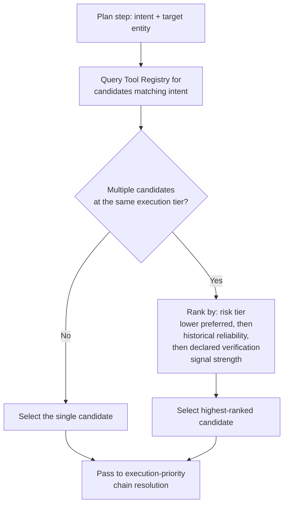

# Tool Selection

## Purpose

Describes how the Planner chooses which specific registered tool
satisfies a given plan step, once it has been determined that a step
requires action — as distinct from the execution-priority chain that
determines *which tier* of execution method is preferred (see
`docs/06-tools/execution-priority.md`).

## Scope

Selection logic among candidate tools. The registry being selected from
is `docs/06-tools/tool-registry.md`; the priority ordering across
execution tiers is `docs/06-tools/execution-priority.md`.

## Selection pipeline

## Tie-breaking factors

When more than one registered tool at the same execution tier could
satisfy a step (e.g., two different MCP servers both expose a
file-search capability), selection ranks candidates by the following
ordered criteria, each breaking ties from the previous:

1. **Risk tier** — lower risk tier for the specific action preferred.
2. **Verification signal strength** — a tool declaring a real
   verification signal (`docs/06-tools/tool-interface.md`) is preferred
   over one restricted to confirmation-required, `none`-signal execution.
3. **Historical reliability** — the candidate with a higher recorded
   verification-success rate for this action type, tracked per
   `docs/12-testing/` and operational metrics.
4. **Estimated latency and cost** — the lower `estimated_latency_ms` and `estimated_cost_class` (`docs/06-tools/tool-interface.md`), combined
   per the same weakest-link-averse philosophy as
   `docs/05-ai/confidence-propagation.md` (a fast-but-unreliable
   candidate does not outrank a slightly slower, more reliable one —
   reliability, via criteria 2-3, is evaluated before cost/latency, not
   averaged with it).
5. **Deterministic preference** — where one candidate is `deterministic: true` and another is not for equivalent output, the deterministic
   candidate is preferred, directly reinforcing
   `docs/05-ai/deterministic-first.md` at the tool-selection level.

This ranking is deterministic and rule-based — Tool Selection does not
invoke an LLM to choose between tool candidates, for the same reason
Model Router routing is deterministic (`docs/05-ai/model-router.md`):
selection among known, structured candidates does not require reasoning.

## Interaction with execution priority

Tool Selection operates *within* a single execution tier — it does not
itself decide to escalate from, say, CLI to Accessibility. That escalation
decision, and the rule that a lower tier is only used when no higher tier
can perform the action, is `docs/06-tools/execution-priority.md`'s
responsibility. Tool Selection is invoked once per tier under
consideration, in the order that document defines.

## No implicit fallback within a tier

If no registered tool at the currently-considered tier can satisfy the
step, Tool Selection reports "no candidate at this tier" back to the
execution-priority resolution, which then considers the next tier — it
does not itself silently drop to a different tier, keeping tier
escalation centralized in one place rather than duplicated logic.

## Related documents

- `docs/25-failure-modes/FM-07-tool-execution-and-mcp.md` — failure modes for this subsystem
- `docs/06-tools/tool-registry.md` — the catalog being selected from
- `docs/06-tools/execution-priority.md` — the tier-escalation logic this
  process operates within
- `docs/06-tools/tool-interface.md` — the verification-signal declaration
  used as a tie-breaker
