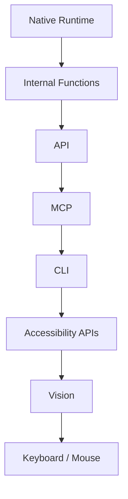

# Execution Priority

## Purpose

The full specification of NOVA's fixed execution-priority chain: the
ordering NOVA follows when more than one execution tier could
theoretically perform a given action, and the rule that a lower tier is
only used when every higher tier is genuinely unavailable for that
specific task.

## Scope

Tier ordering and escalation logic. Tool selection within a single tier
is `docs/05-ai/tool-selection.md`; the interface each tier's tools
implement is `tool-interface.md`.

## The priority chain

1. **Native Runtime** — built-in, compiled functions (`native-runtime.md`).
2. **Internal Functions** — first-party logic not requiring an external
   process (parsers, calculators, index queries).
3. **API** — direct calls to an application or service's official API
   (`api.md`).
4. **MCP** — calls through a configured MCP server (`mcp.md`).
5. **CLI** — command-line invocation (`cli.md`).
6. **Accessibility APIs** — structured UI-tree interaction, e.g. Windows
   UI Automation (`accessibility.md`).
7. **Vision** — screenshot-based visual UI understanding (`vision.md`).
8. **Keyboard/Mouse** — raw input injection (`automation.md`).

(Tiers 7 and 8 are typically used together — vision identifies the
target, keyboard/mouse performs the input — and are treated as a
combined last-resort pair in practice, while remaining architecturally
distinct tools per `tool-interface.md`.)

## Escalation rule

A lower tier is used **only when every higher tier is confirmed
unavailable for this specific action** — not merely "less convenient" or
"the LLM defaulted to it." Tool Selection
(`docs/05-ai/tool-selection.md`) queries the Tool Registry at each tier in
order and only proceeds to the next tier when no registered, capable tool
exists at the current one.

## Why this ordering, specifically

Each tier down the list is progressively less reliable, more expensive,
slower, and — critically — less likely to carry the target application's
own permission and safety checks. An API call to an application
typically respects that application's own authorization model; a
keyboard/mouse click bypasses it entirely by operating the UI as a human
would. This ordering exists specifically so that escalating to a lower
tier changes *how* an action is performed without changing *whether* it
is still gated by NOVA's own risk-tier confirmation requirements — see
`docs/03-runtime/permission-manager.md`, which applies uniformly
regardless of which tier ultimately executes the action.

## No tier is permitted to skip ahead

A new tool integration is never permitted to register itself in a way
that causes it to be preferred over a higher tier capable of the same
action — this is enforced by the fixed ordering above being a property of
the execution-priority resolution process itself, not a per-tool
configurable preference.

## Vision and Keyboard/Mouse scope restriction

Per `docs/00-overview/non-goals.md`, tiers 7 and 8 are restricted to an
explicit, maintained application allow-list (`vision.md`) — they are not
available for arbitrary third-party applications, independent of whether
higher tiers happen to be unavailable for those applications.

## Related documents

- `docs/25-failure-modes/FM-07-tool-execution-and-mcp.md` — failure modes for this subsystem
- `native-runtime.md` through `automation.md` — full detail per tier
- `docs/05-ai/tool-selection.md` — selection within a tier
- `docs/03-runtime/permission-manager.md` — the gate applied uniformly
  across all tiers
