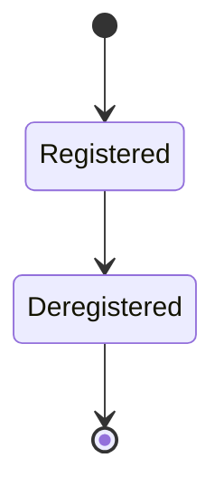

# Tool Registry

## Purpose

The catalog service holding every registered tool, its declared metadata
(from `tool-interface.md`), and providing lookup for Tool Selection
(`docs/05-ai/tool-selection.md`).

## Scope

Registration, storage, and lookup of tool metadata. Does not execute
tools itself (that is the Executor, `docs/03-runtime/executor.md`) and
does not decide which tool to use for a step (that is Tool Selection).

## Registration

A tool is added to the registry by declaring the full metadata contract
required by `tool-interface.md`: execution tier, risk tier(s) per
action, verification signal, lockable resources, and permission scope.
Registration is validated against this schema at registration time — a
tool missing required metadata is rejected, not registered with gaps
filled by assumption.

`tool_id` is a catalog identifier, not a generated instance ID
(`docs/14-development/naming-conventions.md`'s ID generation strategy)
— namespaced by source to prevent collision: a plugin-sourced tool's
full `tool_id` is prefixed by its owning plugin's `plugin_id`
(`<plugin_id>.<tool_name>`); an MCP-server-sourced tool is prefixed by
its server identifier. A second registration attempt under an identical,
already-registered full `tool_id` is rejected outright — it never
silently overwrites the existing entry, even if the new registration's
metadata is otherwise valid, since a silent overwrite would let one
badly-behaved plugin shadow a trusted built-in tool's identifier.

## Lookup interface

Tool Selection queries the registry by: intent/capability (e.g., "file
search," "git operation"), execution tier (when resolving a specific
tier in the priority chain), and target entity type (e.g., only tools
applicable to files, not applicable to browser tabs). The registry
returns all matching candidates with their full metadata for Tool
Selection's ranking step.

## Tool sources

Tools reach the registry from several sources: built-in native functions
(`native-runtime.md`), configured MCP servers (`mcp.md`), registered CLI
command wrappers (`cli.md`), configured direct API integrations
(`api.md`), the accessibility/vision/automation adapters
(`accessibility.md`, `vision.md`, `automation.md`), and installed plugins
(`docs/16-extensibility/plugin-architecture.md`). Regardless of source,
every tool is normalized into the same registry entry shape before it is
queryable — Tool Selection does not need to know or care which source a
tool came from.

## Relationship to the Capability Registry

The Tool Registry is the concrete layer; `docs/05-ai/capability-registry.md` sits above it as a named-ability abstraction the
Planner reasons in terms of. A capability's `required_tools` list
references entries in this registry, and Tool Selection
(`docs/05-ai/tool-selection.md`) is what actually resolves a chosen
capability down to one of the tools listed here.

## Dynamic registration (MCP, plugins)

MCP servers and plugins can register new tools at runtime, after
successful connection and capability discovery
(`mcp.md`). Dynamically registered tools go through the same metadata
validation as built-in tools — an MCP server that does not declare a
verification signal for its exposed tools has those tools registered as
confirmation-required-only, exactly as a built-in tool with the same gap
would be. A validated MCP advertisement batch is registered without partial
exposure: nested input and output schemas are deep-cloned before registration,
and if one registry insertion fails, earlier insertions from that same batch are
removed before the error is returned. A validated MCP advertisement
refresh may replace the existing entries in that server’s namespace only after
the complete incoming batch has passed validation; registration failure
restores the prior source entries, and entries from other sources are never
overwritten.

## Deregistration

A tool is deregistered when its source is removed (an MCP server
disconnected, a plugin uninstalled). MCP source removal is rollback-safe: if
one registry deletion fails after earlier entries were removed, those earlier
entries are restored before the error is returned. In-flight tasks that had
already selected a now-deregistered tool are reported to the Planner as a failed
step requiring re-planning (`docs/03-runtime/planner.md`), rather than
attempting to complete an invocation against a tool that no longer
exists.

## Lifecycle

A tool entry has exactly two states: **Registered** (metadata validated
and stored; queryable by Tool Selection from the moment registration
succeeds — there is no separate "available" state distinct from
registered) and **Deregistered** (source removed; no longer returned by
lookup; terminal — re-adding the same tool later is a new registration,
not a resumed one). This registry does not currently define a
deprecation state distinct from these two; a tool is either registered
and fully usable, or gone.

## Related documents

- `docs/25-failure-modes/FM-07-tool-execution-and-mcp.md` — failure modes for this subsystem
- `tool-interface.md` — the metadata schema this catalog enforces
- `docs/05-ai/tool-selection.md` — the primary consumer of registry
  lookups
- `mcp.md` — the dynamic registration source referenced above
