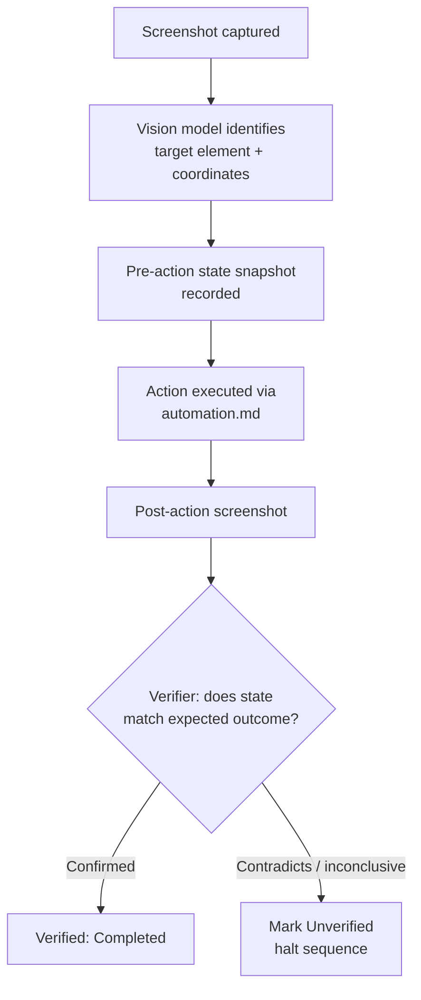

# Vision (Execution Tier 7)

## Purpose

Describes vision-guided UI understanding — screenshot-based visual
recognition of buttons, fields, and dialogs — as NOVA's second-to-last
execution tier, used only when neither structured control (Accessibility)
nor any higher tier is available, and restricted to an explicit,
maintained application allow-list.

## Scope

Vision-specific mechanics, its restriction to an allow-list, and its
verification/rollback requirements. Actual input injection following
vision's target identification is `automation.md`.

## Why this tier exists at all, and why it is restricted

Some applications expose no API, no MCP integration, no CLI, and
incomplete or absent accessibility support. For NOVA to be useful against
such applications at all, vision is the only remaining mechanism. It is
restricted to an explicit application allow-list — not available for
arbitrary third-party applications — because vision-driven control is:
probabilistic (a misdetected button leads to a wrong click), unable to
carry the target application's own permission checks the way an API call
would, and expensive/slow relative to every higher tier. Per
`docs/00-overview/non-goals.md`, NOVA is explicitly not a general-purpose
RPA platform for arbitrary applications — this allow-list restriction is
that non-goal's concrete enforcement mechanism at this tier.

## Application allow-list

Maintained as an explicit, versioned list (analogous to the CLI command
allow-list in `cli.md`) of applications NOVA is permitted to control via
vision, added deliberately as specific need is demonstrated and
maintenance capacity exists — not grown automatically or implicitly.

## Interaction pipeline

## Mandatory state capture

Every vision-driven step, not just the overall task, captures a
before/after state snapshot sufficient for manual or automatic rollback
— this is the direct fix for the error-compounding risk identified in the
project's foundational review: without per-step snapshots, a
misdetection early in a multi-step vision sequence can compound into
further wrong actions before anyone notices.

## Verification is never vision-only

Per `docs/03-runtime/verifier.md`, a vision-driven action's outcome is
checked against ground-truth signals wherever any exist for the affected
application (e.g., checking the resulting file's hash even though the
action that produced it was vision-driven) — vision-based post-action
screenshot comparison is used only when no other signal is available,
never as the sole check for an action that itself used vision to act.

## Cost and latency

Every vision step involves a model call over an image, which is slower
and more expensive than any other tier — per `docs/05-ai/model-router.md`
this tier's calls are routed under the same cost/latency budget
constraints as any other LLM usage, and the Planner treats this tier's
per-step cost/latency as a factor discouraging its use whenever a higher
tier could still apply.

## Related documents

- `docs/25-failure-modes/FM-09-browser-and-vision.md` — failure modes for this subsystem
- `execution-priority.md` — this tier's place as second-to-last resort
- `automation.md` — the input-injection mechanism following target
  identification
- `docs/00-overview/non-goals.md` — the scope restriction this tier
  enforces
