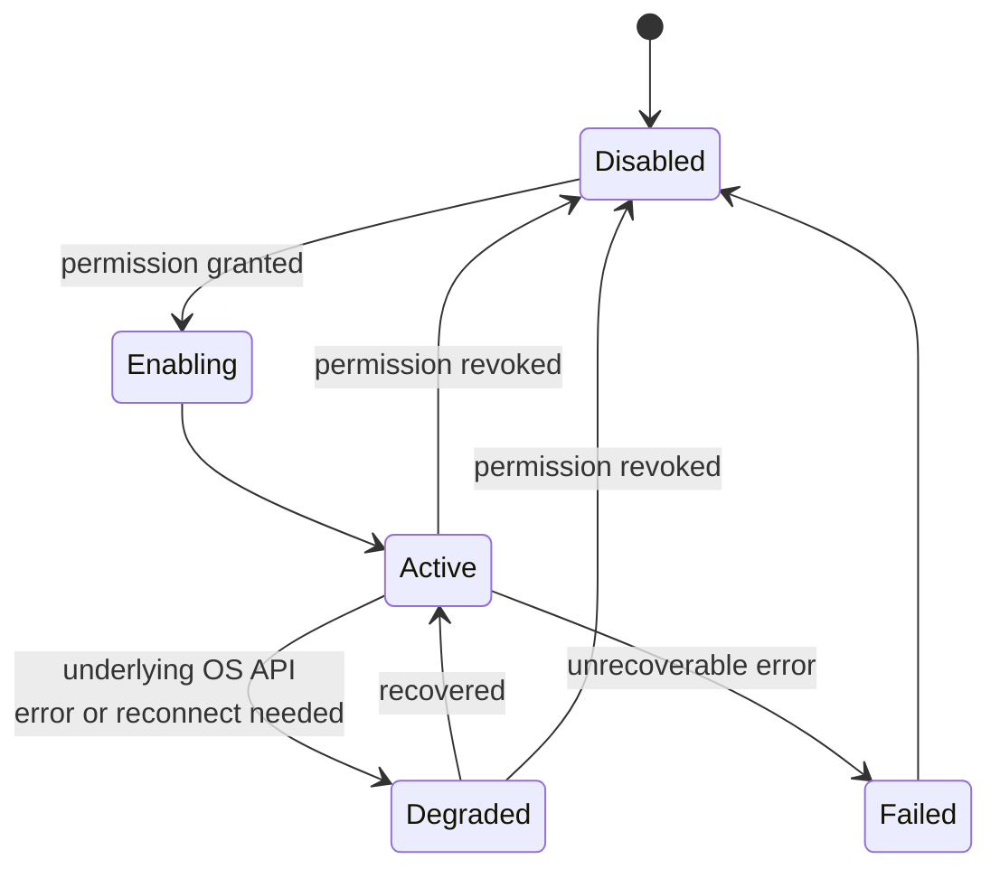

# Observer Sources: Implementation Guide

## Purpose

While `docs/03-runtime/observer.md` defines the shared observer framework
contract (registration, permission gating, normalization), this document
is the practical guide to each individual observer source: what it
watches, what it deliberately does not capture, and its specific
permission scope. Read `docs/03-runtime/observer.md` first for the
framework this guide implements against.

## Scope

Index and shared conventions for all observer sources. Each source has
its own dedicated page in this folder.

## Observer source index

| Source        | Captures                                                                                                                           | Explicitly does not capture                                                                                       | Detail             |
| ------------- | ---------------------------------------------------------------------------------------------------------------------------------- | ----------------------------------------------------------------------------------------------------------------- | ------------------ |
| Filesystem    | Create/modify/delete/move/rename, within granted folders                                                                           | Content of files outside granted scope; system/hidden files by default                                            | `filesystem.md`    |
| Applications  | Install/remove/launch/close, version where observable                                                                              | Application internal state or data                                                                                | `applications.md`  |
| Windows       | Open/close/focus/title                                                                                                             | Window contents (that is Vision's domain, gated separately)                                                       | `windows.md`       |
| Browser       | `browser_metadata`: visible extension tab open/close/activation/navigation metadata, normalized HTTP(S) domain/path, bounded title | Page content, form fields, entered text, passwords, payment data, DOM state, automation, screenshots, OCR, vision | `browser.md`       |
| Clipboard     | Copy metadata under `clipboard_metadata`; eligible text content only when `clipboard_content` is also granted                      | Content from applications flagged as sensitive (password managers), plus all content without both grants          | `clipboard.md`     |
| Notifications | Metadata under `notifications_metadata`; body only when `notifications_content` is also granted                                    | Bodies from messaging/authentication sources, plus all body content without both grants                           | `notifications.md` |
| Keyboard      | `keyboard_activity`: activity/idle signal and explicitly registered hotkey triggers only                                          | Keystroke content, key codes, modifier lists, entered text — never a keylogger                                  | `keyboard.md`      |
| Mouse         | Activity/idle signal, current position for World Model                                                                             | Continuous movement trail/history                                                                                 | `mouse.md`         |

Screen contents are deliberately not an observer row: on-demand capture is the separate `screen` permission and `nova.screen-capture` tool defined in `docs/06-tools/desktop-agent.md`. Structured desktop control is the separate `desktop_control` permission and accessibility-tier `nova.desktop-accessibility` tool; neither starts continuous capture.

## Shared convention: minimum necessary capture

Every observer source in this folder follows one rule beyond the
framework's permission gating: capture the minimum signal that satisfies
the use cases in `docs/01-product/use-cases.md`, not the maximum
technically available. Where a source could capture more (e.g., full
clipboard content vs. just its type), the broader capture is a separate,
more granular permission grant, never bundled silently with the coarser
one — see `docs/10-security/permissions.md` for how granular permission
scopes are structured per source.

## Why keyboard and mouse are scoped so narrowly

Continuous keystroke or mouse-movement logging is functionally
indistinguishable from a keylogger, regardless of stated intent — this is
addressed directly, not left implicit: NOVA's keyboard and mouse
observers capture only activity/idle state and explicit registered
hotkey triggers, never keystroke content or movement trails. Where mouse
_position_ is needed (for GUI automation targeting in
`docs/06-tools/automation.md`), that is read on-demand at the moment of
an Executor action via the World Model, not continuously logged.

## Observer scheduling model

| Source           | Mechanism                                                 | Sampling/backoff                                                                                                                                                                                                                                                                                                                                                                                                         |
| ---------------- | --------------------------------------------------------- | ------------------------------------------------------------------------------------------------------------------------------------------------------------------------------------------------------------------------------------------------------------------------------------------------------------------------------------------------------------------------------------------------------------------------ |
| Filesystem       | Event-based (OS file-watch API)                           | Debounced per `docs/02-architecture/event-driven-architecture.md`; falls back to periodic reconciliation polling (low frequency) only to catch watch-API gaps after sleep/wake, per `docs/02-architecture/lifecycle.md`                                                                                                                                                                                                  |
| Applications     | Event-based (OS process notification)                     | No polling under normal operation                                                                                                                                                                                                                                                                                                                                                                                        |
| Windows          | Event-based (OS window-event hooks)                       | No polling under normal operation                                                                                                                                                                                                                                                                                                                                                                                        |
| Browser          | Event-based (extension API callbacks)                     | No polling; the Native Messaging port is recreated on the next permitted tab event after a disconnect                                                                                                                                                                                                                                                                                                                    |
| Clipboard        | Event-based (OS clipboard-change notification)            | No polling                                                                                                                                                                                                                                                                                                                                                                                                               |
| Notifications    | Event-based (OS notification API)                         | No polling                                                                                                                                                                                                                                                                                                                                                                                                               |
| Keyboard / Mouse | Event-based (activity-only signal, per the scoping above) | Keyboard idle duration is sampled every 5 seconds and defaults to 120 seconds before emitting an idle transition; the keyboard threshold is a bounded runtime override, while the current native sampling interval is a fixed implementation constant. This is the one source using sampling rather than pure event-driven capture, since "idle" is inherently a duration-based judgment, not a discrete event. |

NOVA prefers event-based observation over polling everywhere the OS
provides an event API, consistent with `docs/03-runtime/world-model.md`'s
"continuous update, not polling" principle — polling is used only as a
narrow reconciliation fallback (filesystem, after sleep/wake) or where a
signal is inherently sampled by nature (idle detection).

## CPU limits and backoff under load

Each observer source has an independent CPU budget within the overall
resource ceiling (`docs/11-performance/resource-usage.md`) — a source
generating an unusually high event volume (see event-storm handling,
`docs/02-architecture/event-driven-architecture.md`) that would exceed
its budget triggers increased debounce/batch windows for that source
specifically, rather than affecting other sources' budgets.

## Observer state machine

An observer in `Degraded` continues attempting recovery (e.g., browser
extension reconnection with backoff) without requiring the whole NOVA
instance to be restarted, per Principle 3's failure-isolation goal
(`docs/00-overview/design-principles.md`) applied at the individual-
source level.

## Related documents

- `docs/25-failure-modes/FM-15-architecture-runtime-lifecycle-events.md` — failure modes for this subsystem
- `docs/03-runtime/observer.md` — the shared framework contract
- `docs/10-security/permissions.md` — the granular permission model this
  guide's scoping decisions plug into
- `events.md` — the concrete event taxonomy per source
