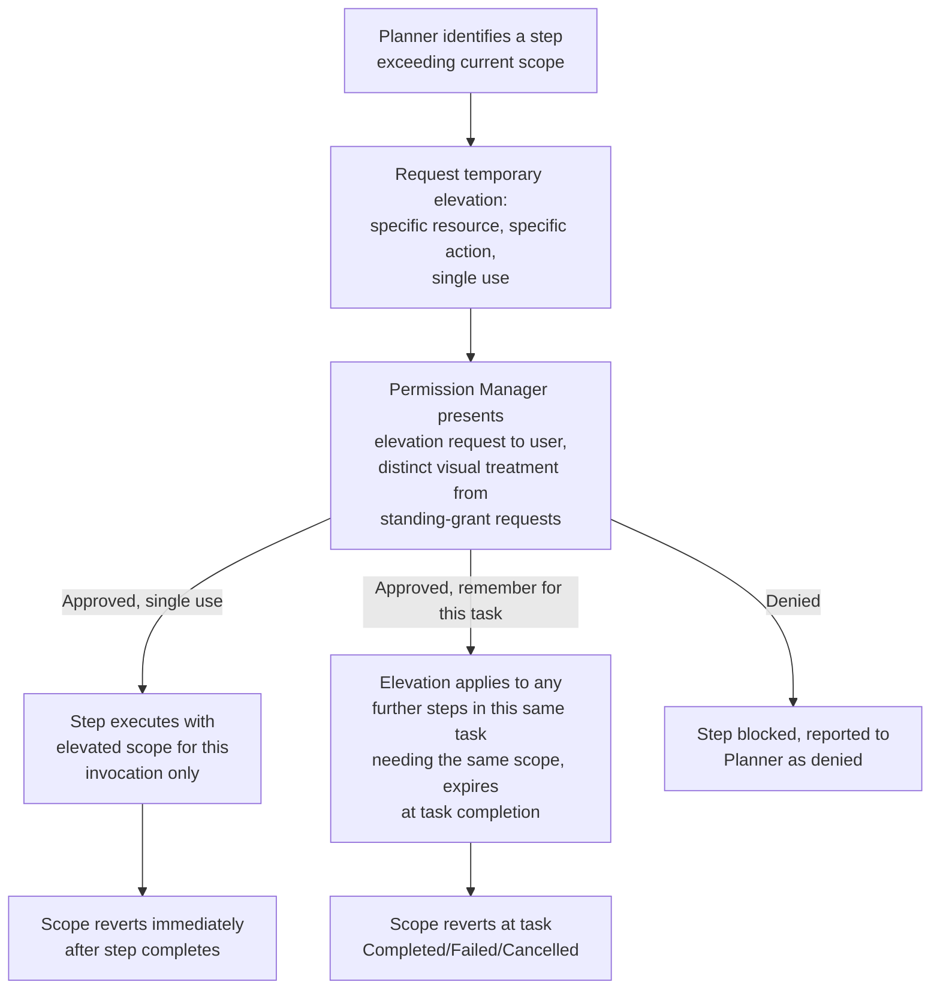

# Permission Escalation Flow

## Purpose

Specifies how a task obtains *temporary*, single-use elevated permission
for a specific action beyond what has been permanently granted — distinct
from the permanent, standing grants in `docs/10-security/permissions.md`.
This closes a real gap: the prior specification covered permanent grants
and per-action confirmation, but not a formal "just this once, allow a
broader action" flow.

## Scope

Temporary elevation specifically. Standing permission grants remain
`docs/10-security/permissions.md`; agent-instance tool allowlist scoping
remains `docs/05-ai/planner-agent.md`.

## When temporary elevation applies

A task's plan may include a step whose risk tier or required scope
exceeds what the task's current standing grants or agent-instance
allowlist cover — e.g., a one-off need to access a folder outside any
previously granted filesystem scope. Rather than requiring the user to
navigate to the permission center and grant a new standing permission
(`docs/10-security/permissions.md`) for a single, one-time need, the
Planner can request a **temporary elevation** scoped narrowly to that
step alone.

## Escalation flow

## Elevation is never silent or permanent by default

Every elevation request is presented to the user explicitly — there is
no code path where a task silently exceeds its granted scope. The
"remember for this task" option (per the flow above) is the broadest
elevation available and still expires at task completion; converting a
temporary elevation into a standing grant requires the user to explicitly
do so through the permission center (`docs/10-security/permissions.md`),
never as an automatic consequence of repeated elevation requests.

## Audit trail

Every elevation request, its scope, and the user's response are recorded
in the audit trail (`docs/10-security/audit.md`) with the same
`correlation_id` linkage as any other permission decision, distinguishing
"acted under a standing grant" from "acted under a one-off elevation" in
the historical record.

## Relationship to risk tiers

Temporary elevation changes *scope* (which resource or action category is
accessible), not *risk tier* — a temporarily elevated destructive action
still requires the same mandatory, no-override confirmation as any other
destructive action (`docs/10-security/permissions.md`); elevation and
risk-tier confirmation are independent gates that both apply.

## Related documents

- `docs/25-failure-modes/FM-12-security-sandbox-identity.md` — failure modes for this subsystem
- `docs/10-security/permissions.md` — standing grants and risk-tier
  confirmation, both independent of this flow
- `docs/05-ai/planner-agent.md` — the agent-instance allowlist this flow
  temporarily extends
- `docs/10-security/audit.md` — where elevation events are recorded
