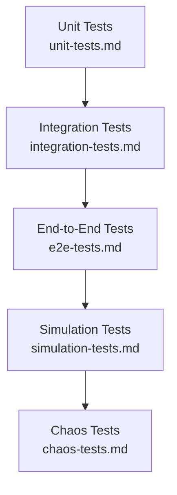

# Testing Strategy

## Purpose

The overall approach to verifying NOVA's correctness across four
distinct testing layers, each addressing a different class of risk
identified throughout this repository — from unit-level correctness to
the specific challenge of testing an agent whose environment is the
user's own live, mutating desktop.

## Scope

The relationship between testing layers. Each layer's specifics are
detailed in its own document in this folder.

## Testing layers

- **Unit Tests** — individual service logic in isolation, per
  `unit-tests.md`.
- **Integration Tests** — cross-service interaction over the real
  Communication Bus, per `integration-tests.md`.
- **End-to-End Tests** — the full observation-to-verified-result pipeline
  against a real (test) OS environment, per `e2e-tests.md`.
- **Simulation Tests** — replay of recorded real-world tasks and golden
  datasets to catch regressions that only manifest against realistic,
  messy input, per `simulation-tests.md`.
- **Chaos Tests** — deliberate fault injection (killing a service
  mid-task, corrupting a message, denying a permission mid-flow) to
  confirm the failure-recovery mechanisms in
  `docs/03-runtime/failure-recovery.md` actually behave as documented
  under real disruption, not just in the clean scenarios the other four
  layers primarily exercise. See `chaos-tests.md`.

## Why five layers, not fewer

Unit and integration tests alone cannot catch the failure modes specific
to this project — a Planner that makes technically-valid but practically
wrong tool selections, or a Vision-tier interaction that works against a
clean test fixture but fails against a real application's actual current
UI state. Simulation testing against recorded real-world scenarios exists
specifically to catch this gap. Chaos testing exists for a distinct
reason: every other layer tends to test the happy path plus a handful of
deliberately authored failure cases, whereas chaos testing injects faults
the test author did not necessarily anticipate, at points the other
layers may not think to probe (mid-checkpoint process kill, a resource
lock held past its timeout, a dead-lettered message per
`docs/02-architecture/communication-model.md`).

## Test coverage matrix

| Component | Unit | Integration | Simulation | Chaos | Benchmark |
|---|---|---|---|---|---|
| Planner (`docs/03-runtime/planner.md`) | Required | Required | Required | Required (mid-plan kill) | Required |
| Executor (`docs/03-runtime/executor.md`) | Required | Required | Required | Required (mid-step kill) | Required |
| Verifier (`docs/03-runtime/verifier.md`) | Required | Required | Required | Optional | Required |
| Memory / Knowledge Graph (`docs/04-memory/`) | Required | Required | Required | Required (corruption injection) | Required |
| Tool Registry / individual tools (`docs/06-tools/`) | Required | Required | Required (GUI-tier only) | Optional | Optional |
| Plugin system (`docs/16-extensibility/`) | Required | Required | Optional | Required (crash isolation) | Optional |
| UI surfaces (`docs/09-ui/`) | Optional | Required | Optional | Optional | Optional |
| Observers (`docs/07-observers/`) | Required | Required | Required (event storms) | Optional | Required |

"Required" means a component cannot pass `validation.md`'s acceptance
checklist without coverage at that layer; "Optional" means coverage is
valuable but not a merge-blocking requirement, left to reviewer judgment
per the specific change's risk.

## Coverage minimums for state-transition logic

Beyond the required/optional layers above, any code implementing a
state machine (Task, Agent, Workspace, Plugin, Provider, Session, or any
future entity in
`docs/26-system-reference/16-lifecycle-and-state-machine-index.md`)
requires **100% branch coverage on every documented transition** — every
edge in the entity's canonical state diagram has at least one test that
exercises it, and every documented illegal transition has at least one
test confirming it is rejected. This is a stricter bar than the general
unit-test requirement above and is non-negotiable: state-machine drift
between documentation and implementation was, empirically, the single
largest category of defect found during this specification's own
hardening audit — the same failure mode, in code
instead of docs, is exactly what this coverage minimum exists to catch
before it ships.

## Negative test cases are mandatory, not optional extras

A component's test suite is not "done" once its happy-path and one
error case pass. For every documented failure mode that applies to a
component (its entries in `docs/25-failure-modes/` and
`docs/45-code-perfection-failure-modes/`), there is at least one test
that exercises that *exact* failure input or condition — not a
generic "throws an error" assertion, but the specific trigger condition
from the failure-mode table. An AI agent generating tests defaults to
happy-path-plus-one-error-case unless explicitly required to do
otherwise; this section is that explicit requirement. A component
missing a test for a documented, applicable failure mode fails
`docs/43-ai-development/review-checklist.md`'s Failure mode coverage
check, and is not merge-eligible regardless of how much happy-path
coverage exists.

## Tests before code

For any new component, endpoint, or state-machine transition, the test
for that unit is written and confirmed to fail (for the right reason —
"not yet implemented," not a typo in the test itself) before the
implementation is written. This is not a style preference: writing the
test first is what forces the acceptance criteria
(`docs/43-ai-development/acceptance-criteria.md`) to be made concrete
and checkable before implementation choices are made that quietly
narrow what "correct" means. Implementation-first, tests-added-after
is permitted only for exploratory spikes explicitly marked as such and
discarded or rewritten test-first before merge — never shipped directly.

## Every layer maps to a component's acceptance criteria

Per `validation.md`, no component is considered complete until it has
passing coverage at every layer marked "Required" for it above — a Tool
Registry integration, for example, requires unit tests for its metadata
validation, integration tests confirming it is correctly discoverable by
Tool Selection, and, if it is a GUI-tier tool, simulation tests against
recorded interaction scenarios for its specific target application.

## Testing and the deterministic-first principle

Because deterministic paths are, by construction, fully specified and
reproducible, they receive full unit-test coverage as a baseline
expectation. LLM-involving paths (`docs/05-ai/ambiguity-resolution.md`)
are additionally covered by simulation testing against golden datasets,
since their non-deterministic nature makes exhaustive unit-level
assertion less meaningful on its own.

## Static security analysis on generated code

Every AI-generated code change is run through a static application
security testing (SAST) pass before it is presented as complete — a
known-bad pattern (SQL string concatenation, hardcoded secret, missing
input validation) is a blocking failure, never a soft warning, per
`docs/25-failure-modes/FM-08-code-generation-and-testing.md`'s FM-08-009.
This runs in addition to, not instead of, the unit/integration/e2e
layers above; a security-lint failure blocks delivery regardless of
whether the functional tests pass.

## Test/production environment parity

The test sandbox environment (dependency versions, OS/runtime target,
configuration) is kept as close to the actual deployment target as
practical, specifically to prevent a test passing in the sandbox while
the same code fails once deployed (`docs/25-failure-modes/FM-08-code-generation-and-testing.md`'s FM-08-015). Where full parity isn't
practical (e.g., testing all supported OS targets on every commit),
the gap between sandbox and target is an explicit, tracked technical-
debt item (`docs/14-development/technical-debt.md`), not a silent
assumption that "it probably works the same."

## Related documents

- `docs/25-failure-modes/FM-08-code-generation-and-testing.md` — failure modes for this subsystem
- `unit-tests.md`, `integration-tests.md`, `e2e-tests.md`,
  `simulation-tests.md`, `chaos-tests.md` — full detail per layer
- `validation.md` — acceptance criteria tying these layers together
- `docs/11-performance/benchmarks.md` — the performance-specific
  measurement this testing strategy complements
- `docs/03-runtime/failure-recovery.md` — the mechanisms chaos testing
  specifically validates
