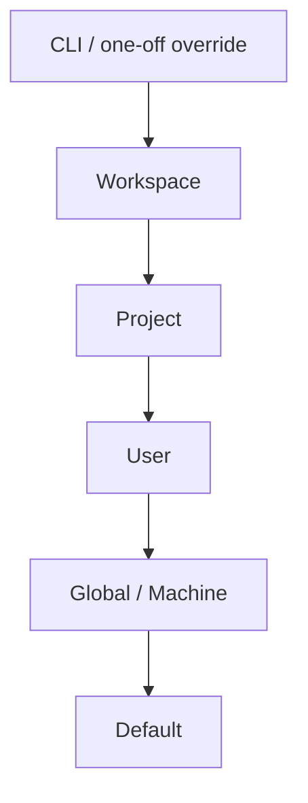

# Configuration Architecture

## Purpose

Defines where NOVA's configuration lives, at what scopes it can be set,
and the precedence rule when the same setting is configured at more than
one scope simultaneously — a gap in the prior specification, which
referenced individual settings (provider configuration, permission
grants, cost budgets) without a central model for how they compose.

## Scope

Configuration scope, storage, and precedence. Individual setting schemas
remain in their owning documents (e.g., provider configuration is
`docs/05-ai/model-providers.md`); this document governs how any setting
resolves when defined at multiple scopes.

## Configuration scopes

From highest to lowest precedence:

- **CLI / one-off override** — an explicit override passed for a single
  task or session (e.g., via the external API or command palette,
  `docs/09-ui/command-palette.md`); highest precedence, never persisted.
- **Workspace** — settings scoped to the current NOVA workspace (per
  `docs/01-product/project-scope.md`'s one-workspace-per-OS-account
  model).
- **Project** — settings scoped to a specific Project entity
  (`docs/04-memory/ontology.md`), e.g., a per-project provider
  preference or permission scope.
- **User** — the OS user's own persisted preferences, applying across
  all projects in their workspace.
- **Global / Machine** — settings applying to the NOVA installation as a
  whole, relevant primarily for shared-machine scenarios where multiple
  OS-user workspaces exist (`docs/10-security/authentication.md`).
- **Default** — NOVA's built-in default, used only when no higher scope
  specifies a value.

## Precedence resolution rule

A setting resolves to the value defined at the **highest-precedence
scope that defines it at all** — a lower scope's value is used only when
every higher scope leaves the setting unset, not partially overridden.
There is no field-level merging within a single setting (e.g., a
Project-scoped permission grant is not merged with a User-scoped one;
whichever scope defines the setting at all wins entirely for that
setting).

## Where configuration is stored

Per `docs/13-devops/deployment.md`, configuration is stored separately
from Memory/Knowledge Graph storage (`docs/04-memory/memory-storage.md`),
in a user-scoped configuration location, with Project- and Workspace-
scoped configuration stored as structured records referencing the
relevant Knowledge Graph Project/Workspace entities rather than as
freestanding files disconnected from the entity model.

Core system configuration is included in the same backup schedule as
Memory (`docs/13-devops/backup.md`) and is additionally kept under
version control as structured, human-readable records (not a binary
blob), so accidental deletion or corruption of the runtime config store
is recoverable from either the backup or version history, per
`docs/25-failure-modes/FM-21-catastrophic-failures.md`'s FM-21-007 —
never a case where configuration exists only as live, unbacked-up
runtime state.

## Explicit conflict surfacing

Where a Project-scoped setting overrides a User-scoped default in a way
that affects a security-relevant setting (e.g., a permission grant or
risk-tier confirmation preference), the override is surfaced to the user
at the point of first relevant use — a security-relevant configuration
override is never silently applied without the user being able to see
that a more specific scope is overriding their general preference.

## Related documents

- `docs/25-failure-modes/FM-15-architecture-runtime-lifecycle-events.md` — failure modes for this subsystem
- `docs/05-ai/model-providers.md`, `docs/10-security/permissions.md` —
  examples of settings this precedence model applies to
- `docs/04-memory/ontology.md` — the Project/Workspace entities
  Project-scoped configuration is attached to
- `docs/13-devops/deployment.md` — where configuration storage sits
  relative to memory storage
