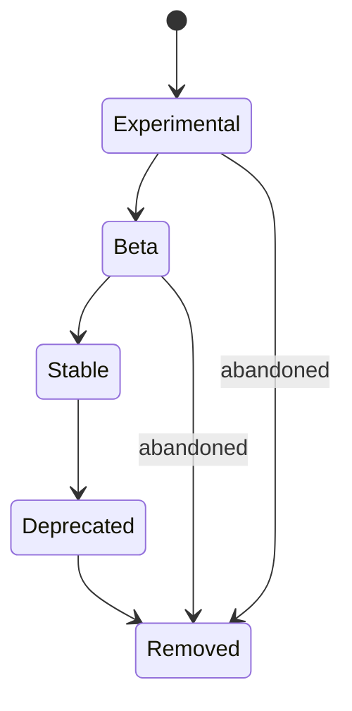

# Feature Flags

## Purpose

Defines the maturity-lifecycle model for rolling out new capabilities
safely — Experimental, Beta, Stable, Deprecated, Removed — so a new
feature (a new tool, a new observer source, a new capability) can be
introduced, tested, and eventually retired without destabilizing the
rest of the system.

## Scope

Feature maturity states and their behavioral implications. This applies
across tools, observers, capabilities, and UI surfaces alike, not one
specific subsystem.

## Maturity states

- **Experimental** — off by default; must be explicitly enabled by the
  user; not covered by the performance/reliability guarantees in
  `docs/11-performance/performance-goals.md`; excluded from default
  Capability Registry discovery (`docs/05-ai/capability-registry.md`)
  unless explicitly opted into.
- **Beta** — on by default for users who have opted into a beta channel;
  covered by reduced (but present) reliability expectations; included in
  Capability Registry discovery with a maturity tag surfaced to the
  Planner and, where relevant, the user.
- **Stable** — on by default; fully covered by performance targets,
  the full testing strategy (`docs/12-testing/testing-strategy.md`), and
  risk-tier/verification requirements exactly as any other production
  capability.
- **Deprecated** — still functional but flagged for removal, with a
  stated removal target release; surfaced to the user/developer wherever
  it is used, mirroring the API deprecation approach in
  `docs/08-api/versioning.md`.
- **Removed** — no longer available; any task planning that would have
  selected it fails cleanly with a clear "no longer available" reason,
  routed through normal capability-not-found handling
  (`docs/05-ai/capability-registry.md`).

## Behavioral gating by maturity

The Planner's tool/capability selection (`docs/05-ai/tool-selection.md`,
`docs/05-ai/capability-registry.md`) is maturity-aware: an Experimental
capability is never selected for an unattended, non-confirmed action
regardless of its declared risk tier — maturity state acts as an
additional gate alongside, not instead of, the existing risk-tier
confirmation model in `docs/10-security/permissions.md`.

## Promotion criteria

Promotion from Experimental to Beta, and Beta to Stable, requires passing
the applicable validation checklist (`docs/12-testing/validation.md`) at
the target maturity's expected rigor — a capability does not reach Stable
merely by being available for a period of time without incident; it
requires demonstrated test coverage and, where applicable, benchmark
compliance (`docs/11-performance/benchmarks.md`).

## Related documents

- `docs/25-failure-modes/FM-15-architecture-runtime-lifecycle-events.md` — failure modes for this subsystem
- `docs/05-ai/capability-registry.md` — where maturity tags are surfaced
  for capability discovery
- `docs/08-api/versioning.md` — the analogous deprecation approach for
  the external API
- `docs/12-testing/validation.md` — promotion criteria referenced above
