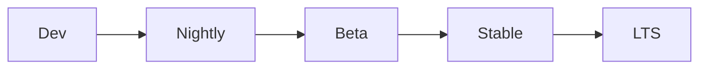

# Release Checklist

## Purpose

The concrete checklist a release must satisfy before shipping, tying
together validation (`docs/12-testing/validation.md`), performance
(`docs/11-performance/benchmarks.md`), and the branching model
(`docs/14-development/branching.md`) into one release-time gate.

## Scope

Release-time checks. Individual PR-level checks are
`docs/14-development/module-checklist.md`; this document is the
aggregate gate applied to the release as a whole, not per-change.

## Release channels

Releases progress through a fixed channel sequence before reaching
general availability:

- **Dev** — internal, built from the current phase branch
  (`docs/14-development/branching.md`); not distributed.
- **Nightly** — automated daily build for internal/early testing; may
  contain `Experimental`-maturity features (`docs/14-development/feature-flags.md`) not yet gated behind opt-in.
- **Beta** — opt-in channel for users who want early access; only
  `Beta`-maturity-or-higher features are enabled by default, consistent
  with the feature-flags maturity model.
- **Stable** — general availability; only `Stable`-maturity features
  are enabled by default.
- **LTS** — a designated Stable release receiving an extended security-
  and-critical-fix-only support window, for users who prioritize
  stability over new capability; follows the same support-window
  disclosure convention as `SECURITY.md`'s supported-versions policy.

A release is promoted to the next channel only after this checklist
passes for that channel's specific bar — Nightly has the lightest bar
(automated tests passing); Stable requires the full checklist above
including the benchmark and chaos-test gates.

## Checklist

- [ ] Every phase-branch deliverable listed in `ROADMAP.md` for the target phase is merged and passes `docs/12-testing/validation.md`'s
  full checklist.
- [ ] The benchmark suite (`docs/11-performance/benchmarks.md`) shows no
  unresolved regression against `docs/11-performance/performance-goals.md`'s
  targets.
- [ ] The full test matrix (`docs/12-testing/testing-strategy.md`) shows
  passing coverage across unit, integration, end-to-end, and simulation
  layers for every component touched since the last release.
- [ ] Any new or changed ADR (`docs/15-decisions/`) is in `Accepted`
  status, not `Proposed`.
- [ ] `CHANGELOG.md` is updated with the release's changes, following
  the existing entry format.
- [ ] Any breaking change to the external API (`docs/08-api/versioning.md`), tool contracts (`docs/06-tools/tool-schema-versioning.md`), or plugin contracts (`docs/16-extensibility/plugin-versioning.md`) has a major version bump and, where applicable,
  a deprecation window already communicated, not introduced in the same
  release it takes effect.
- [ ] A pre-release backup snapshot is confirmed
  (`docs/13-devops/backup.md`), consistent with the pre-update snapshot
  requirement in `docs/13-devops/updates.md`.
- [ ] Any memory schema migration (`docs/04-memory/memory-versioning.md`)
  or ontology version change (`docs/04-memory/ontology.md`) included in
  this release has been tested against a realistic-scale dataset, per
  `docs/11-performance/benchmarks.md`'s realistic-scale testing
  requirement.
- [ ] Feature maturity tags (`docs/14-development/feature-flags.md`) are
  reviewed — nothing shipped as `Stable` that has not actually completed
  Beta promotion criteria.
- [ ] Documentation for every changed or new component reflects actual
  shipped behavior, not aspirational behavior — checked per
  `docs/12-testing/validation.md`'s "documented behavior matches
  implemented behavior" requirement.
- [ ] Any new attack surface (new feature, new integration) shipped in
  this release has a corresponding entry in
  `docs/10-security/threat-model.md` — no new capability surface ships
  without this, per
  `docs/25-failure-modes/FM-12-security-sandbox-identity.md`'s
  FM-12-014.
- [ ] Any new action category a component can take has a corresponding
  entry in the Policy Engine's policy table
  (`docs/23-autonomy/self-growing-capability.md`,
  `docs/05-ai/escalation-rules.md`) before it ships — an action category
  with no matching policy defaults to requiring approval until a policy
  is authored, per
  `docs/25-failure-modes/FM-18-autonomy-policy-approval.md`'s
  FM-18-009, but this checklist item exists so that default is never
  silently relied on past a release boundary.

## Release approval

A release is not shipped until every item above is checked by someone
other than the change's original author, mirroring the reviewer-
attestation requirement in `docs/14-development/module-checklist.md`.

## Related documents

- `docs/25-failure-modes/FM-20-deployment-and-evolution.md` — failure modes for this subsystem
- `docs/12-testing/validation.md` — the component-level acceptance
  criteria this checklist aggregates
- `docs/13-devops/updates.md` — the update sequence this checklist gates
  entry into
- `docs/14-development/module-checklist.md` — the PR-level counterpart
  to this release-level checklist
