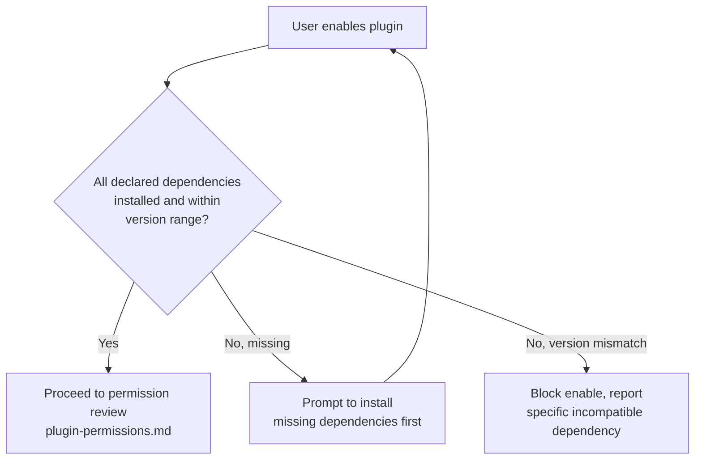

# Plugin Dependency Management

## Purpose

Specifies how dependencies between plugins (one plugin requiring another
to be installed and enabled) are declared and resolved, preventing a
plugin from being enabled into a broken or inconsistent state.

## Scope

Inter-plugin dependency resolution. Does not cover a plugin's dependency
on core NOVA capabilities (every plugin implicitly depends on the Tool
Registry and Permission Manager being available, which is guaranteed by
`docs/02-architecture/dependency-map.md`'s startup ordering).

## Dependency declaration

Per `plugin-architecture.md`'s manifest schema, a plugin declares
dependencies as a list of `{ plugin_id, version_range }` pairs.

## Resolution at enable time

A plugin is never enabled into a state where a declared dependency is
missing or version-incompatible — resolution happens before the
lifecycle transition in `plugin-lifecycle.md` begins, not as a runtime
failure discovered later when a dependent tool is actually invoked.

## Circular dependency prevention

The dependency graph across all installed plugins is validated for
cycles at resolution time, mirroring the no-cycles rule already applied
to the core service dependency graph
(`docs/02-architecture/dependency-map.md`) — a circular plugin dependency
is rejected at install/enable time with a clear error identifying the
cycle, never silently accepted.

## Disable/uninstall cascade

Disabling or uninstalling a plugin that other enabled plugins depend on
is blocked by default, with the dependent plugins listed explicitly to
the user — this prevents silently breaking a dependent plugin's tools
mid-use. An explicit "force disable, also disable dependents" option is
available but requires confirmation naming every affected dependent.

## Related documents

- `docs/25-failure-modes/FM-19-plugin-ecosystem.md` — failure modes for this subsystem
- `plugin-architecture.md` — the manifest schema dependencies are
  declared in
- `plugin-versioning.md` — the version-range semantics used in resolution
- `docs/02-architecture/dependency-map.md` — the analogous core-service
  dependency model this mirrors
