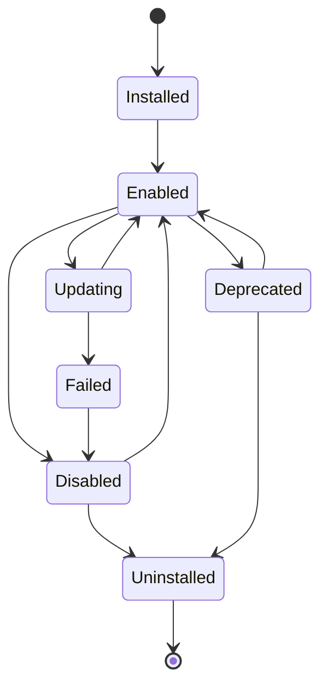

# Plugin Lifecycle

## Status: canonical for state names and narrative detail

This file is the canonical source for plugin state names and the
behavior at each transition. The formal transition table (for building
a switch/match statement) is a derived summary at
`docs/26-system-reference/04-state-transition-tables.md`, Plugin
Lifecycle section — kept in sync with this file's diagram; if they ever
disagree, this file is correct.

## Purpose

Defines the states a plugin moves through from installation to removal,
and what happens to its registered tools and any in-flight tasks using
them at each transition.

## Scope

Plugin-level lifecycle states. Individual tool invocation lifecycle is
`docs/06-tools/tool-interface.md`; process-level supervision is
`plugin-sandboxing.md`.

## Lifecycle states

- **Installed** — package present and validated (schema, signature) but
  not yet registering any tools.
- **Enabled** — the plugin process is running (`plugin-sandboxing.md`)
  and its declared tools are registered in the Tool Registry
  (`docs/06-tools/tool-registry.md`).
- **Disabled** — process stopped, tools deregistered, package retained.
- **Updating** — a new version is being applied; per `updates` handling
  below, in-flight tasks using this plugin's tools are handled before the
  transition completes.
- **Deprecated** — still `Enabled` and functional, but flagged by its
  publisher (or by NOVA itself, if the plugin's SDK version falls outside
  the current compatibility matrix, `plugin-versioning.md`) with a stated
  removal or unsupported-after date, surfaced to the user wherever the
  plugin's tools are used — mirroring the maturity model in
  `docs/14-development/feature-flags.md` applied to third-party plugins
  specifically.
- **Uninstalled** — package removed entirely.

## Deregistration on disable/update

Consistent with `docs/06-tools/tool-registry.md`'s deregistration
behavior, disabling or updating a plugin deregisters its tools; any
in-flight task that had already selected one of those tools is reported
to the Planner as a failed step requiring replanning
(`docs/03-runtime/planner.md`), never left silently invoking a
tool that no longer exists.

## Update sequence

1. New version package validated (schema, signature, declared
   `plugin-versioning.md` compatibility) before any transition begins.
2. Plugin transitions to `Updating`; its currently-registered tools are
   deregistered.
3. New version's process starts and re-registers its (possibly changed)
   tool set.
4. On failure at any step, the plugin reverts to `Disabled` with the
   previous version's package retained, never left in a partially-updated
   state.

## Sub-steps within Installed → Enabled

The transition from `Installed` to `Enabled` is not a single atomic step
— it comprises, in order: **Verify** (signature, hash, and SBOM
validation per `docs/10-security/supply-chain-security.md`), **Sandbox**
(the isolated process environment is provisioned per
`plugin-sandboxing.md`, before any plugin code executes), and **Load**
(the plugin's process starts within that sandbox and begins its own
initialization). Only after all three sub-steps succeed does the plugin
register its tools and reach `Enabled`. A failure at Verify halts before
Sandbox is ever provisioned; a failure at Sandbox halts before Load ever
executes untrusted plugin code — the ordering itself is a security
property, not merely a sequencing convenience, since it guarantees
unverified code is never given a chance to run even briefly.

## Enable-time validation

Before transitioning to `Enabled`, the Plugin Manager (the component
implementing this lifecycle) verifies: declared dependencies are
satisfied (`plugin-dependencies.md`), declared permissions are either
already granted or will be prompted for (`plugin-permissions.md`), and
the plugin's declared tools pass `docs/06-tools/tool-interface.md`
schema validation exactly as any other tool registration would.

## Related documents

- `docs/25-failure-modes/FM-19-plugin-ecosystem.md` — failure modes for this subsystem
- `plugin-architecture.md` — the overall extension system this lifecycle
  is part of
- `docs/06-tools/tool-registry.md` — tool registration/deregistration
  this lifecycle triggers
- `plugin-versioning.md` — the compatibility check referenced in updates
  and the SDK-version-driven deprecation trigger
- `docs/14-development/feature-flags.md` — the maturity model the
  Deprecated state mirrors
- `docs/10-security/supply-chain-security.md` — the Verify sub-step's
  full specification
- `plugin-sandboxing.md` — the Sandbox sub-step's full specification
