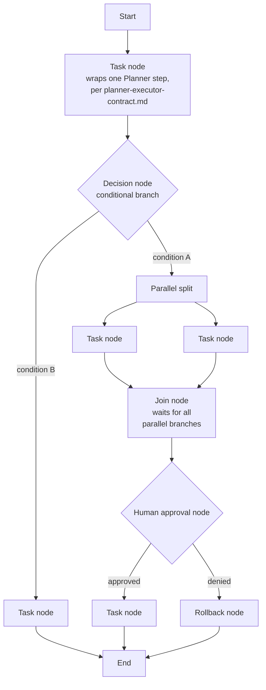

# Workflow Engine

## Purpose

Specifies the structured workflow model for multi-step tasks that require
more than the Planner's linear iterative loop
(`docs/03-runtime/planner.md`) can express cleanly: branching,
parallel execution, explicit human-approval gates, and structured
rollback across a graph of steps rather than a single sequence. This has
been referenced as a future capability across several previous documents
without a dedicated specification until now.

## Scope

The workflow graph model and its execution semantics. This is a
capability the Planner invokes for a specific class of complex task, not
a replacement for the Planner's normal step-by-step loop — most tasks
(per `docs/01-product/use-cases.md`) do not need a full workflow graph
and continue to use the standard planning loop directly.

## When a workflow (rather than a linear plan) is used

The Planner escalates from its normal linear loop to a workflow graph
when a goal genuinely requires: parallel branches that must later join,
conditional branching on a runtime value, or an explicit human-approval
step that gates which of several subsequent paths executes. A
straightforward sequential task (`docs/00-overview/end-to-end-walkthrough.md`'s
example) never needs this — invoking the workflow engine for a task that
does not require branching or parallelism is itself considered
unnecessary complexity, per `docs/05-ai/deterministic-first.md`'s general
"use the simplest sufficient mechanism" philosophy applied here.

## Workflow node types

- **Task node** — wraps exactly one step per the Planner-Executor
  Contract (`docs/03-runtime/planner-executor-contract.md`); a workflow
  is a graph of these, not a different execution primitive.
- **Decision node** — a deterministic branch on a runtime value (e.g., a
  prior task node's result) — decision-node conditions are themselves
  subject to `docs/05-ai/deterministic-first.md`: a condition evaluable
  deterministically is evaluated deterministically, never routed through
  an LLM call unless it genuinely requires judgment.
- **Parallel split / Join** — concurrent execution of independent
  branches; the Join node does not proceed until every incoming branch
  reaches it *successfully*, and per `docs/11-performance/
  concurrency.md`, branches requiring the same resource lock are still
  serialized against each other by the Resource Manager even when
  modeled as "parallel" in the workflow graph. If any branch fails
  (as opposed to merely running slowly), the Join node does not wait
  indefinitely for a result that will never arrive — it fails
  immediately once any one branch fails, and the still-running sibling
  branches are cancelled (per Cancellation below) rather than left to
  complete pointlessly toward a Join that has already failed. A Join
  never partially proceeds with only the branches that happened to
  finish first.
- **Human approval node** — an explicit workflow-level checkpoint,
  distinct from (and in addition to) the per-step risk-tier confirmation
  in `docs/10-security/permissions.md` — a workflow can require approval
  at a specific graph point regardless of whether any individual step at
  that point is itself risk-tier-gated, useful for approval points that
  are about the workflow's direction, not any single action's risk.
- **Rollback node** — invokes the compensation/rollback mechanisms in
  `docs/03-runtime/failure-recovery.md` for every task node completed on
  the path leading to it.

## Workflow state

A workflow instance's state is the union of its constituent task nodes'
states (`docs/03-runtime/task-manager.md`'s per-step state machine) plus
the graph-level position (which nodes have completed, which parallel
branches are still in flight, which decision path was taken) — persisted
incrementally exactly as task checkpoints are
(`docs/03-runtime/failure-recovery.md`), so a workflow can resume after a
crash at its last-completed node rather than restarting the entire graph.

## Retry and timeout at the workflow level

A task node's retry/timeout behavior is identical to a standalone step's
(`docs/03-runtime/failure-recovery.md`). A workflow-level timeout also
exists — **24 hours**, configurable
(`docs/14-development/configuration-schema.md`) — bounding the entire
graph's total execution time, independent of individual node timeouts,
since a workflow with many branches could otherwise complete each node
within its own budget while the overall workflow runs far longer than
intended. Exceeding it fails the workflow instance explicitly (routing
through Rollback for any completed branches, per Cancellation below),
never leaving it silently running past budget.

The Human approval node has its own timeout, deliberately distinct from
and longer than `docs/03-runtime/permission-manager.md`'s 5-minute
per-tool-call confirmation timeout: **24 hours**, matching the workflow-
level budget above, since a workflow-level approval checkpoint is a
different kind of decision than a single quick "OK to proceed" — it may
reasonably wait on a user who is away for the day, and forcing the same
5-minute window onto it would fail workflows for no reason connected to
their actual correctness. Exceeding it is treated as `denied` (routing to
Rollback), the same safe-direction default the Permission Manager uses
for its own confirmation timeout. This closes the "stuck human-approval
gate with no timeout" risk `docs/36-failure-catalog/workflow-failures.md`
lists explicitly.

## Cancellation

Cancelling a workflow cancels every in-flight task node
(`docs/03-runtime/task-manager.md`'s cancellation semantics) and, unlike
 a single linear task, may need to invoke rollback nodes for branches that
had already completed — cancellation of a workflow with completed
parallel branches routes through the same Rollback node logic a normal
"denied" path would, rather than leaving completed branches unaddressed.

## Parallel failure implementation contract

The Workflow Engine passes an optional `AbortSignal` to each parallel task execution. When the first branch returns a failure, the engine aborts every still-running sibling and waits for those branch promises to settle before propagating the original workflow failure. Executor implementations should stop issuing new sub-steps when the signal is aborted, while allowing any already-running unsafe OS operation to reach its next safe boundary as required by `docs/03-runtime/executor.md`.

The engine emits structured local diagnostics for the first failed branch and each cooperatively cancelled sibling. These records contain only the workflow identifier, branch node identifier, and bounded reason metadata; workflow context, task parameters, tool arguments, credentials, and arbitrary result payloads are excluded.

## Related documents

- `docs/25-failure-modes/FM-02-planner-task-queue-scheduler.md` — failure modes for this subsystem
- `docs/03-runtime/planner.md` — the linear loop this engine is invoked
  from for the subset of tasks that need graph-structured execution
- `docs/03-runtime/planner-executor-contract.md` — the per-node step
  contract
- `docs/03-runtime/failure-recovery.md` — rollback/compensation mechanics
  Rollback nodes invoke
- `docs/10-security/permissions.md` — the per-step confirmation model
  Human approval nodes complement, not replace
